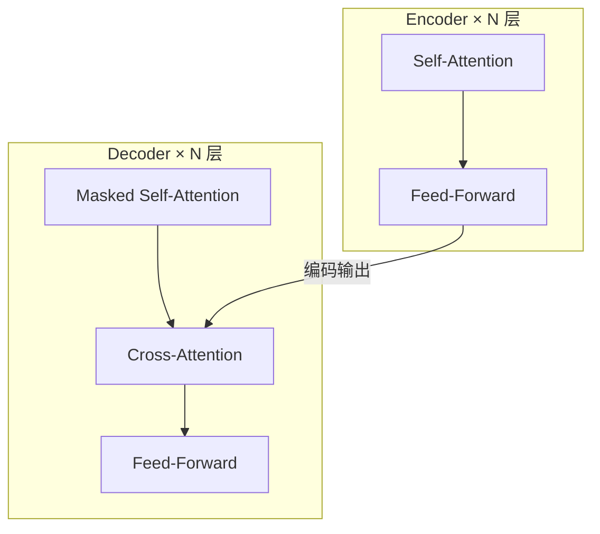
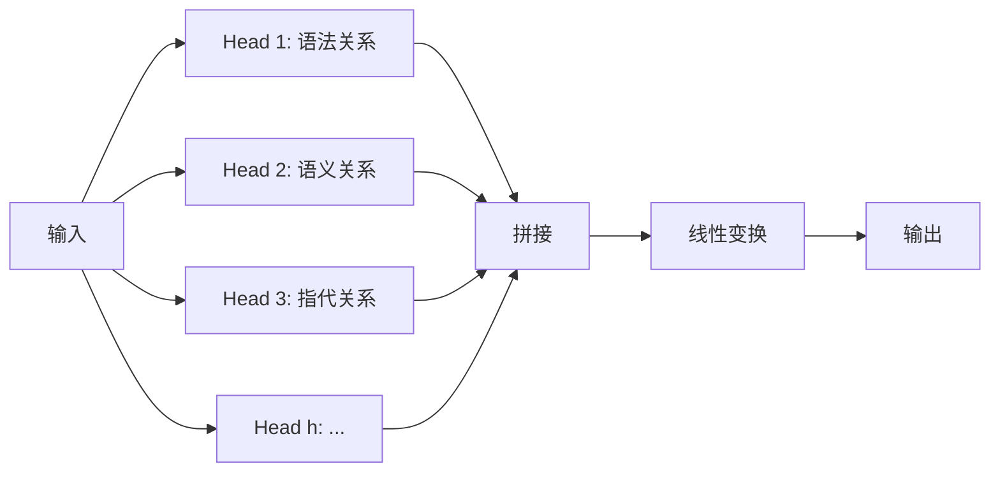

:::note[术语：LLM]
LLM（Large Language Model，大语言模型）是指参数量巨大（通常数十亿到数万亿）的神经网络语言模型，如 GPT-4、Claude、LLaMA。它们通过海量文本训练，能够理解和生成自然语言。本指南中"模型"一词通常指 LLM。
:::

## 为什么需要 Transformer？

在 Transformer 出现之前，处理序列数据（如文本）的主流模型是 RNN 和 LSTM。想象你在读一本书：

- **RNN** 就像一个只能逐字阅读、且记忆力很差的读者——读到第 100 页时，第 1 页的内容已经模糊了。
- **LSTM** 改进了记忆力，但仍然必须一个字一个字地读，无法跳读。
- **Transformer** 则像一个能同时看到整页内容的读者，可以自由地关联任意两个词之间的关系。

2017 年 Google 发表了论文 *"Attention Is All You Need"*，提出了 Transformer 架构，彻底改变了 NLP 领域。

:::note[术语：NLP]
NLP（Natural Language Processing，自然语言处理）是计算机科学中研究如何让机器理解、生成人类语言的领域。聊天机器人、翻译、搜索引擎都是 NLP 的应用。
:::

## 整体架构：Encoder-Decoder



- **Encoder**：将输入文本编码为连续的向量表示。BERT 只用了 Encoder。
- **Decoder**：根据 Encoder 的输出和已生成的内容，逐步生成输出。GPT 系列只用了 Decoder。
- 原始 Transformer（用于翻译）同时使用 Encoder 和 Decoder。

:::note[术语：Feed-Forward 网络]
Feed-Forward（前馈网络）是一个简单的两层全连接神经网络，对 Attention 的输出做非线性变换。可以理解为：Attention 负责"看哪些词重要"，Feed-Forward 负责"理解这些词的含义"。
:::

## Self-Attention 机制

Self-Attention 是 Transformer 的灵魂。核心思想：**对于序列中的每个词，计算它与其他所有词的相关性**。

### Q/K/V 矩阵

每个输入词的 Embedding 会被线性变换为三个向量：

- **Query (Q)**：「我在找什么？」
- **Key (K)**：「我能提供什么？」
- **Value (V)**：「我的实际内容是什么？」

类比：图书馆检索系统。你带着一个搜索词（Query），去匹配每本书的标签（Key），匹配度高的书把内容（Value）返回给你。

### 注意力得分计算

$$
\text{Attention}(Q, K, V) = \text{softmax}\!\left(\frac{QK^T}{\sqrt{d_k}}\right)V
$$

:::note[术语：Softmax]
Softmax 是一个数学函数，将任意一组数字转换为概率分布（所有值在 0-1 之间，总和为 1）。在 Attention 中，它把原始得分转换为"注意力权重"——得分越高的词获得越大的权重。
:::

```python
import numpy as np

def self_attention(Q, K, V):
    d_k = K.shape[-1]
    # 1. 计算注意力得分
    scores = Q @ K.T / np.sqrt(d_k)
    # 2. Softmax 归一化为概率分布
    weights = np.exp(scores) / np.exp(scores).sum(axis=-1, keepdims=True)
    # 3. 加权求和 Value
    output = weights @ V
    return output, weights
```

除以 $\sqrt{d_k}$ 是为了防止点积值过大导致 softmax 梯度消失。

## Multi-Head Attention

单个 Attention 只能捕捉一种关联模式。Multi-Head Attention 让模型同时关注不同类型的关系：



每个 Head 独立学习不同的 Q/K/V 变换，最后拼接起来。这就像让多个专家各自分析同一段文本，然后综合意见。

## Position Encoding

Transformer 的 Attention 机制本身不包含位置信息——它不知道哪个词在前、哪个词在后。因此需要额外注入位置编码。

原始论文使用**正弦余弦函数**：

$$
\begin{aligned}
PE_{(pos, 2i)}   &= \sin\!\left(\frac{pos}{10000^{2i/d}}\right) \\
PE_{(pos, 2i+1)} &= \cos\!\left(\frac{pos}{10000^{2i/d}}\right)
\end{aligned}
$$

现代模型（如 LLaMA）则使用 **RoPE（旋转位置编码）**，支持更好的长度外推。

:::note[术语：RoPE]
RoPE（Rotary Position Embedding，旋转位置编码）通过对向量施加旋转变换来编码位置信息。相比原始正弦编码，RoPE 能更好地处理超出训练长度的序列（长度外推），是目前最主流的位置编码方式。
:::

## 为什么 Transformer 替代了 RNN/LSTM

| 特性 | RNN/LSTM | Transformer |
|------|----------|------------|
| 并行计算 | 不支持（必须顺序处理） | 完全并行 |
| 长距离依赖 | 困难（梯度消失） | 轻松捕获 |
| 训练速度 | 慢 | 快（可利用 GPU 并行） |
| 可扩展性 | 差 | 优秀（Scaling Law） |

核心优势：**并行化** + **全局注意力** = 更快训练 + 更好效果。

## 面试考点

<div style="border-left:4px solid #f97316;padding:.8rem 1.2rem;margin:.8rem 0;background:#1a1a2e;border-radius:0 8px 8px 0;">
  <div style="font-weight:bold;color:#f97316;margin-bottom:.5rem;">Q: 为什么 Attention 公式要除以 $\sqrt{d_k}$？</div>
  <details>
    <summary style="cursor:pointer;color:#888;font-size:.9rem;">查看答案</summary>
    <div style="margin-top:.5rem;font-size:.9rem;">
      当向量维度 $d_k$ 较大时，Q 和 K 的点积结果会变得很大（方差约为 $d_k$）。过大的值输入 Softmax 后会导致梯度极小（接近 one-hot 分布），模型难以学习。除以 $\sqrt{d_k}$ 将方差归一化到 1，让 Softmax 的梯度保持在合理范围内。
    </div>
  </details>
</div>

<div style="border-left:4px solid #f97316;padding:.8rem 1.2rem;margin:.8rem 0;background:#1a1a2e;border-radius:0 8px 8px 0;">
  <div style="font-weight:bold;color:#f97316;margin-bottom:.5rem;">Q: Multi-Head Attention 的作用是什么？</div>
  <details>
    <summary style="cursor:pointer;color:#888;font-size:.9rem;">查看答案</summary>
    <div style="margin-top:.5rem;font-size:.9rem;">
      单个 Attention 只能学习一种关联模式。Multi-Head 让模型在不同子空间中同时捕捉不同类型的依赖关系：比如 Head 1 学语法依赖（主语-谓语），Head 2 学语义关联（同义词），Head 3 学指代关系（"他"指谁）。最后将所有 Head 的输出拼接起来，获得更丰富的表示。
    </div>
  </details>
</div>

<div style="border-left:4px solid #f97316;padding:.8rem 1.2rem;margin:.8rem 0;background:#1a1a2e;border-radius:0 8px 8px 0;">
  <div style="font-weight:bold;color:#f97316;margin-bottom:.5rem;">Q: Decoder 中的 Masked Attention 是什么？</div>
  <details>
    <summary style="cursor:pointer;color:#888;font-size:.9rem;">查看答案</summary>
    <div style="margin-top:.5rem;font-size:.9rem;">
      在训练时，Decoder 需要同时处理整个目标序列来提高效率。但生成第 $i$ 个 token 时，模型不应该看到第 $i+1$ 及之后的 token（否则就是"作弊"）。Masked Attention 通过将未来位置的注意力权重设为 $-\infty$（Softmax 后变为 0）来实现这一点，确保每个位置只能关注它之前的 token。
    </div>
  </details>
</div>

<div style="border-left:4px solid #f97316;padding:.8rem 1.2rem;margin:.8rem 0;background:#1a1a2e;border-radius:0 8px 8px 0;">
  <div style="font-weight:bold;color:#f97316;margin-bottom:.5rem;">Q: Transformer 的计算复杂度是多少？</div>
  <details>
    <summary style="cursor:pointer;color:#888;font-size:.9rem;">查看答案</summary>
    <div style="margin-top:.5rem;font-size:.9rem;">
      Self-Attention 的复杂度是 $O(n^2 d)$，其中 $n$ 是序列长度，$d$ 是向量维度。$n^2$ 来自每个 token 都要计算与所有其他 token 的注意力得分。这也是为什么长序列（如 128K tokens）需要 FlashAttention、稀疏 Attention 等优化技术来降低计算和显存开销。
    </div>
  </details>
</div>

<div style="border-left:4px solid #60a5fa;padding:.8rem 1.2rem;margin:.8rem 0;background:#1a1a2e;border-radius:0 8px 8px 0;">
  <details>
    <summary style="font-weight:bold;color:#60a5fa;cursor:pointer;">自测题 1：Self-Attention 中 Q、K、V 分别代表什么？为什么需要三个不同的矩阵？</summary>
    <div style="margin-top:.8rem;font-size:.9rem;">
      <strong>Q（Query）</strong>代表"我在找什么"——当前 token 的查询意图。<strong>K（Key）</strong>代表"我能提供什么"——每个 token 的可匹配特征。<strong>V（Value）</strong>代表"我的实际内容"。Q 与 K 的点积决定注意力权重，权重再作用于 V 得到最终输出。<br/><br/>
      如果 $Q=K=V$（即用同一个矩阵），模型只能做简单的自相关计算，表达能力大大受限。使用三个独立的线性变换，让模型可以在不同的子空间中分别学习"如何匹配"和"输出什么"，极大增强了灵活性。
    </div>
  </details>
</div>

<div style="border-left:4px solid #60a5fa;padding:.8rem 1.2rem;margin:.8rem 0;background:#1a1a2e;border-radius:0 8px 8px 0;">
  <details>
    <summary style="font-weight:bold;color:#60a5fa;cursor:pointer;">自测题 2：Transformer 为什么能并行训练而 RNN 不能？</summary>
    <div style="margin-top:.8rem;font-size:.9rem;">
      RNN 的隐藏状态 $h_t$ 依赖于 $h_{t-1}$，形成严格的顺序依赖链——必须算完第 1 步才能算第 2 步。而 Transformer 的 Self-Attention 通过矩阵运算一次性计算所有位置之间的关系，没有顺序依赖。<br/><br/>
      打个比方：RNN 像流水线工人，每个人必须等上一个人做完才能开始；Transformer 像一群人同时开工，各做各的。这使得 Transformer 能充分利用 GPU 的并行计算能力，训练速度快数倍到数十倍。
    </div>
  </details>
</div>

<div style="border-left:4px solid #60a5fa;padding:.8rem 1.2rem;margin:.8rem 0;background:#1a1a2e;border-radius:0 8px 8px 0;">
  <details>
    <summary style="font-weight:bold;color:#60a5fa;cursor:pointer;">自测题 3：如果去掉 Position Encoding，Transformer 会怎样？</summary>
    <div style="margin-top:.8rem;font-size:.9rem;">
      Transformer 会变成一个"词袋模型"（Bag of Words）——它能看到句子里有哪些词，但不知道它们的顺序。"猫追狗"和"狗追猫"会被视为完全相同的输入，因为 Attention 本身是排列不变的（permutation invariant）。<br/><br/>
      Position Encoding 注入了位置信息，让模型知道每个 token 在序列中的位置。没有它，模型无法理解语序、语法结构和指代关系，生成的文本也会丧失连贯性。
    </div>
  </details>
</div>

## 延伸阅读

- [Attention Is All You Need (原始论文)](https://arxiv.org/abs/1706.03762)
- [The Illustrated Transformer — Jay Alammar](https://jalammar.github.io/illustrated-transformer/)
- [3Blue1Brown: Attention in Transformers (视频)](https://www.youtube.com/watch?v=eMlx5fFNoYc)
