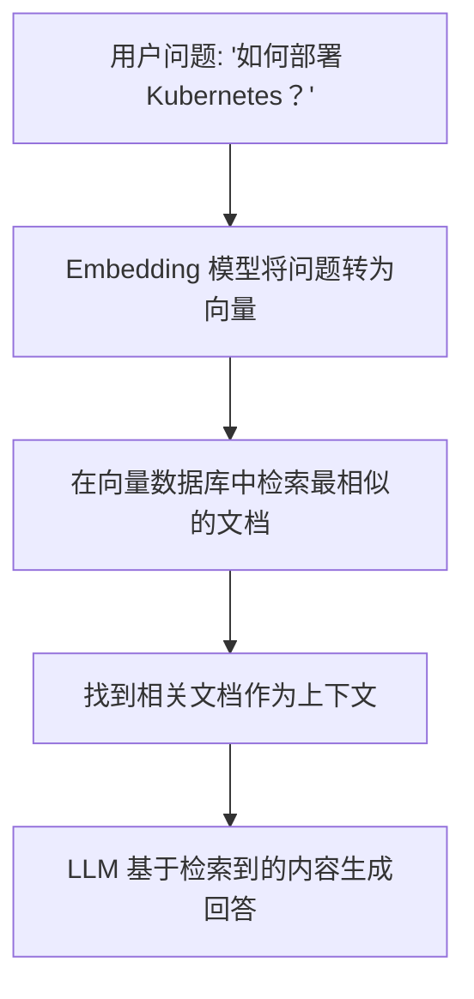

## 文本到数字：为什么需要 Tokenization？

大语言模型不认识文字，只能处理数字。Tokenization 就是把文本拆分成小单元（Token），再映射为数字 ID 的过程。

:::note[为什么模型"不认识文字"？]
神经网络的本质是**矩阵运算**——所有计算都是数字之间的加减乘除。文字（如"猫"）对计算机来说只是一个 Unicode 编码（U+732B），它没有"毛茸茸"或"四条腿"这样的语义。Tokenization + Embedding 的作用就是：先把文字拆成 Token 并编号（Tokenization），再把编号转换为包含语义信息的数字向量（Embedding），这样模型才能通过矩阵运算"理解"文字的含义。
:::

```
"我喜欢机器学习" → ["我", "喜欢", "机器", "学习"] → [8821, 35946, 9554, 15206]
```

## Token 化方法

### BPE（Byte Pair Encoding）

GPT 系列使用的方法。核心思想：从单个字符开始，反复合并出现频率最高的相邻字符对。

```
训练过程示意：
初始词表:  [a, b, c, d, ...]
第 1 轮:   合并 (t, h) → th      （因为 "th" 出现最频繁）
第 2 轮:   合并 (th, e) → the     （"the" 出现最频繁）
第 3 轮:   合并 (i, n) → in
...重复直到词表达到目标大小
```

BPE 的优势：能处理任何语言，罕见词自动拆分为子词，不会出现 OOV（Out of Vocabulary）。

### WordPiece

BERT 使用的方法，与 BPE 类似，但合并依据是最大化语言模型的似然度，而非频率。

### SentencePiece

Google 开发的独立分词工具，将整个句子视为原始输入（包括空格），不依赖预分词。支持 BPE 和 Unigram 两种算法。LLaMA 等模型使用此方法。

### 三种方法对比

| 特性 | BPE | WordPiece | SentencePiece |
|------|-----|-----------|---------------|
| **合并策略** | 按字符对出现频率合并 | 按语言模型似然度合并 | 支持 BPE 和 Unigram 两种 |
| **预分词** | 需要（先按空格/标点拆分） | 需要 | **不需要**（直接处理原始字节流） |
| **多语言支持** | 好，但依赖预分词规则 | 好 | **最好**（语言无关，对中日韩特别友好） |
| **代表模型** | GPT 系列、Claude | BERT、DistilBERT | LLaMA、T5、ALBERT |
| **OOV 处理** | 回退到字节级别 | 回退到字符级别（`##` 前缀） | 回退到字节级别 |
| **空格处理** | 特殊前缀（如 `Ġ`） | `##` 标记延续 | `▁` 表示词首空格 |

:::tip[如何选择？]
- 如果只处理英文：三者差异不大
- 如果处理多语言（尤其中日韩）：优先 SentencePiece，因为它不依赖空格分词
- 实际使用中你通常不需要选择——每个模型自带固定的 Tokenizer
:::

## Tokenizer 工作流程


```python
# 使用 tiktoken（OpenAI 的 tokenizer）
import tiktoken

enc = tiktoken.encoding_for_model("gpt-4")
tokens = enc.encode("Hello, 大语言模型!")
print(tokens)       # [9906, 11, 220, 28947, 99454, 39013, 0]
print(len(tokens))  # 7 个 token

# 解码回文本
text = enc.decode(tokens)
print(text)  # "Hello, 大语言模型!"
```

### Token 计数的重要性

Token 数量直接影响：
- **成本**：API 按 token 计费
- **速度**：token 越多，推理越慢
- **上下文窗口**：输入 + 输出的 token 总和不能超过模型的上下文窗口

经验法则：1 个英文单词 ≈ 1-1.5 个 token；1 个中文字 ≈ 1.5-2 个 token。

## Embedding：从 ID 到语义空间

Token ID 只是一个编号，没有语义信息。Embedding 层将每个 ID 映射为一个高维向量（如 768 维或 4096 维），使得语义相近的词在向量空间中距离更近。

### Embedding 的完整应用流程

在实际应用中（尤其是 RAG 场景），Embedding 不只是"把一个词变成向量"这么简单。完整流程包括：


1. **分块（Chunking）**：长文档需要切分成合适大小的文本块，太大检索不精确，太小丢失上下文
2. **Embedding 生成**：用 Embedding 模型将每个文本块转换为高维向量
3. **存储与索引**：将向量存入向量数据库（如 Chroma、Pinecone），建立索引
4. **相似性检索**：用户提问时，将问题也转为向量，在数据库中找到最相似的文本块

:::tip[本章 vs RAG 章节的分工]
本章聚焦 Embedding 的**原理**——什么是向量、为什么语义相近的词距离更近、如何计算相似度。分块策略、向量数据库选型、检索优化等**工程实践**在 [第 4 章：RAG 深入](/04-rag/02-rag-basics/) 中详细展开。
:::

<div style="display:flex;gap:2rem;justify-content:center;margin:1.5rem 0;">
  <div style="border:2px solid #60a5fa;border-radius:12px;padding:1.2rem 2rem;text-align:center;min-width:120px;">
    <div style="font-size:.85rem;color:#60a5fa;margin-bottom:.6rem;font-weight:bold;">🐾 动物区域</div>
    <div style="font-size:1.3rem;letter-spacing:.3rem;">猫 🔵</div>
    <div style="font-size:1.3rem;letter-spacing:.3rem;">狗 🔵</div>
    <div style="font-size:1.3rem;letter-spacing:.3rem;">鸟 🔵</div>
  </div>
  <div style="display:flex;align-items:center;color:#888;font-size:2rem;">⟷</div>
  <div style="border:2px solid #f97316;border-radius:12px;padding:1.2rem 2rem;text-align:center;min-width:120px;">
    <div style="font-size:.85rem;color:#f97316;margin-bottom:.6rem;font-weight:bold;">🚗 交通工具区域</div>
    <div style="font-size:1.3rem;letter-spacing:.3rem;">🟠 汽车</div>
    <div style="font-size:1.3rem;letter-spacing:.3rem;">🟠 卡车</div>
    <div style="font-size:1.3rem;letter-spacing:.3rem;">🟠 火车</div>
  </div>
</div>
<p style="text-align:center;color:#888;font-size:.85rem;">向量空间示意：语义相近的词聚集在一起，不同类别的词彼此远离</p>

### 语义相似性计算

两个向量的相似程度通常用**余弦相似度（Cosine Similarity）** 来衡量。

:::note[为什么用余弦（cos）而不是正弦（sin）？]
余弦相似度衡量的是两个向量**方向**的一致程度，而非大小。$\cos\theta$ 在两个向量方向完全相同时等于 1（$\theta = 0°$），方向正交时等于 0（$\theta = 90°$），完全相反时等于 -1（$\theta = 180°$）。这恰好映射了"相似 → 无关 → 相反"的语义直觉。

而 $\sin\theta$ 在方向相同时等于 0，正交时等于 1——含义正好反过来，用起来不直观。此外，余弦可以直接通过向量点积高效计算，不需要先求出角度。
:::

```python
import numpy as np

def cosine_similarity(a, b):
    """余弦相似度：衡量两个向量的方向是否一致"""
    return np.dot(a, b) / (np.linalg.norm(a) * np.linalg.norm(b))

# 示例（真实向量维度远高于此）
vec_cat = np.array([0.9, 0.1, 0.8])
vec_dog = np.array([0.85, 0.15, 0.75])
vec_car = np.array([0.1, 0.9, 0.2])

print(cosine_similarity(vec_cat, vec_dog))  # ≈ 0.99（猫和狗很相似）
print(cosine_similarity(vec_cat, vec_car))  # ≈ 0.45（猫和车差异大）
```

## 为什么 Embedding 对 Agent 很重要

Embedding 是 **RAG（检索增强生成）** 的基石：



Agent 利用 Embedding 实现：
1. **知识检索**：从海量文档中快速找到相关信息
2. **记忆管理**：将历史对话编码存储，按语义检索
3. **工具选择**：将工具描述编码，根据任务语义匹配最合适的工具

常用 Embedding 模型：OpenAI `text-embedding-3-small`、`BAAI/bge-m3`、`Cohere embed-v3`。

<details>
<summary>自测题 1：为什么 BPE 不会遇到 OOV 问题？</summary>

BPE 的最小粒度是单个字节（或字符）。即使遇到从未见过的词，也可以把它拆分为更小的已知子词或字符来表示。最极端的情况是把每个字符当作一个 token。
</details>

<details>
<summary>自测题 2：为什么中文比英文消耗更多 token？</summary>

大多数 LLM 的 tokenizer 以英文语料为主训练，英文常见词被合并为单个 token。而中文字符在训练语料中出现频率相对较低，往往需要多个 token 来表示一个汉字（尤其是 UTF-8 编码下一个汉字占 3 个字节）。
</details>

<details>
<summary>自测题 3：Embedding 向量的维度越高越好吗？</summary>

不一定。更高维度可以表达更丰富的语义信息，但也带来更大的存储和计算开销。实际中需要在表达能力和效率之间权衡。OpenAI 的 text-embedding-3 系列支持通过 `dimensions` 参数动态调整维度。
</details>

## 延伸阅读

- [Byte Pair Encoding — Hugging Face NLP Course](https://huggingface.co/learn/nlp-course/chapter6/5)
- [OpenAI Tokenizer 可视化工具](https://platform.openai.com/tokenizer)
- [Massive Text Embedding Benchmark (MTEB)](https://huggingface.co/spaces/mteb/leaderboard)
