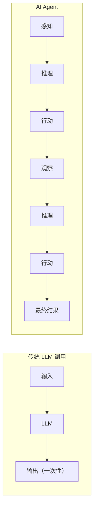
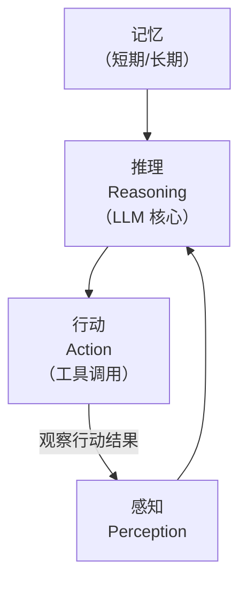

## AI Agent 的定义

AI Agent（智能体）是一个能够**自主感知环境、做出决策、执行行动**并根据反馈调整行为的系统。

类比：如果 LLM 是一个博学但被关在房间里的专家，那么 Agent 就是给了这个专家一部手机、一台电脑和一张信用卡——它不仅能思考，还能**行动**。



## Agent vs Chatbot vs Copilot vs Pipeline

这几个概念经常被混淆，核心区别在于**自主性**和**行动能力**：

```
┌─────────────┬──────────┬──────────┬──────────────────────┐
│             │ 自主决策  │ 使用工具  │ 典型场景              │
├─────────────┼──────────┼──────────┼──────────────────────┤
│ Pipeline    │   ✗      │   ✗      │ 固定流程，如翻译管道   │
│ Chatbot     │   ✗      │   ✗/有限  │ 客服问答              │
│ Copilot     │   部分    │   ✓      │ 人类主导，AI 辅助      │
│ Agent       │   ✓      │   ✓      │ AI 主导，人类监督      │
└─────────────┴──────────┴──────────┴──────────────────────┘
```

- **Pipeline**：预定义的固定流程，没有动态决策。`输入 → 步骤A → 步骤B → 输出`。
- **Chatbot**：一问一答，不执行实际操作，不记住跨对话的上下文。
- **Copilot**：人类在驾驶座，AI 提供建议和辅助（如 GitHub Copilot）。
- **Agent**：AI 自主规划和执行，人类设定目标并监督结果。

## Agent 的核心组件



### 1. 感知（Perception）

Agent 接收和理解外部信息的能力：
- 用户输入（文本、语音、图像）
- 工具返回的结果
- 环境状态变化

### 2. 推理（Reasoning）

Agent 的"大脑"，由 LLM 驱动：
- 理解当前任务和上下文
- 规划执行步骤
- 决定使用哪个工具
- 判断任务是否完成

### 3. 行动（Action）

Agent 与外部世界交互的方式：
- 调用 API（搜索、数据库查询、发邮件）
- 执行代码
- 操作文件系统
- 与其他 Agent 通信

### 4. 记忆（Memory）

```
短期记忆 (Working Memory):
  当前对话的上下文、中间推理结果
  → 存储在上下文窗口中

长期记忆 (Long-term Memory):
  用户偏好、历史任务经验、知识库
  → 存储在向量数据库或外部存储中
```

## Agent 的自主性等级

参考 Anthropic 2025 年提出的分类：

```
Level 0: 无自主性
  固定流水线，不涉及 LLM 决策

Level 1: LLM 辅助路由
  LLM 决定调用哪个预定义函数
  例: 意图分类 → 路由到对应处理器

Level 2: 工具使用
  LLM 自主选择和调用工具，但在受限循环中
  例: 查天气 → 调搜索 API → 返回结果

Level 3: 自主规划与执行
  LLM 自主分解任务、规划步骤、迭代执行
  例: "帮我调研竞品" → 搜索 → 整理 → 分析 → 生成报告

Level 4: 多 Agent 协作
  多个 Agent 各司其职，协同完成复杂任务
  例: 产品经理 Agent + 工程师 Agent + 测试 Agent

Level 5: 完全自主（尚未实现）
  Agent 能自主设定目标、学习新技能
```

### 实际建议

**从低等级开始**。绝大多数生产应用只需要 Level 1-2。不要因为 Agent 听起来酷就过度设计——简单的 LLM + 工具调用往往比复杂的自主 Agent 更可靠。

```python
# Level 2 Agent 的最简实现
def simple_agent(user_query: str, tools: dict, max_steps: int = 5):
    messages = [{"role": "user", "content": user_query}]

    for step in range(max_steps):
        response = llm.chat(messages, tools=tools)

        if response.has_tool_call:
            tool_name = response.tool_call.name
            tool_args = response.tool_call.arguments
            result = tools[tool_name](**tool_args)
            messages.append({"role": "tool", "content": str(result)})
        else:
            return response.content  # 任务完成

    return "达到最大步数，任务未完成"
```

<details>
<summary>自测题 1：Copilot 和 Agent 的核心区别是什么？</summary>

核心区别在于"谁在驾驶座"。Copilot 是人类主导、AI 辅助——人类决定做什么，AI 帮忙怎么做（如代码补全）。Agent 是 AI 主导、人类监督——人类设定目标，AI 自主规划和执行具体步骤。
</details>

<details>
<summary>自测题 2：Agent 的"记忆"分为哪两类？各自如何实现？</summary>

短期记忆（Working Memory）：存储在 LLM 的上下文窗口中，包括当前对话历史和推理过程，会话结束后消失。长期记忆（Long-term Memory）：存储在外部系统（如向量数据库、文件系统）中，持久化保存用户偏好、历史经验等，跨会话可用。
</details>

<details>
<summary>自测题 3：为什么建议从低自主性等级开始？</summary>

1) 高自主性 Agent 更难调试和控制；2) 错误会在自主循环中累积放大；3) 成本更高（多轮 LLM 调用）；4) 大多数实际需求不需要完全自主。简单的工具调用（Level 2）就能解决 80% 的场景，且更可靠、更经济。
</details>

## 延伸阅读

- [Anthropic: Building Effective Agents](https://www.anthropic.com/research/building-effective-agents)
- [LLM Powered Autonomous Agents — Lilian Weng](https://lilianweng.github.io/posts/2023-06-23-agent/)
- [The Landscape of Emerging AI Agent Architectures](https://arxiv.org/abs/2404.11584)
