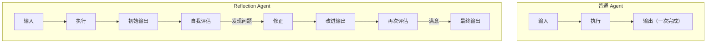
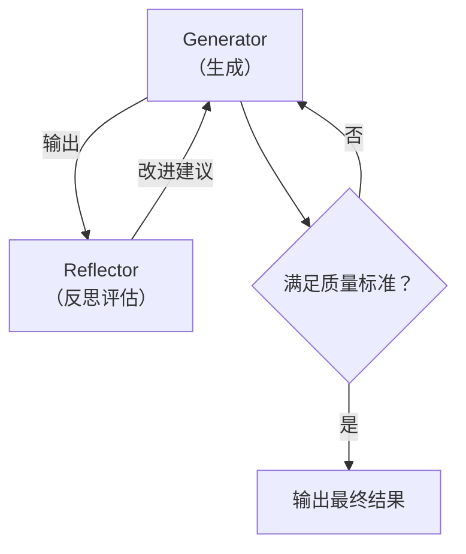
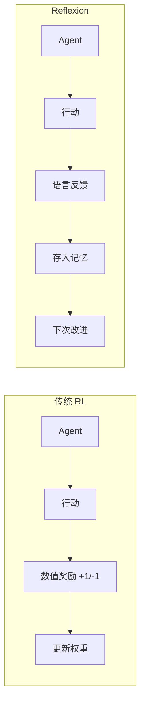
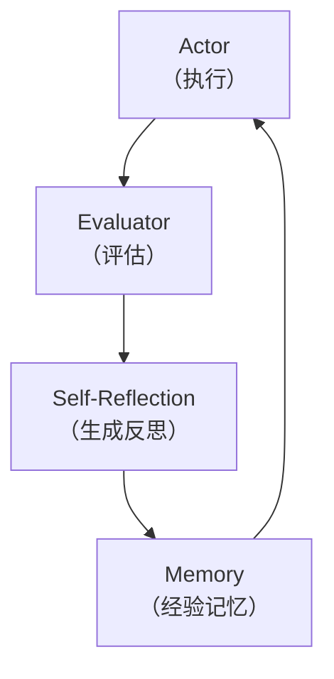

## Reflection 模式定义

Reflection（反思）模式让 Agent 在执行后**回顾和评估自己的输出**，发现问题并自我修正。

类比：就像你写完一篇文章后重新检查一遍——检查有没有错字、逻辑是否通顺、是否遗漏了重要信息。Agent 的 Reflection 做的就是同样的事。



## 自我评估与纠错机制

Reflection 的核心是两个步骤的循环：

### 1. Generator（生成器）

执行任务，产生初始输出。

### 2. Reflector（反思器）

评估 Generator 的输出，提出改进建议。



### 实现方式

Reflector 可以是：
- **同一个 LLM** 用不同的 Prompt 评估自己的输出
- **另一个 LLM** 作为独立评审
- **基于规则的验证器**（如代码能否编译、测试是否通过）
- **人工反馈**（Human-in-the-loop）

## Reflexion 论文核心思想

Reflexion (Shinn et al., 2023) 是 Reflection 模式的正式化研究。论文提出了一种**通过语言反馈进行强化学习**的方法。

### 与传统 RL 的区别



### Reflexion 的三组件架构



1. **Actor**：执行任务的 Agent
2. **Evaluator**：评估执行结果（成功/失败/部分成功）
3. **Self-Reflection**：生成文字形式的经验教训
4. **Memory**：存储历史反思，供下次尝试参考

## 代码示例

```python
def reflection_agent(task: str, llm, max_reflections: int = 3) -> str:
    """带反思能力的 Agent"""

    # 第一次生成
    generator_prompt = f"请完成以下任务:\n{task}"
    output = llm.chat(generator_prompt)

    reflections = []

    for i in range(max_reflections):
        # 反思评估
        reflector_prompt = f"""请评估以下输出的质量。

任务: {task}

当前输出:
{output}

{"之前的反思记录:" + chr(10).join(reflections) if reflections else ""}

请从以下维度评估:
1. 正确性：信息是否准确？
2. 完整性：是否遗漏了重要内容？
3. 清晰度：表达是否清晰易懂？

如果输出已经足够好，请回答 "PASS"。
否则，请具体指出问题并给出改进建议。
"""
        reflection = llm.chat(reflector_prompt)

        if "PASS" in reflection:
            print(f"第 {i+1} 轮反思通过，输出最终结果。")
            return output

        reflections.append(reflection)

        # 基于反思改进
        improve_prompt = f"""请根据以下反馈改进你的输出。

原始任务: {task}
当前输出: {output}
反馈: {reflection}

请输出改进后的版本:
"""
        output = llm.chat(improve_prompt)

    return output


# 使用示例
result = reflection_agent(
    task="写一个 Python 函数，实现二分查找",
    llm=my_llm,
    max_reflections=3,
)
```

### 带代码执行验证的 Reflection

更强大的模式是用实际执行结果来验证：

```python
def code_reflection_agent(task: str, llm, test_cases: list) -> str:
    """用测试用例驱动反思的代码生成 Agent"""
    code = llm.chat(f"请写一个函数: {task}")

    for attempt in range(5):
        # 运行测试
        results = run_tests(code, test_cases)

        if all(r.passed for r in results):
            return code  # 所有测试通过

        # 将失败信息反馈给 LLM
        failures = [r for r in results if not r.passed]
        feedback = "\n".join(
            f"测试 {f.name}: 预期 {f.expected}，实际 {f.actual}"
            for f in failures
        )

        code = llm.chat(f"""
代码有以下测试失败:
{feedback}

当前代码:
{code}

请修复并输出完整的新代码。
""")

    return code
```

## 与 ReAct 的结合

Reflection 可以增强 ReAct 循环，形成更强大的 Agent：

```
ReAct + Reflection:

Step 1: Thought → Action → Observation
Step 2: Thought → Action → Observation
Step 3: Thought → Action → Observation
         ↓
      Reflection: "回顾整个过程，Step 2 的搜索
                   查询不够精确，导致 Step 3
                   基于了错误信息。应该重新搜索。"
         ↓
Step 4: Thought(修正后) → Action(改进的搜索) → Observation
Step 5: Final Answer
```

这种结合让 Agent 具备了**元认知**能力——不仅能推理和行动，还能反思自己的推理和行动是否有效。

### 常见陷阱

Reflection 模式虽然强大，但也有容易踩的坑。首先是**过度反思**：如果 Reflector 的标准设得太高，Agent 会陷入无限修改的循环，每次"改进"反而引入新问题。实践中应设置明确的退出条件（如最多 3 轮反思，或评分连续两轮无提升则停止）。其次是**反思质量取决于评估能力**：如果 LLM 本身无法识别输出中的错误（比如专业领域的事实性错误），那么 Reflection 就是"盲人摸象"。这种情况下，基于规则的验证器（代码测试、格式检查）比 LLM 自评更可靠。

<div class="card-quiz">
  <details>
    <summary>自测题 1：Reflection 和简单的"重试"有什么区别？</summary>
    <div class="answer">
      重试只是重新执行同样的操作，期望随机性带来不同结果。Reflection 则是有针对性的改进——先分析失败原因，生成具体的改进建议，然后基于这些建议修正输出。Reflection 保留了"经验教训"，避免重犯同样的错误。
    </div>
  </details>
</div>

<div class="card-quiz">
  <details>
    <summary>自测题 2：Reflexion 为什么不需要更新模型权重就能"学习"？</summary>
    <div class="answer">
      Reflexion 把学到的经验以自然语言形式存储在外部记忆中（而非模型参数中）。在下一次尝试时，这些经验作为上下文输入给 LLM，LLM 通过 in-context learning 利用这些经验改进行为。这是一种"推理时学习"而非"训练时学习"。
    </div>
  </details>
</div>

<div class="card-quiz">
  <details>
    <summary>自测题 3：在什么场景下 Reflection 模式最有价值？</summary>
    <div class="answer">
      1) 需要高质量输出的场景（如代码生成、技术写作）；2) 有客观评估标准的任务（如代码有测试用例、数学有标准答案）；3) 错误成本高的场景（如自动化部署脚本）。对于简单的问答或分类任务，Reflection 的额外开销通常不值得。
    </div>
  </details>
</div>

## 延伸阅读

- [Reflexion: Language Agents with Verbal Reinforcement Learning](https://arxiv.org/abs/2303.11366)
- [Self-Refine: Iterative Refinement with Self-Feedback](https://arxiv.org/abs/2303.17651)
- [LATS: Language Agent Tree Search](https://arxiv.org/abs/2310.04406)
