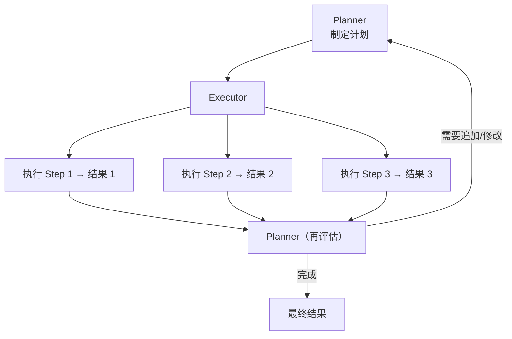
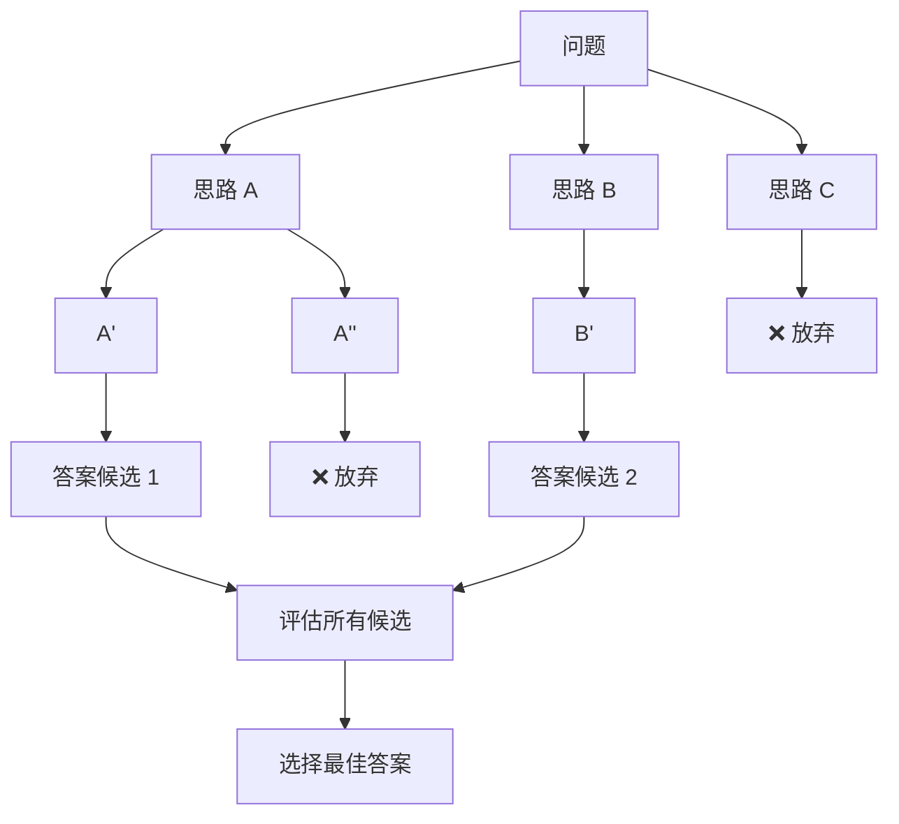

## 为什么 Agent 需要 Planning？

ReAct 模式是"边想边做"，适合简单任务。但面对复杂任务时，先制定计划再执行更高效。

类比：要装修一套房子，你不会直接拿起锤子开干——你需要先画设计图、列材料清单、排工期。Planning 就是 Agent 的"施工计划"。

```
ReAct (边想边做):          Planning (先规划再执行):
  想 → 做                   1. 分析任务
  想 → 做                   2. 制定计划
  想 → 做                   3. 按计划逐步执行
  想 → 做                   4. 根据执行结果调整计划
  ...                       5. 完成

适合: 3-5 步的简单任务       适合: 需要 10+ 步的复杂任务
```

## 任务分解（Task Decomposition）

把复杂任务拆分为可管理的子任务，是 Planning 的第一步。

```
复杂任务: "帮我分析公司上季度的销售数据，生成报告并发送给团队"

分解结果:
├── 1. 获取数据
│   ├── 1.1 连接数据库
│   ├── 1.2 查询上季度销售记录
│   └── 1.3 数据清洗
├── 2. 分析数据
│   ├── 2.1 计算关键指标（总额、增长率、TOP 产品）
│   ├── 2.2 同比/环比对比
│   └── 2.3 异常检测
├── 3. 生成报告
│   ├── 3.1 创建图表
│   ├── 3.2 撰写分析摘要
│   └── 3.3 格式化为 PDF
└── 4. 发送报告
    ├── 4.1 获取团队成员邮件列表
    └── 4.2 发送邮件
```

## Plan-and-Execute 模式

将 Agent 分为 **Planner** 和 **Executor** 两个角色：



```python
def plan_and_execute(task: str, llm, tools: dict, max_replans: int = 3):
    """Plan-and-Execute Agent"""

    # Phase 1: 制定计划
    plan_prompt = f"""请为以下任务制定执行计划。
将任务分解为具体的、可执行的步骤。

任务: {task}

可用工具: {list(tools.keys())}

请以 JSON 格式输出计划:
[
  {{"step": 1, "action": "工具名", "input": "参数", "purpose": "目的"}},
  ...
]
"""
    plan = llm.chat(plan_prompt)
    steps = parse_json(plan)

    results = []

    # Phase 2: 逐步执行
    for step in steps:
        print(f"执行 Step {step['step']}: {step['purpose']}")

        if step["action"] in tools:
            result = tools[step["action"]](step["input"])
        else:
            result = llm.chat(f"请完成: {step['purpose']}")

        results.append({"step": step["step"], "result": result})

    # Phase 3: 评估是否需要追加步骤
    eval_prompt = f"""
原始任务: {task}
执行计划和结果:
{format_results(results)}

任务是否已完成？如果需要追加步骤，请列出。
如果已完成，请输出 "COMPLETE" 和最终答案。
"""
    evaluation = llm.chat(eval_prompt)

    if "COMPLETE" in evaluation:
        return evaluation
    else:
        # 动态重规划（见下节）
        return replan_and_execute(task, results, evaluation, llm, tools)
```

## Tree of Thought (ToT)

ToT 是一种探索多条推理路径的方法，由 Yao et al. (2023) 提出。



### ToT 的搜索策略

```
BFS（广度优先）:
  先展开所有第一层想法 → 评估 → 保留最好的
  → 展开第二层 → 评估 → ...
  适合: 每层选择较少的问题

DFS（深度优先）:
  深入探索一条路径到底 → 不行就回溯
  → 尝试另一条路径
  适合: 解空间大、需要深度推理的问题
```

ToT 的代价是成倍增加的 LLM 调用次数，通常用于高价值决策场景。

## 动态重规划

现实中计划很少完美执行——工具调用可能失败、新信息可能改变方向。动态重规划让 Agent 能够灵活应对。

```
原始计划:
  Step 1: 搜索产品评价  ✓ 完成
  Step 2: 访问官网      ✗ 网站 503 错误
  Step 3: 生成报告      ？等待

动态重规划:
  "Step 2 失败了，让我调整计划"
  Step 2': 搜索缓存页面或第三方评测
  Step 3:  基于已有信息生成报告（标注数据来源有限）
```

```python
def replan(original_plan, completed_steps, failed_step, error_info, llm):
    """当执行失败时动态重规划"""
    prompt = f"""
原始计划: {original_plan}
已完成步骤: {completed_steps}
失败步骤: {failed_step}
失败原因: {error_info}

请生成一个修订后的计划，考虑:
1. 已完成步骤的结果可以复用
2. 失败步骤需要替代方案
3. 后续步骤可能需要相应调整
"""
    return llm.chat(prompt)
```

## 面试常见问题

### Q1: Plan-and-Execute 和 ReAct 如何选择？

| 场景 | 推荐模式 |
|------|---------|
| 简单工具调用（1-3 步） | ReAct |
| 复杂多步任务 | Plan-and-Execute |
| 需要探索多种方案 | ToT |
| 不确定步骤数的开放任务 | ReAct + Reflection |

### Q2: 如何评估 Agent 的规划质量？

1. **完整性**：计划是否覆盖了所有必要步骤？
2. **可执行性**：每个步骤是否具体到可以直接执行？
3. **依赖关系**：步骤间的顺序是否合理？
4. **容错性**：是否考虑了失败场景？

### Q3: 规划粒度多细合适？

太粗的计划缺乏指导性，太细的计划缺乏灵活性。经验法则：每个步骤应该对应 1-2 次工具调用或 LLM 推理。

<details>
<summary>自测题 1：Plan-and-Execute 模式的主要优势是什么？</summary>

1) 全局视角：先看到完整任务再动手，避免遗漏步骤；2) 可追踪：每个步骤有明确目的，便于调试；3) 可并行：独立的子任务可以并行执行；4) 可复用：相似任务的计划模板可以复用。
</details>

<details>
<summary>自测题 2：Tree of Thought 相比标准 CoT 的代价是什么？</summary>

ToT 需要探索多条推理路径并对每条路径进行评估，导致 LLM 调用次数成倍增加。如果分支因子为 b、深度为 d，最坏情况下需要 O(b^d) 次调用。因此 ToT 通常只用于高价值场景，且需要设计好剪枝策略。
</details>

<details>
<summary>自测题 3：动态重规划在什么情况下会触发？</summary>

1) 工具调用失败（API 报错、超时）；2) 获取到的信息与预期不符；3) 发现了新的关键信息需要调整方向；4) 某个步骤的输出表明原计划不可行。好的 Agent 应该在每步执行后评估是否需要调整计划。
</details>

## 延伸阅读

- [Plan-and-Solve Prompting](https://arxiv.org/abs/2305.04091)
- [Tree of Thoughts: Deliberate Problem Solving](https://arxiv.org/abs/2305.10601)
- [LLMCompiler: An LLM Compiler for Parallel Function Calling](https://arxiv.org/abs/2312.04511)
