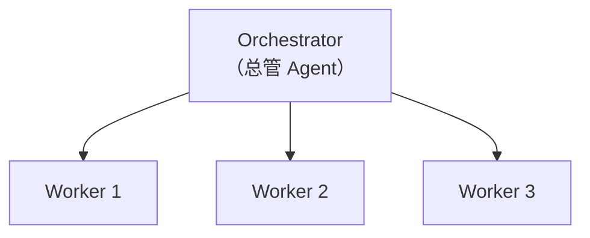
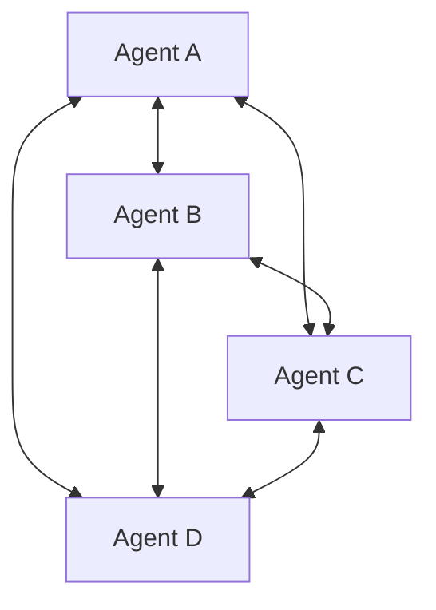
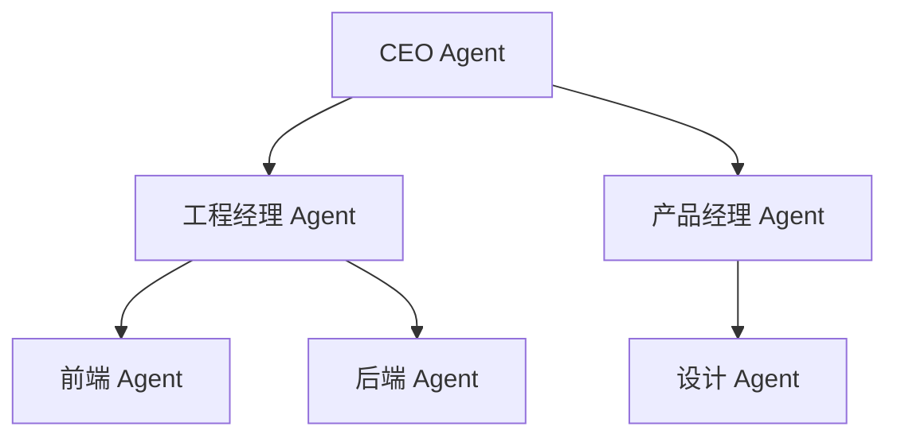
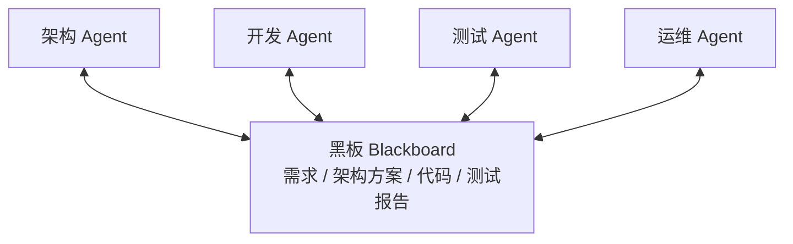
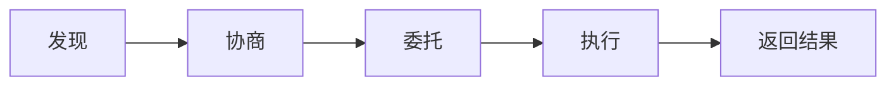

## 为什么需要多 Agent？

单个 Agent 面对复杂任务时会遇到瓶颈：

- **上下文窗口不够**：一个 Agent 难以同时处理所有信息
- **角色冲突**：一个人同时当产品经理、程序员和测试员，效果不好
- **错误放大**：单点推理链越长，错误累积越严重

多 Agent 系统的理念：**让专业的 Agent 做专业的事，通过协作完成复杂任务**。

类比：一个人独自装修整套房子 vs 请一支施工队（水电工、泥瓦匠、木工各司其职）。

<div style="display:flex;gap:2rem;justify-content:center;margin:1.5rem 0;flex-wrap:wrap;">
  <div style="border:2px solid #888;border-radius:12px;padding:1.2rem 1.5rem;min-width:180px;">
    <div style="font-weight:bold;margin-bottom:.5rem;">单 Agent</div>
    <div style="font-size:.9rem;">一个 Agent 负责所有事：分析需求、写代码、测试、部署…</div>
  </div>
  <div style="display:flex;align-items:center;color:#888;font-size:1.5rem;">→</div>
  <div style="border:2px solid #60a5fa;border-radius:12px;padding:1.2rem 1.5rem;min-width:180px;">
    <div style="font-weight:bold;margin-bottom:.5rem;color:#60a5fa;">多 Agent</div>
    <div style="font-size:.9rem;">协调者分配任务给专业 Agent：<br/>分析 Agent / 编码 Agent / 测试 Agent<br/>各自专注自己的领域</div>
  </div>
</div>

## 协作模式

### 1. 中心化（Orchestrator）

一个"总管" Agent 协调所有工作 Agent。



优点: 控制流清晰，易于调试
缺点: 总管是单点瓶颈，扩展性有限
适用: 大多数生产场景

### 2. 去中心化（Peer-to-Peer）

Agent 之间平等通信，无中心节点。



优点: 无单点故障，可扩展
缺点: 通信复杂，难以追踪，可能死循环
适用: 需要高可用的分布式系统

### 3. 层级式（Hierarchical）

多级管理结构，类似公司组织架构。



优点: 分层授权，任务分解自然
缺点: 层级过多增加延迟
适用: 大型复杂项目

## 通信模式

### 共享状态（Shared State）

所有 Agent 读写同一个状态存储。

```python
# 共享状态示例
shared_state = {
    "task": "构建一个 TODO 应用",
    "requirements": [...],     # 产品 Agent 写入
    "code": {...},             # 开发 Agent 写入
    "test_results": [...],     # 测试 Agent 写入
    "status": "in_progress",
}

# 每个 Agent 读取并更新共享状态
def developer_agent(state):
    requirements = state["requirements"]
    code = generate_code(requirements)
    state["code"] = code
    state["status"] = "ready_for_testing"
    return state
```

### 消息传递（Message Passing）

Agent 之间通过消息直接通信。

```python
# 消息传递示例
class Message:
    sender: str
    receiver: str
    content: str
    msg_type: str  # "request", "response", "broadcast"

# Agent A 发送消息给 Agent B
msg = Message(
    sender="planner",
    receiver="coder",
    content="请实现用户认证模块，使用 JWT",
    msg_type="request",
)
agent_b.receive(msg)
```

### 黑板模式（Blackboard）

所有 Agent 共享一个"黑板"，各自在上面读写信息。



## A2A 协议简介

**A2A（Agent-to-Agent Protocol）** 是 Google 在 2025 年提出的开放协议，旨在标准化不同 Agent 之间的通信。

### 核心概念

<div style="border:2px solid #a78bfa;border-radius:12px;padding:1.2rem 1.5rem;margin:1.5rem 0;">
  <div style="font-weight:bold;color:#a78bfa;margin-bottom:.8rem;">A2A 协议核心概念</div>
  <div style="display:grid;grid-template-columns:auto 1fr;gap:.3rem 1rem;font-size:.9rem;">
    <strong>Agent Card</strong><span>Agent 的"名片"，描述能力</span>
    <strong>Task</strong><span>Agent 之间交换的工作单元</span>
    <strong>Message</strong><span>任务中的通信消息</span>
    <strong>Artifact</strong><span>任务产出的结果物</span>
  </div>
</div>



A2A 解决的问题：
- 不同框架构建的 Agent 如何互相调用？
- 如何发现哪些 Agent 可以帮忙完成某个任务？
- 如何标准化任务委托和结果返回？

A2A 与 MCP（Model Context Protocol）是互补关系：MCP 解决 Agent 与工具/数据的连接，A2A 解决 Agent 与 Agent 的连接。

## 主流框架中的多 Agent 实现

### LangGraph

```python
# LangGraph 多 Agent 示例（简化版）
from langgraph.graph import StateGraph

def researcher(state):
    """研究员 Agent：搜索信息"""
    result = search_tool(state["query"])
    return {"research": result}

def writer(state):
    """写手 Agent：撰写内容"""
    content = llm.chat(f"基于以下研究写一篇文章:\n{state['research']}")
    return {"draft": content}

def reviewer(state):
    """审稿 Agent：审核内容"""
    feedback = llm.chat(f"请审核这篇文章:\n{state['draft']}")
    return {"feedback": feedback}

# 构建工作流
graph = StateGraph()
graph.add_node("researcher", researcher)
graph.add_node("writer", writer)
graph.add_node("reviewer", reviewer)
graph.add_edge("researcher", "writer")
graph.add_edge("writer", "reviewer")
```

### CrewAI

```python
# CrewAI 示例
from crewai import Agent, Task, Crew

researcher = Agent(
    role="研究员",
    goal="深入研究给定主题",
    backstory="你是一名资深研究员...",
)

writer = Agent(
    role="技术写手",
    goal="将研究成果写成易懂的文章",
    backstory="你是一名技术博客作者...",
)

research_task = Task(description="研究 AI Agent 最新进展", agent=researcher)
write_task = Task(description="撰写研究报告", agent=writer)

crew = Crew(agents=[researcher, writer], tasks=[research_task, write_task])
result = crew.kickoff()
```

### Autogen

微软的多 Agent 框架，强调**对话驱动**的协作。Agent 之间通过对话交流，支持人类参与讨论。

<details>
<summary>自测题 1：中心化和去中心化协作模式各自适合什么场景？</summary>

中心化适合大多数生产场景，因为控制流清晰、易于调试和监控。去中心化适合需要高可用和水平扩展的场景，如分布式任务处理。但去中心化的复杂性高，容易出现死循环或消息风暴，需要额外的协调机制。
</details>

<details>
<summary>自测题 2：A2A 和 MCP 的区别是什么？</summary>

MCP（Model Context Protocol）解决的是 Agent 与外部工具和数据源的连接问题——让 Agent 能调用搜索引擎、数据库等工具。A2A（Agent-to-Agent Protocol）解决的是 Agent 之间的互操作问题——让不同框架构建的 Agent 能够发现彼此、委托任务、交换结果。两者互补。
</details>

<details>
<summary>自测题 3：多 Agent 系统的主要挑战有哪些？</summary>

1) 通信开销：Agent 间的消息传递增加延迟和成本；2) 一致性：共享状态的并发访问可能导致冲突；3) 调试困难：分布式系统的问题难以复现和定位；4) 错误传播：一个 Agent 的错误输出可能误导其他 Agent；5) 过度工程：很多任务不需要多 Agent，单 Agent 就够了。
</details>

## 延伸阅读

- [Google A2A Protocol](https://github.com/google/A2A)
- [LangGraph Multi-Agent 文档](https://langchain-ai.github.io/langgraph/)
- [CrewAI 框架](https://github.com/crewAIInc/crewAI)
- [Autogen: Enabling Next-Gen LLM Applications](https://arxiv.org/abs/2308.08155)
