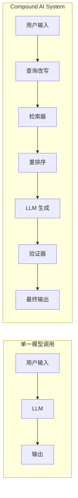
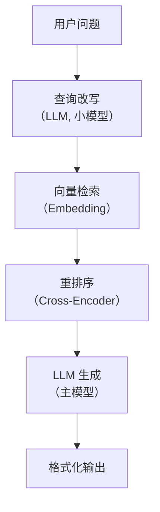

## Compound AI Systems 定义

**Compound AI Systems（复合 AI 系统）** 是 Berkeley 的 Zaharia 等人在 2024 年提出的概念：通过组合多个组件（LLM 调用、检索器、代码执行器、验证器等）来构建 AI 系统，而非依赖单一的模型调用。

类比：单一模型调用就像一个全能选手独自比赛，Compound AI 就像一支接力队——每个环节由最擅长的选手负责。



## 与单一模型调用的区别

| 维度 | 单一模型调用 | Compound AI System |
|------|------------|-------------------|
| 架构 | 单次 LLM 调用 | 多组件流水线 |
| 可控性 | 低（黑盒） | 高（每个组件可调） |
| 可观测性 | 只看最终输出 | 可监控每个组件 |
| 成本优化 | 用更大的模型 | 用更小的模型 + 智能组合 |
| 错误处理 | 靠 Prompt 改进 | 可以在组件间加验证 |
| 知识更新 | 重新训练/微调 | 更新检索器的数据源 |

### 为什么 Compound AI 越来越重要？

1. **模型能力有天花板**：单纯靠扩大模型参数的收益在递减
2. **系统化思维**：实际应用需要检索、验证、格式化等多个步骤
3. **成本效益**：小模型 + 好的系统设计可以超越大模型的单次调用
4. **可控性**：生产环境需要可监控、可调试、可回滚

## 典型架构示例

### RAG 作为 Compound AI System



### 带验证的代码生成系统

```
用户需求 → LLM 生成代码 → 语法检查 → 运行测试
              ↑                          │
              └── 不通过时反馈修改 ←───────┘
```

## DSPy 框架简介

**DSPy** 是 Stanford NLP 组开发的框架，将 Compound AI System 的构建**程序化**，用代码而非手写 Prompt 来定义 AI 系统。

### 核心理念

```
传统方式:
  手动写 Prompt → 手动调试 → 手动优化
  (脆弱、不可复现、难以维护)

DSPy 方式:
  定义签名(Signature) → 组合模块(Module) → 自动优化(Optimizer)
  (程序化、可复现、自动调优)
```

### 基本用法

```python
import dspy

# 1. 定义签名：声明输入和输出
class GenerateAnswer(dspy.Signature):
    """基于上下文回答问题"""
    context = dspy.InputField(desc="相关文档")
    question = dspy.InputField(desc="用户问题")
    answer = dspy.OutputField(desc="简洁准确的答案")

# 2. 构建模块：组合多个组件
class RAG(dspy.Module):
    def __init__(self):
        self.retrieve = dspy.Retrieve(k=3)  # 检索组件
        self.generate = dspy.ChainOfThought(GenerateAnswer)  # 生成组件

    def forward(self, question):
        context = self.retrieve(question).passages
        answer = self.generate(context=context, question=question)
        return answer

# 3. 编译优化：自动调优 Prompt 和参数
from dspy.teleprompt import BootstrapFewShot

optimizer = BootstrapFewShot(metric=my_metric)
optimized_rag = optimizer.compile(RAG(), trainset=my_train_data)

# 使用优化后的系统
result = optimized_rag("什么是 Compound AI？")
```

### DSPy 的关键概念

```
Signature:  定义输入/输出的"接口"
Module:     可组合的处理单元（类似 PyTorch 的 nn.Module）
Optimizer:  自动搜索最佳 Prompt 和示例
Metric:     评估输出质量的函数
```

DSPy 的核心价值：**把 Prompt Engineering 从手工艺变成工程**。

## 模块化组合的优势

### 1. 独立优化

每个组件可以单独改进，不影响其他部分。

```
检索效果不好？ → 只换检索器（如 BM25 → 向量检索）
生成质量不好？ → 只调 LLM（如换模型或改 Prompt）
格式不对？     → 只改输出格式化组件
```

### 2. 成本优化

不同组件可以用不同等级的模型。

```
查询改写:  用小模型 (便宜、快速)
主生成:    用大模型 (质量保证)
验证:      用规则或小模型
```

### 3. 可测试性

每个组件可以独立编写单元测试。

```python
# 单独测试检索器
def test_retriever():
    results = retriever.search("什么是 RAG？")
    assert len(results) > 0
    assert "检索增强生成" in results[0].text

# 单独测试重排序器
def test_reranker():
    docs = [doc_relevant, doc_irrelevant]
    ranked = reranker.rank(query, docs)
    assert ranked[0] == doc_relevant
```

## 何时用 Compound AI vs 单 Agent

```
选择 Compound AI 当:
  ✓ 任务流程相对固定
  ✓ 需要高可靠性和可观测性
  ✓ 需要精细的成本控制
  ✓ 有明确的质量评估标准
  例: RAG 系统、数据处理管道、内容审核

选择单 Agent 当:
  ✓ 任务开放性强，步骤不确定
  ✓ 需要动态决策和工具选择
  ✓ 人机交互场景
  例: 个人助手、代码调试、开放问答

两者结合:
  Agent 作为编排器，内部调用 Compound AI 组件
  例: Agent 决定使用 RAG 检索 → 调用优化过的 RAG pipeline
```

<details>
<summary>自测题 1：Compound AI System 相比单一大模型调用的核心优势是什么？</summary>

核心优势是可控性和可优化性。每个组件可以独立监控、调试、替换和优化，而不是把所有希望寄托在一个大模型上。此外，可以针对不同组件使用不同成本的模型，实现整体成本优化。
</details>

<details>
<summary>自测题 2：DSPy 解决了 Prompt Engineering 的什么问题？</summary>

DSPy 解决了 Prompt Engineering 的不可复现和手动调优问题。传统方式需要人工反复修改 Prompt，过程不可复现且难以系统化优化。DSPy 将 Prompt 视为可优化的参数，通过 Optimizer 基于评估指标自动搜索最佳 Prompt 和 Few-shot 示例。
</details>

<details>
<summary>自测题 3：一个 RAG 系统中有哪些组件可以独立优化？</summary>

1) 查询改写器：优化搜索查询；2) 检索器：更换检索算法或模型；3) 重排序器：提高相关性排序质量；4) 文档分块策略：调整 chunk size 和重叠；5) LLM 生成器：更换模型或优化 Prompt；6) 输出格式化：调整答案格式和引用方式。每个环节的改进都可以独立评估效果。
</details>

## 延伸阅读

- [The Shift from Models to Compound AI Systems — Berkeley Blog](https://bair.berkeley.edu/blog/2024/02/18/compound-ai-systems/)
- [DSPy: Compiling Declarative Language Model Calls](https://arxiv.org/abs/2310.03714)
- [DSPy GitHub](https://github.com/stanfordnlp/dspy)
- [STORM: Synthesis of Topic Outlines through Retrieval and Multi-perspective Question Asking](https://arxiv.org/abs/2402.14207)
