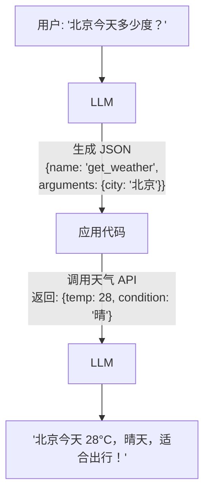

## 什么是 Function Calling

想象一下：你问一个百科全书式的学者「今天北京天气怎么样？」，他知识渊博但**无法联网查天气**。Function Calling 就是给这位学者配了一部电话——他虽然不能亲自查天气，但可以**写一张纸条**告诉助手去查，助手查到后把结果念给他，他再组织语言回答你。

Function Calling（也叫 Tool Use）是 LLM 与外部世界交互的核心机制。LLM 本身只能生成文本，但通过 Function Calling，它可以：

- 查询实时数据（天气、股价、数据库）
- 执行操作（发邮件、创建日历事件）
- 调用计算工具（计算器、代码执行器）

## LLM 如何"调用"函数

关键认知：**LLM 并不真正执行函数**。它做的事情是生成一段结构化的 JSON，告诉调用方「我想调用某个函数，参数是这些」。实际的函数执行发生在你的应用代码中。



## OpenAI Function Calling vs Claude Tool Use

两者理念相同，但 API 设计有差异：

| 维度 | OpenAI Function Calling | Claude Tool Use |
|------|------------------------|-----------------|
| 工具定义位置 | `tools` 参数 | `tools` 参数 |
| Schema 格式 | JSON Schema | JSON Schema |
| 响应格式 | `tool_calls` 数组 | `tool_use` content block |
| 并行调用 | 支持（一次返回多个） | 支持 |
| 强制调用 | `tool_choice: "required"` | `tool_choice: {"type": "any"}` |
| 结果回传 | `role: "tool"` 消息 | `tool_result` content block |

核心区别在于消息结构：OpenAI 使用独立的 `tool` role 消息回传结果，Claude 将工具结果嵌套在 `user` 消息的 content block 中。

## 代码示例：一个简单的 Function Calling

以 OpenAI 格式为例，实现一个查询天气的 Function Calling：

```python
from openai import OpenAI

client = OpenAI()

# 1. 定义工具
tools = [
    {
        "type": "function",
        "function": {
            "name": "get_weather",
            "description": "获取指定城市的当前天气信息",
            "parameters": {
                "type": "object",
                "properties": {
                    "city": {
                        "type": "string",
                        "description": "城市名称，如 '北京'、'上海'"
                    }
                },
                "required": ["city"]
            }
        }
    }
]

# 2. 发送请求
response = client.chat.completions.create(
    model="gpt-4o",
    messages=[{"role": "user", "content": "北京今天天气怎么样？"}],
    tools=tools,
)

# 3. 检查是否有工具调用
message = response.choices[0].message
if message.tool_calls:
    tool_call = message.tool_calls[0]
    print(f"LLM 想调用: {tool_call.function.name}")
    print(f"参数: {tool_call.function.arguments}")

    # 4. 执行函数（这里用模拟数据）
    result = '{"temp": 28, "condition": "晴", "humidity": 45}'

    # 5. 将结果回传给 LLM
    final_response = client.chat.completions.create(
        model="gpt-4o",
        messages=[
            {"role": "user", "content": "北京今天天气怎么样？"},
            message,  # 包含 tool_calls 的 assistant 消息
            {
                "role": "tool",
                "tool_call_id": tool_call.id,
                "content": result,
            },
        ],
        tools=tools,
    )
    print(final_response.choices[0].message.content)
```

## 常见误区

1. **LLM 不执行代码** —— 它只是生成调用意图，执行在你的代码里
2. **Function Calling 不是 100% 可靠** —— LLM 可能选错工具或生成无效参数
3. **工具描述至关重要** —— 描述不清楚，LLM 就不知道何时该用这个工具

## 常见陷阱

在实际项目中，Function Calling 容易踩的坑远比想象的多：

1. **工具描述质量 > 一切** —— 很多人花大量时间优化 prompt，却忽略了工具的 `description`。LLM 选错工具的 80% 原因是描述写得模糊。应包含：做什么、何时用、参数示例。
2. **返回值过大导致上下文爆炸** —— 如果工具返回一个 10 万字的数据库查询结果，会挤占 LLM 的上下文窗口。应在工具层做截断或分页。
3. **缺少错误处理** —— 工具调用失败时，应返回结构化的错误信息（如 `{"error": "城市名无效"}`），而不是抛异常或返回空值。LLM 需要理解错误才能自我纠正。
4. **忽略工具调用的确认环节** —— 对于有副作用的操作（如发邮件、下单），应加一层人工确认，而不是让 LLM 直接执行。
5. **工具名称冲突或语义重叠** —— 当有 `search_products` 和 `find_items` 两个功能相似的工具时，LLM 会困惑。工具之间应有明确的职责边界。

:::tip[与其他章节的关联]
Function Calling 是 Agent 使用工具的底层机制。在 [第 2 章：ReAct 模式](/02-agent-patterns/02-react/) 中，Agent 通过 Thought → Action → Observation 循环反复调用工具，而每一次 Action 的实质就是一次 Function Calling。理解了 Function Calling，就理解了 Agent 的"手"。
:::

---

<div style="border-left:4px solid #60a5fa;padding:.8rem 1.2rem;margin:.8rem 0;background:rgba(255,255,255,0.03);border-radius:0 8px 8px 0;">
  <details>
    <summary style="font-weight:bold;color:#60a5fa;cursor:pointer;">自测题 1：Function Calling 中，LLM 实际做了什么？</summary>
    <div style="margin-top:.8rem;font-size:.9rem;">
      LLM 生成结构化的 JSON（函数名 + 参数），而不是真正执行函数。它更像是一个"指挥官"——告诉你的应用代码该调用什么、传什么参数，但自己不动手。
    </div>
  </details>
</div>

<div style="border-left:4px solid #60a5fa;padding:.8rem 1.2rem;margin:.8rem 0;background:rgba(255,255,255,0.03);border-radius:0 8px 8px 0;">
  <details>
    <summary style="font-weight:bold;color:#60a5fa;cursor:pointer;">自测题 2：OpenAI 和 Claude 在工具结果回传上有什么区别？</summary>
    <div style="margin-top:.8rem;font-size:.9rem;">
      OpenAI 使用独立的 <code>role: "tool"</code> 消息回传结果，Claude 将 <code>tool_result</code> 嵌套在 <code>user</code> 消息的 content block 中。这意味着在 Claude 的 API 中，工具结果是用户消息的一部分，而在 OpenAI 中是一个独立的消息角色。
    </div>
  </details>
</div>

<div style="border-left:4px solid #60a5fa;padding:.8rem 1.2rem;margin:.8rem 0;background:rgba(255,255,255,0.03);border-radius:0 8px 8px 0;">
  <details>
    <summary style="font-weight:bold;color:#60a5fa;cursor:pointer;">自测题 3：为什么说工具描述比工具名称更重要？</summary>
    <div style="margin-top:.8rem;font-size:.9rem;">
      LLM 依赖 description 来理解工具的用途、适用场景和使用时机，name 只是标识符。类比：你去一家餐厅，菜名叫"狮子头"你未必知道是什么，但如果描述写了"红烧大肉丸，肥瘦相间，口感鲜嫩"，你立刻就知道要不要点。
    </div>
  </details>
</div>

## 延伸阅读

- [OpenAI Function Calling 文档](https://platform.openai.com/docs/guides/function-calling)
- [Anthropic Tool Use 文档](https://docs.anthropic.com/en/docs/build-with-claude/tool-use/overview)
- [Function Calling 最佳实践 (OpenAI Cookbook)](https://cookbook.openai.com/examples/how_to_call_functions_with_chat_models)
