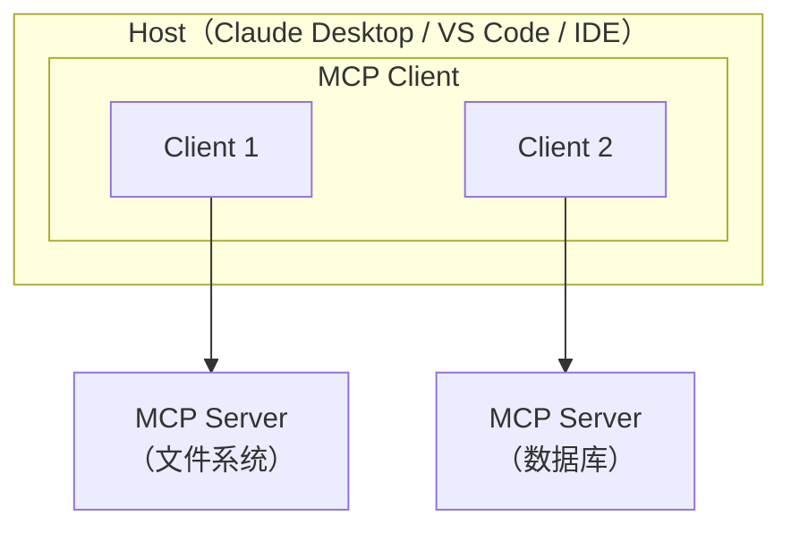

## MCP 是什么

MCP (Model Context Protocol) 是 Anthropic 于 2024 年底推出的开放协议，目标是**标准化 LLM 应用与外部数据源/工具之间的通信**。

打个比方：在 MCP 出现之前，每个 AI 应用想接入一个新工具（比如数据库、日历、文件系统），都要写一套自定义的集成代码。这就像每个电器都用不同的插头——MCP 就是那个「统一插座标准」。

```
Before MCP:                    After MCP:
┌─────┐  自定义协议  ┌──────┐   ┌─────┐            ┌──────┐
│App A│─────────────│Tool 1│   │App A│            │Tool 1│
└─────┘             └──────┘   │App B│──── MCP ───│Tool 2│
┌─────┐  另一套协议  ┌──────┐   │App C│            │Tool 3│
│App B│─────────────│Tool 2│   └─────┘            └──────┘
└─────┘             └──────┘    N 个 App × 1 协议  M 个 Tool
N × M 种集成
```

## 为什么需要标准化协议

1. **减少重复开发** —— 工具开发者写一次 MCP Server，所有支持 MCP 的客户端都能用
2. **生态共享** —— 社区开发的 MCP Server 可以直接复用
3. **关注点分离** —— AI 应用专注于用户体验，工具专注于能力实现

## MCP 架构

MCP 采用 Client-Server 架构，包含三个核心角色：



- **Host**：终端用户使用的应用程序，负责管理 MCP Client 实例
- **Client**：在 Host 内部，与 MCP Server 建立一对一连接
- **Server**：暴露工具 (Tools)、资源 (Resources)、提示模板 (Prompts) 给 Client

MCP Server 可以提供三种能力：

| 能力 | 说明 | 示例 |
|------|------|------|
| **Tools** | 可执行的操作 | 查询数据库、发送邮件 |
| **Resources** | 可读取的数据 | 文件内容、API 响应 |
| **Prompts** | 预定义的提示模板 | 代码审查模板、翻译模板 |

## Transport 层

MCP 支持三种传输方式：

```
┌──────────────────────────────────────────────────┐
│              Transport 对比                       │
├──────────┬──────────────┬────────────────────────┤
│  stdio   │ 本地进程通信   │ Server 作为子进程运行    │
│          │ 最简单        │ 适合本地工具             │
├──────────┼──────────────┼────────────────────────┤
│  SSE     │ HTTP 长连接    │ Server-Sent Events     │
│          │ 单向流        │ 已逐步被替代             │
├──────────┼──────────────┼────────────────────────┤
│Streamable│ HTTP 双向流    │ 2025 新增               │
│  HTTP    │ 最灵活        │ 推荐用于远程 Server      │
└──────────┴──────────────┴────────────────────────┘
```

- **stdio**：最常用，Server 以子进程启动，通过 stdin/stdout 通信。适合本地工具
- **Streamable HTTP**：2025 年新增，替代 SSE，支持远程部署的 MCP Server

## MCP 生态现状（2025-2026）

- **客户端支持**：Claude Desktop、Claude Code、VS Code (Copilot)、Cursor、Windsurf 等主流 AI 编程工具
- **官方 Server**：Anthropic 提供了 filesystem、GitHub、Slack、Google Drive 等参考实现
- **社区生态**：数千个社区 MCP Server 覆盖数据库、云服务、开发工具等
- **企业采用**：越来越多企业将内部系统封装为 MCP Server

## 如何写一个 MCP Server

以 Python 为例，使用官方 SDK 创建一个简单的计算器 MCP Server：

```python
from mcp.server.fastmcp import FastMCP

# 创建 MCP Server 实例
mcp = FastMCP("Calculator")

@mcp.tool()
def add(a: float, b: float) -> float:
    """将两个数字相加。当用户需要做加法运算时使用此工具。"""
    return a + b

@mcp.tool()
def multiply(a: float, b: float) -> float:
    """将两个数字相乘。当用户需要做乘法运算时使用此工具。"""
    return a * b

@mcp.resource("config://version")
def get_version() -> str:
    """返回计算器版本号"""
    return "1.0.0"

# 启动 Server（默认使用 stdio transport）
if __name__ == "__main__":
    mcp.run()
```

安装与配置：

```bash
# 安装 MCP SDK
pip install mcp

# 在 Claude Desktop 配置中添加（claude_desktop_config.json）
# {
#   "mcpServers": {
#     "calculator": {
#       "command": "python",
#       "args": ["path/to/calculator_server.py"]
#     }
#   }
# }
```

---

<details>
<summary><strong>自测题</strong></summary>

1. **MCP 中 Host、Client、Server 分别是什么角色？**
   - 答：Host 是用户使用的应用（如 Claude Desktop），Client 是 Host 内部管理与 Server 通信的组件，Server 是提供工具/资源/提示的外部服务。

2. **stdio 和 Streamable HTTP 两种 Transport 各适用什么场景？**
   - 答：stdio 适合本地工具（Server 作为子进程），Streamable HTTP 适合远程部署的 Server。

3. **MCP Server 的三种能力是什么？**
   - 答：Tools（可执行操作）、Resources（可读取数据）、Prompts（提示模板）。

</details>

## 延伸阅读

- [MCP 官方规范](https://modelcontextprotocol.io/)
- [MCP Python SDK](https://github.com/modelcontextprotocol/python-sdk)
- [MCP TypeScript SDK](https://github.com/modelcontextprotocol/typescript-sdk)
- [Awesome MCP Servers](https://github.com/punkpeye/awesome-mcp-servers)
