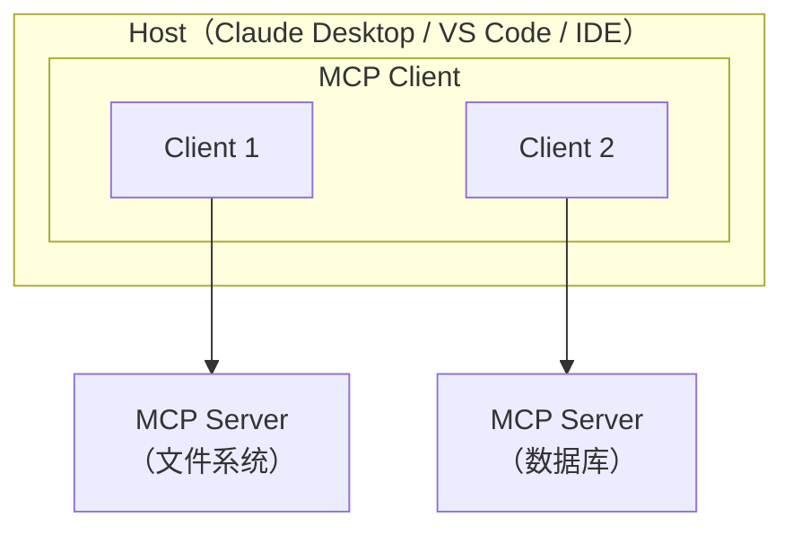

## MCP 是什么

MCP (Model Context Protocol) 是 Anthropic 于 2024 年底推出的开放协议，目标是**标准化 LLM 应用与外部数据源/工具之间的通信**。

打个比方：在 MCP 出现之前，每个 AI 应用想接入一个新工具（比如数据库、日历、文件系统），都要写一套自定义的集成代码。这就像每个电器都用不同的插头——MCP 就是那个「统一插座标准」。

<div style="display:flex;gap:2rem;justify-content:center;margin:1.5rem 0;flex-wrap:wrap;">
  <div style="border:2px solid #ef4444;border-radius:12px;padding:1.2rem 1.5rem;min-width:200px;">
    <div style="font-weight:bold;color:#ef4444;margin-bottom:.5rem;">Before MCP</div>
    <div style="font-size:.9rem;">App A ⟷ 自定义协议 ⟷ Tool 1<br/>App B ⟷ 另一套协议 ⟷ Tool 2<br/><strong>N × M 种集成</strong></div>
  </div>
  <div style="border:2px solid #22c55e;border-radius:12px;padding:1.2rem 1.5rem;min-width:200px;">
    <div style="font-weight:bold;color:#22c55e;margin-bottom:.5rem;">After MCP</div>
    <div style="font-size:.9rem;">App A / B / C ⟷ <strong>MCP</strong> ⟷ Tool 1 / 2 / 3<br/><strong>N × 1 协议</strong></div>
  </div>
</div>

## 为什么需要标准化协议

MCP 解决的不只是技术问题，更是**生态问题**。在 MCP 出现之前，AI 工具集成是碎片化的：每个 AI 应用需要为每个工具写定制代码，工具开发者也需要为每个平台做适配。这造成了巨大的重复劳动和生态割裂。

MCP 的意义在于：就像 USB 统一了外设接口、HTTP 统一了 Web 通信，MCP 正在统一 AI 应用与工具之间的通信标准。一旦形成标准，**网络效应**就会发挥作用——越多客户端支持 MCP，就有越多开发者愿意写 MCP Server；反之亦然。

1. **减少重复开发** —— 工具开发者写一次 MCP Server，所有支持 MCP 的客户端都能用
2. **生态共享** —— 社区开发的 MCP Server 可以直接复用
3. **关注点分离** —— AI 应用专注于用户体验，工具专注于能力实现

## MCP 架构

MCP 采用 Client-Server 架构，包含三个核心角色：



- **Host**：终端用户使用的应用程序，负责管理 MCP Client 实例
- **Client**：在 Host 内部，与 MCP Server 建立一对一连接
- **Server**：暴露工具 (Tools)、资源 (Resources)、提示模板 (Prompts) 给 Client

MCP Server 可以提供三种能力：

| 能力 | 说明 | 示例 |
|------|------|------|
| **Tools** | 可执行的操作 | 查询数据库、发送邮件 |
| **Resources** | 可读取的数据 | 文件内容、API 响应 |
| **Prompts** | 预定义的提示模板 | 代码审查模板、翻译模板 |

## Transport 层

MCP 支持三种传输方式：

```
┌──────────────────────────────────────────────────┐
│              Transport 对比                       │
├──────────┬──────────────┬────────────────────────┤
│  stdio   │ 本地进程通信   │ Server 作为子进程运行    │
│          │ 最简单        │ 适合本地工具             │
├──────────┼──────────────┼────────────────────────┤
│  SSE     │ HTTP 长连接    │ Server-Sent Events     │
│          │ 单向流        │ 已逐步被替代             │
├──────────┼──────────────┼────────────────────────┤
│Streamable│ HTTP 双向流    │ 2025 新增               │
│  HTTP    │ 最灵活        │ 推荐用于远程 Server      │
└──────────┴──────────────┴────────────────────────┘
```

- **stdio**：最常用，Server 以子进程启动，通过 stdin/stdout 通信。适合本地工具
- **Streamable HTTP**：2025 年新增，替代 SSE，支持远程部署的 MCP Server

:::note[术语：stdio]
stdio 是 standard input/output（标准输入输出）的缩写，是操作系统中进程间通信的最基本方式。一个程序通过 stdin 接收输入、通过 stdout 输出结果。在 MCP 中，Host 启动 Server 作为子进程，然后通过 stdin/stdout 管道与其通信，无需网络连接，简单高效。
:::

:::note[术语：SSE (Server-Sent Events)]
SSE 是一种基于 HTTP 的单向流技术：服务端可以持续向客户端推送数据，但客户端只能通过普通 HTTP 请求发消息给服务端。在 MCP 早期版本中用于远程 Server 通信，现已被更灵活的 Streamable HTTP 替代。
:::

## MCP 生态现状（2025-2026）

- **客户端支持**：Claude Desktop、Claude Code、VS Code (Copilot)、Cursor、Windsurf 等主流 AI 编程工具
- **官方 Server**：Anthropic 提供了 filesystem、GitHub、Slack、Google Drive 等参考实现
- **社区生态**：数千个社区 MCP Server 覆盖数据库、云服务、开发工具等
- **企业采用**：越来越多企业将内部系统封装为 MCP Server

## 如何写一个 MCP Server

以 Python 为例，使用官方 SDK 创建一个简单的计算器 MCP Server：

```python
from mcp.server.fastmcp import FastMCP

# 创建 MCP Server 实例
mcp = FastMCP("Calculator")

@mcp.tool()
def add(a: float, b: float) -> float:
    """将两个数字相加。当用户需要做加法运算时使用此工具。"""
    return a + b

@mcp.tool()
def multiply(a: float, b: float) -> float:
    """将两个数字相乘。当用户需要做乘法运算时使用此工具。"""
    return a * b

@mcp.resource("config://version")
def get_version() -> str:
    """返回计算器版本号"""
    return "1.0.0"

# 启动 Server（默认使用 stdio transport）
if __name__ == "__main__":
    mcp.run()
```

:::tip[与其他章节的关联]
MCP 为多 Agent 系统提供了工具共享的基础设施。在 [第 2 章：Multi-Agent 模式](/02-agent-patterns/05-multi-agent/) 中，多个 Agent 需要访问共同的工具和数据源——MCP 让这些工具只需实现一次，所有 Agent 都能通过标准协议调用。
:::

安装与配置：

```bash
# 安装 MCP SDK
pip install mcp

# 在 Claude Desktop 配置中添加（claude_desktop_config.json）
# {
#   "mcpServers": {
#     "calculator": {
#       "command": "python",
#       "args": ["path/to/calculator_server.py"]
#     }
#   }
# }
```

---

<div class="card-quiz">
  <details>
    <summary>自测题 1：MCP 中 Host、Client、Server 分别是什么角色？</summary>
    <div class="answer">
      Host 是用户使用的应用（如 Claude Desktop），Client 是 Host 内部管理与 Server 通信的组件（每个 Server 对应一个 Client 实例），Server 是提供工具/资源/提示的外部服务。类比：Host 是办公室，Client 是办公室里的电话机，Server 是电话另一端的服务商。
    </div>
  </details>
</div>

<div class="card-quiz">
  <details>
    <summary>自测题 2：stdio 和 Streamable HTTP 两种 Transport 各适用什么场景？</summary>
    <div class="answer">
      stdio 适合本地工具（Server 作为子进程运行在同一台机器上，通过标准输入输出通信，零网络开销），Streamable HTTP 适合远程部署的 Server（需要跨网络通信，支持多客户端并发连接）。
    </div>
  </details>
</div>

<div class="card-quiz">
  <details>
    <summary>自测题 3：MCP Server 的三种能力是什么？</summary>
    <div class="answer">
      Tools（可执行操作，如查询数据库）、Resources（可读取数据，如文件内容）、Prompts（预定义提示模板，如代码审查模板）。三者分别对应"做事"、"读数据"、"给建议"。
    </div>
  </details>
</div>

## 延伸阅读

- [MCP 官方规范](https://modelcontextprotocol.io/)
- [MCP Python SDK](https://github.com/modelcontextprotocol/python-sdk)
- [MCP TypeScript SDK](https://github.com/modelcontextprotocol/typescript-sdk)
- [Awesome MCP Servers](https://github.com/punkpeye/awesome-mcp-servers)
