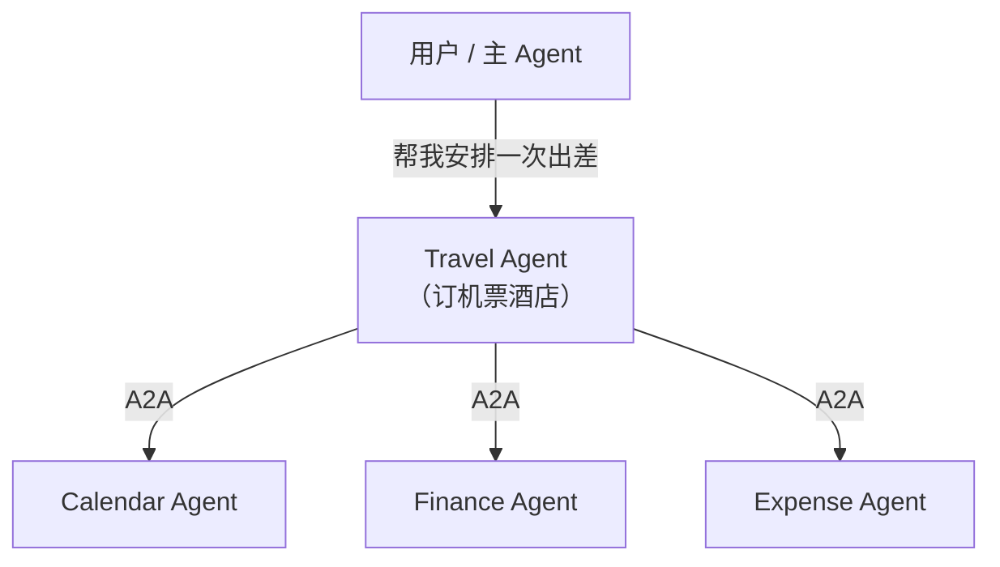

## A2A 协议背景

当你的 AI Agent 越来越强大时，一个自然的问题出现了：**不同的 Agent 之间如何协作？**

想象一个企业场景：HR Agent 需要招人，它要和 Finance Agent 确认预算、和 IT Agent 申请账号、和 Legal Agent 审核合同。这些 Agent 可能由不同团队、不同公司开发，运行在不同平台上。它们之间需要一种**通用语言**来沟通。

A2A (Agent-to-Agent Protocol) 就是为了解决这个问题而生的开放协议。

### 为什么跨组织协作是刚需

现实世界中，企业的 AI 系统不可能由单一供应商提供。一家公司可能用 Salesforce 的 CRM Agent、SAP 的 ERP Agent、自研的客服 Agent。这些系统要协作，就需要一个开放标准，就像不同银行之间需要 SWIFT 协议来转账一样。A2A 正是 Agent 世界的"SWIFT"。

## Google 2025 年提出的动机

Google 于 2025 年 4 月发布 A2A 协议，核心动机：

1. **Agent 孤岛问题** —— 各平台的 Agent 相互隔离，无法跨系统协作
2. **互操作性需求** —— 企业内部往往有多个 AI 系统，需要打通
3. **与 MCP 互补** —— MCP 解决了 Agent 与工具的连接，但没有解决 Agent 与 Agent 的连接



## Agent Card 概念

A2A 的核心创新是 **Agent Card** —— 一个 JSON 文件，描述 Agent 的身份和能力，类似于 API 的 OpenAPI 规范。

```json
{
  "name": "Travel Booking Agent",
  "description": "专门处理差旅预订，支持机票、酒店、租车",
  "url": "https://travel-agent.example.com",
  "version": "1.0.0",
  "capabilities": {
    "streaming": true,
    "pushNotifications": false
  },
  "skills": [
    {
      "id": "book_flight",
      "name": "预订机票",
      "description": "搜索并预订国内外机票",
      "tags": ["travel", "flight", "booking"]
    },
    {
      "id": "book_hotel",
      "name": "预订酒店",
      "description": "搜索并预订酒店住宿",
      "tags": ["travel", "hotel", "accommodation"]
    }
  ],
  "authentication": {
    "schemes": ["OAuth2"]
  }
}
```

Agent Card 通常托管在 `/.well-known/agent.json`，其他 Agent 可以通过这个标准路径发现并了解该 Agent 的能力。

## A2A vs MCP 的区别与互补

这是面试高频问题，务必理解清楚：

<div class="card-interview">
  <div class="question">Q: MCP 和 A2A 的核心区别是什么？能否只用其中一个？</div>
  <details>
    <summary>查看答案</summary>
    <div class="answer">MCP 解决 Agent 与工具的连接（"我要用螺丝刀"），A2A 解决 Agent 与 Agent 的协作（"我请同事帮忙"）。它们解决不同层面的问题，通常一起使用：Agent A 通过 A2A 委托任务给 Agent B，Agent B 内部通过 MCP 调用工具完成任务。只用 MCP 无法实现跨 Agent 协作，只用 A2A 则 Agent 没有工具可用。</div>
  </details>
</div>

<div style="display:flex;gap:2rem;justify-content:center;margin:1.5rem 0;flex-wrap:wrap;">
  <div style="border:2px solid #60a5fa;border-radius:12px;padding:1.2rem 1.5rem;min-width:200px;">
    <div style="font-weight:bold;color:#60a5fa;margin-bottom:.5rem;">MCP: Agent ↔ Tool</div>
    <div style="font-size:.9rem;">人与工具的关系<br/>"我要用螺丝刀拧螺丝"</div>
  </div>
  <div style="border:2px solid #a78bfa;border-radius:12px;padding:1.2rem 1.5rem;min-width:200px;">
    <div style="font-weight:bold;color:#a78bfa;margin-bottom:.5rem;">A2A: Agent ↔ Agent</div>
    <div style="font-size:.9rem;">人与人的协作关系<br/>"我请同事帮我完成一个任务"</div>
  </div>
</div>

| 维度 | MCP | A2A |
|------|-----|-----|
| 解决什么 | Agent 如何使用工具 | Agent 之间如何协作 |
| 通信模式 | 请求-响应（同步） | 任务生命周期（异步） |
| 发现机制 | 配置文件声明 | Agent Card (/.well-known/) |
| 任务模型 | 无（工具调用即时完成） | 有（submitted→working→done） |
| 提出者 | Anthropic (2024) | Google (2025) |
| 关系 | 互补，不竞争 | 互补，不竞争 |

**它们经常一起工作**：Agent A 通过 A2A 协议委托任务给 Agent B，而 Agent B 内部通过 MCP 调用各种工具来完成任务。

## 协议生态现状

A2A 于 2025 年发布，目前仍处于早期阶段：

- **支持者**：Google、Salesforce、SAP、Atlassian 等 50+ 公司参与
- **参考实现**：Google 提供了 Python 和 TypeScript 的 SDK
- **实际落地**：企业级应用场景正在探索中，社区生态仍在建设
- **与 MCP 并存**：业界共识是两者互补而非竞争，未来的 Agent 平台可能同时支持两种协议

:::tip[与其他章节的关联]
A2A 是 Multi-Agent 架构的通信基础。在 [第 2 章：Multi-Agent 模式](/02-agent-patterns/05-multi-agent/) 中讨论的多 Agent 协作模式（如 Orchestrator-Worker、Debate），当这些 Agent 跨越组织和平台边界时，就需要 A2A 这样的标准协议来实现互操作。
:::

---

<div class="card-quiz">
  <details>
    <summary>自测题 1：A2A 和 MCP 最核心的区别是什么？</summary>
    <div class="answer">
      MCP 解决 Agent 与工具的连接（使用工具），A2A 解决 Agent 与 Agent 的连接（委托任务）。一个是"人与工具"的关系，一个是"人与人"的协作关系。
    </div>
  </details>
</div>

<div class="card-quiz">
  <details>
    <summary>自测题 2：Agent Card 的作用是什么？类比现实中的什么？</summary>
    <div class="answer">
      Agent Card 描述 Agent 的身份和能力，类似于人的名片或 API 的 OpenAPI 规范。它托管在 <code>/.well-known/agent.json</code>，让其他 Agent 能够自动发现并了解该 Agent 擅长什么、支持什么通信方式。
    </div>
  </details>
</div>

<div class="card-quiz">
  <details>
    <summary>自测题 3：一个完整的 Agent 协作场景中，MCP 和 A2A 如何配合？</summary>
    <div class="answer">
      Agent A 通过 A2A 委托任务给 Agent B，Agent B 内部通过 MCP 调用各种工具来完成具体操作，然后通过 A2A 返回结果。例如：用户让 Travel Agent 订机票，Travel Agent 通过 A2A 委托给 Payment Agent 处理付款，Payment Agent 通过 MCP 调用支付网关工具完成扣款。
    </div>
  </details>
</div>

## 延伸阅读

- [A2A 协议官方文档](https://google.github.io/A2A/)
- [A2A GitHub 仓库](https://github.com/google/A2A)
- [MCP vs A2A 深度对比 (Anthropic Blog)](https://www.anthropic.com/research/building-effective-agents)
