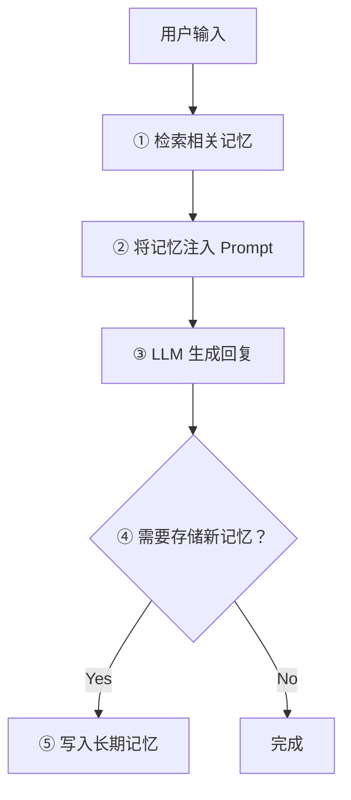

## Agent 为什么需要记忆

想象一个没有记忆的助手：每次你跟他说话，他都不记得之前聊过什么。你说「我叫小明」，下一轮他就忘了你是谁。这就是没有记忆系统的 LLM 的状态。

Agent 的记忆系统解决三个核心问题：

1. **连续性** —— 多轮对话中保持上下文
2. **个性化** —— 记住用户偏好，越用越好用
3. **任务管理** —— 跟踪复杂任务的进度和状态

## 三种记忆类型

```
┌──────────────────────────────────────────────────────┐
│                Agent 记忆架构                          │
│                                                      │
│  ┌──────────────┐  生命周期：单次对话                   │
│  │  短期记忆      │  类比：工作台上摊开的文件              │
│  │ Short-term   │  实现：对话历史（messages 数组）       │
│  └──────────────┘                                    │
│                                                      │
│  ┌──────────────┐  生命周期：当前任务                   │
│  │  工作记忆      │  类比：便利贴上的待办清单              │
│  │ Working      │  实现：Scratchpad / 状态变量          │
│  └──────────────┘                                    │
│                                                      │
│  ┌──────────────┐  生命周期：永久                      │
│  │  长期记忆      │  类比：笔记本中的永久记录              │
│  │ Long-term    │  实现：向量数据库 / 文件系统            │
│  └──────────────┘                                    │
└──────────────────────────────────────────────────────┘
```

### 短期记忆（对话上下文）

最基础的记忆形式，就是把对话历史作为 prompt 的一部分发给 LLM：

```python
messages = [
    {"role": "system", "content": "你是一个有帮助的助手。"},
    {"role": "user", "content": "我叫小明"},
    {"role": "assistant", "content": "你好小明！"},
    {"role": "user", "content": "我叫什么？"},  # LLM 能从上文找到答案
]
```

**局限**：受 Context Window 限制（4K-200K tokens），对话太长就会超出窗口。

### 工作记忆（当前任务状态）

Agent 执行复杂任务时，需要一个「草稿本」记录中间状态：

```python
working_memory = {
    "current_task": "帮用户规划北京三日游",
    "completed_steps": ["确认日期: 7月1-3日", "确认预算: 5000元"],
    "pending_steps": ["选择景点", "预订酒店", "规划路线"],
    "constraints": ["用户不吃辣", "需要无障碍设施"],
}
```

工作记忆在任务完成后通常会被清除或归档。

### 长期记忆（持久化存储）

跨会话保存的信息，通常存储在向量数据库中：

```python
# 写入长期记忆
def save_memory(user_id: str, content: str, metadata: dict):
    embedding = embed_model.encode(content)
    vector_db.upsert(
        id=f"{user_id}_{timestamp}",
        vector=embedding,
        metadata={"user_id": user_id, "content": content, **metadata},
    )

# 读取长期记忆（语义搜索）
def recall_memory(user_id: str, query: str, top_k: int = 5):
    query_embedding = embed_model.encode(query)
    results = vector_db.query(
        vector=query_embedding,
        filter={"user_id": user_id},
        top_k=top_k,
    )
    return [r.metadata["content"] for r in results]
```

## 记忆的读写机制



**何时写入**的策略：
- **显式存储** —— 用户说「记住这个」
- **隐式存储** —— LLM 自行判断某信息值得记忆（如用户偏好）
- **会话摘要** —— 对话结束时将整轮对话压缩为摘要存储

## 记忆压缩与遗忘策略

Context Window 有限，不可能塞入所有历史。常用策略：

| 策略 | 做法 | 适用场景 |
|------|------|---------|
| **滑动窗口** | 只保留最近 N 轮对话 | 简单场景 |
| **摘要压缩** | 用 LLM 将旧对话压缩成摘要 | 长对话 |
| **重要性排序** | 按重要性打分，淘汰低分记忆 | 长期记忆管理 |
| **时间衰减** | 越久远的记忆权重越低 | 模拟人类遗忘曲线 |

摘要压缩的示例：

```python
def compress_conversation(messages: list, model="gpt-4o-mini") -> str:
    """将长对话压缩为摘要"""
    response = client.chat.completions.create(
        model=model,
        messages=[
            {"role": "system", "content": "将以下对话压缩为关键信息摘要，保留重要事实和用户偏好。"},
            {"role": "user", "content": str(messages)},
        ],
    )
    return response.choices[0].message.content
```

---

<details>
<summary><strong>自测题</strong></summary>

1. **短期记忆的局限是什么？如何解决？**
   - 答：受 Context Window 大小限制。通过摘要压缩、滑动窗口或长期记忆检索来解决。

2. **工作记忆和长期记忆的生命周期有什么区别？**
   - 答：工作记忆只存在于当前任务期间，任务完成即清除；长期记忆跨会话持久化，永久保存。

3. **为什么需要「遗忘策略」？全部记住不好吗？**
   - 答：Context Window 有限，全部注入会超出限制且增加成本和延迟。另外旧信息可能已过时，需要定期清理。

</details>

## 延伸阅读

- [MemGPT: 操作系统式记忆管理](https://memgpt.ai/)
- [LangChain Memory 模块文档](https://python.langchain.com/docs/modules/memory/)
- [Anthropic Claude Memory 功能](https://docs.anthropic.com/en/docs/build-with-claude/memory)
