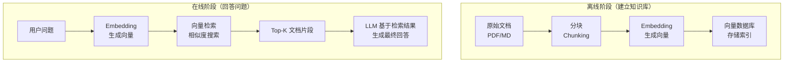

## RAG 定义与动机

RAG (Retrieval-Augmented Generation) 是将**信息检索**与**文本生成**结合的技术。

为什么不能只靠 LLM 的参数记忆？

1. **知识过时** —— LLM 的训练数据有截止日期，不知道最新信息
2. **知识缺失** —— 企业内部文档、私有数据不在训练集中
3. **幻觉问题** —— LLM 可能编造看起来合理但错误的答案
4. **引用溯源** —— 无法提供信息来源

RAG 的思路很直观：**先搜索，再回答**。就像学生考开卷考试——允许翻书查资料后再作答，准确率自然比闭卷高。

## RAG 完整流程



## Embedding 模型选择

Embedding 模型将文本转换为向量（一组数字），语义相似的文本在向量空间中距离更近。

| 模型 | 维度 | 特点 | 价格 |
|------|------|------|------|
| OpenAI text-embedding-3-small | 1536 | 性价比高 | $0.02/1M tokens |
| OpenAI text-embedding-3-large | 3072 | 精度最高 | $0.13/1M tokens |
| Cohere embed-v3 | 1024 | 多语言优秀 | 免费额度 |
| BGE-M3 (开源) | 1024 | 免费、多语言 | 免费 |
| nomic-embed-text (开源) | 768 | 轻量、快速 | 免费 |

选择建议：
- **快速原型** → OpenAI text-embedding-3-small
- **多语言场景** → Cohere embed-v3 或 BGE-M3
- **数据敏感/成本敏感** → 本地部署开源模型

## 检索方式

```
┌────────────────────────────────────────────────────┐
│              三种检索方式对比                         │
│                                                    │
│  语义搜索 (Semantic Search)                         │
│  "如何提高睡眠质量" → 匹配 "改善失眠的方法"            │
│  ✅ 理解语义  ❌ 可能忽略关键词                       │
│                                                    │
│  关键词搜索 (BM25)                                  │
│  "Python 3.12 新特性" → 精确匹配包含这些词的文档      │
│  ✅ 精确匹配  ❌ 不懂同义词                          │
│                                                    │
│  混合搜索 (Hybrid)                                  │
│  同时用语义 + 关键词，加权合并结果                     │
│  ✅ 兼顾两者  ❌ 需要调权重                          │
└────────────────────────────────────────────────────┘
```

实际生产环境推荐使用 **Hybrid Search**，兼顾语义理解和精确匹配。

## 代码示例：一个最简 RAG

```python
from openai import OpenAI
import numpy as np

client = OpenAI()

# ========== 离线阶段：构建知识库 ==========

documents = [
    "Python 3.12 引入了类型参数语法（PEP 695），简化了泛型定义。",
    "FastAPI 是一个高性能的 Python Web 框架，基于 Starlette 和 Pydantic。",
    "Docker Compose 可以用 YAML 文件定义多容器应用的服务。",
    "RAG 通过检索外部知识来增强大语言模型的生成能力。",
]

def get_embedding(text: str) -> list[float]:
    response = client.embeddings.create(
        model="text-embedding-3-small",
        input=text,
    )
    return response.data[0].embedding

# 为所有文档生成向量
doc_embeddings = [get_embedding(doc) for doc in documents]

# ========== 在线阶段：检索 + 生成 ==========

def cosine_similarity(a, b):
    return np.dot(a, b) / (np.linalg.norm(a) * np.linalg.norm(b))

def retrieve(query: str, top_k: int = 2) -> list[str]:
    """检索最相关的文档"""
    query_emb = get_embedding(query)
    similarities = [cosine_similarity(query_emb, doc_emb) for doc_emb in doc_embeddings]
    top_indices = np.argsort(similarities)[-top_k:][::-1]
    return [documents[i] for i in top_indices]

def rag_answer(question: str) -> str:
    """RAG 回答流程"""
    # 1. 检索
    relevant_docs = retrieve(question)
    context = "\n".join(relevant_docs)

    # 2. 生成
    response = client.chat.completions.create(
        model="gpt-4o-mini",
        messages=[
            {"role": "system", "content": f"根据以下参考资料回答问题。如果资料中没有相关信息，请说明。\n\n参考资料：\n{context}"},
            {"role": "user", "content": question},
        ],
    )
    return response.choices[0].message.content

# 使用
answer = rag_answer("什么是 RAG？")
print(answer)
```

---

<details>
<summary><strong>自测题</strong></summary>

1. **RAG 解决了 LLM 的哪些核心问题？**
   - 答：知识过时、知识缺失、幻觉问题、缺乏引用溯源。

2. **语义搜索和关键词搜索各自的优劣是什么？**
   - 答：语义搜索理解同义词和语义但可能忽略关键词精确匹配；关键词搜索精确但不理解语义。混合搜索兼顾两者。

3. **RAG 的离线阶段和在线阶段分别做什么？**
   - 答：离线阶段将文档分块、生成 Embedding、存入向量数据库；在线阶段将用户问题生成 Embedding、检索相似文档、将文档作为上下文让 LLM 生成回答。

</details>

## 延伸阅读

- [RAG 论文 (Lewis et al., 2020)](https://arxiv.org/abs/2005.11401)
- [LangChain RAG 教程](https://python.langchain.com/docs/tutorials/rag/)
- [OpenAI Embedding 文档](https://platform.openai.com/docs/guides/embeddings)
