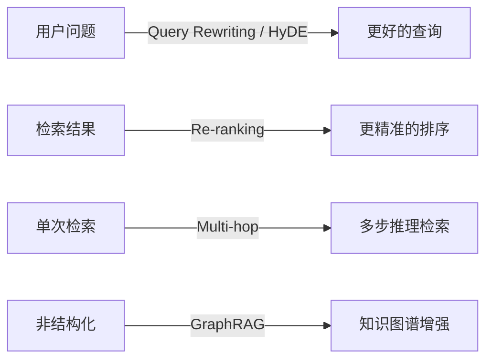
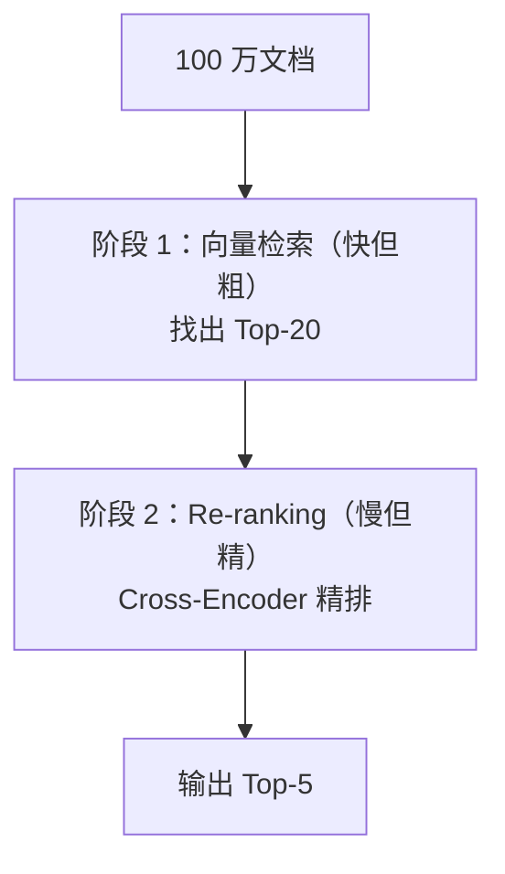
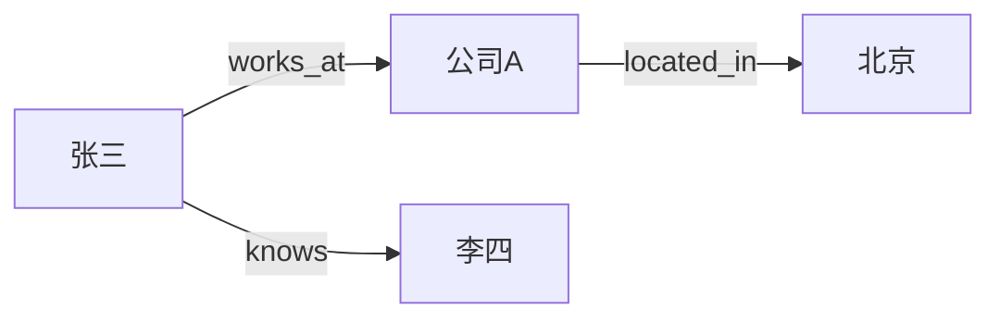

:::tip[与其他章节的关联]
- Query Rewriting 和 HyDE 利用 LLM 生成能力优化检索，与 [ch01 LLM 基础](/01-llm-fundamentals/01-transformer/) 中的生成原理直接相关
- GraphRAG 中的知识图谱概念与 [ch02 Agent 模式](/02-agent-patterns/01-what-is-agent/) 中的推理能力结合
- 这些高级技术在 [ch05 框架章节](/05-frameworks/01-langchain-langgraph/) 中有现成实现（如 LangChain 的 Re-ranker 集成）
:::

## 为什么需要高级 RAG

基础 RAG 的流程是「用户问题 → 向量检索 → LLM 生成」。但现实中这个流程有很多不足：

- 用户提问模糊或不完整
- 检索到的文档排序不够精准
- 单次检索无法回答需要综合多个文档的复杂问题

高级 RAG 技术就是在基础流程的各个环节做优化。



## Query Rewriting（查询改写）

用户的问题往往不适合直接用来检索。Query Rewriting 让 LLM 先优化查询，再去检索。

```python
def rewrite_query(original_query: str) -> list[str]:
    """将用户问题改写为多个检索友好的查询"""
    response = client.chat.completions.create(
        model="gpt-4o-mini",
        messages=[{
            "role": "system",
            "content": "将用户问题改写为 3 个不同角度的搜索查询，每行一个。"
        }, {
            "role": "user",
            "content": original_query,
        }],
    )
    return response.choices[0].message.content.strip().split("\n")

# 示例
# 原始："为什么我的 RAG 效果不好？"
# 改写：
# 1. "RAG 检索质量低的常见原因"
# 2. "提升 RAG 准确率的方法"
# 3. "RAG pipeline 调优最佳实践"
```

## HyDE（Hypothetical Document Embedding）

:::note[术语：HyDE (Hypothetical Document Embedding)]
HyDE 的核心思想是利用 LLM 先生成一个「假设性回答文档」，然后用该文档的向量去检索，而非直接用问题的向量。这解决了问句与陈述句之间的语义空间差异问题。
:::

核心想法：用户的问题是「问句」，但数据库里存的是「陈述句」。两者语义空间不同，直接匹配效果差。

HyDE 的做法：先让 LLM 生成一个**假设性的回答文档**，用这个文档的向量去检索，效果往往更好。

```
┌────────────────────────────────────────────────┐
│  普通检索：                                      │
│  问题 "什么是 RAG？" ──embedding──→ 检索         │
│  （问句向量 vs 答案向量，语义空间不同）             │
│                                                │
│  HyDE：                                        │
│  问题 ──LLM 生成假设答案──→ "RAG 是一种将检索    │
│  与生成结合的技术..." ──embedding──→ 检索         │
│  （答案向量 vs 答案向量，语义空间一致）             │
└────────────────────────────────────────────────┘
```

```python
def hyde_retrieve(question: str, top_k: int = 5):
    # 1. 生成假设文档
    hypo_response = client.chat.completions.create(
        model="gpt-4o-mini",
        messages=[{
            "role": "system",
            "content": "请直接回答以下问题，写一段简洁的解释。"
        }, {
            "role": "user", "content": question,
        }],
    )
    hypo_doc = hypo_response.choices[0].message.content

    # 2. 用假设文档的向量去检索
    hypo_embedding = get_embedding(hypo_doc)
    results = vector_db.query(query_embeddings=[hypo_embedding], n_results=top_k)
    return results
```

## Re-ranking（重排序）

向量检索返回的 Top-K 结果排序不够精准。Re-ranker 用更精确（但更慢）的模型对结果重新排序。



常用 Re-ranker：
- **Cohere Reranker** —— API 服务，效果好
- **bge-reranker** —— 开源，可本地部署
- **Cross-Encoder** —— 基于 sentence-transformers

:::note[术语：Cross-encoder vs Bi-encoder]
**Bi-encoder**（双编码器）分别对查询和文档独立编码为向量，通过余弦相似度匹配，速度快但精度有限——这就是普通向量检索的方式。**Cross-encoder**（交叉编码器）将查询和文档拼接后一起输入模型打分，精度高但速度慢（O(n) 复杂度），因此通常用于 Re-ranking 阶段而非初筛。
:::

```python
import cohere

co = cohere.Client("your-api-key")

results = co.rerank(
    model="rerank-v3.5",
    query="什么是 RAG？",
    documents=["RAG 是检索增强生成...", "CNN 是卷积神经网络...", "RAG 通过外部知识..."],
    top_n=2,
)

for r in results.results:
    print(f"Score: {r.relevance_score:.4f} | {r.document.text[:50]}")
```

## Multi-hop Retrieval（多步检索）

有些问题无法一次检索回答，需要多步推理：

```
问题："LangChain 的创始人之前在哪家公司工作？"

第1步检索 → "LangChain 由 Harrison Chase 创立"
第2步检索 → "Harrison Chase 之前在 Robust Intelligence 工作"
合并回答 → "Harrison Chase 之前在 Robust Intelligence 工作"
```

实现思路：让 LLM 判断检索结果是否足以回答问题，不够则生成后续查询继续检索。

## GraphRAG

微软提出的 GraphRAG 将文档中的实体和关系提取为**知识图谱**，然后在图上做检索。

:::note[术语：Knowledge Graph / 知识图谱]
知识图谱是一种用图结构（节点 + 边）表示知识的方式。节点代表实体（人、地点、概念），边代表实体间的关系（如「工作于」「位于」）。相比向量检索只能找到语义相近的文本，知识图谱能显式表达实体间的结构化关系，适合多跳推理和全局摘要。
:::

<div style="display:flex;gap:2rem;justify-content:center;margin:1.5rem 0;flex-wrap:wrap;">
  <div style="border:2px solid #888;border-radius:12px;padding:1.2rem 1.5rem;min-width:200px;">
    <div style="font-weight:bold;margin-bottom:.5rem;">传统 RAG</div>
    <div style="font-size:.9rem;">文档 → 分块 → 向量 → 语义检索<br/>擅长：局部事实查询</div>
  </div>
  <div style="border:2px solid #a78bfa;border-radius:12px;padding:1.2rem 1.5rem;min-width:200px;">
    <div style="font-weight:bold;color:#a78bfa;margin-bottom:.5rem;">GraphRAG</div>
    <div style="font-size:.9rem;">文档 → 提取实体关系 → 构建图 → 社区摘要<br/>擅长：全局总结、关系推理</div>
  </div>
</div>



GraphRAG 特别适合需要「全局理解」的问题，如「这个数据集中的主要主题是什么？」

## 实际效果对比

| 技术 | 适用场景 | 何时使用 | 提升幅度 | 复杂度 |
|------|---------|---------|---------|--------|
| Query Rewriting | 用户问题模糊 | 用户群体多样、提问质量参差不齐时 | +10-20% | 低 |
| HyDE | 问答语义鸿沟大 | 知识库以长篇陈述文为主、用户以短问句检索时 | +5-15% | 低 |
| Re-ranking | 检索排序不准 | Top-K 中有相关文档但排序靠后时（先验证此问题存在） | +15-25% | 中 |
| Multi-hop | 复杂推理问题 | 答案散布在多个文档中、需要链式推理时 | 必需 | 高 |
| GraphRAG | 全局总结、关系推理 | 需要回答「主要主题是什么」「X 和 Y 什么关系」类问题时 | 场景依赖 | 高 |

:::note[术语：NDCG / MRR / Recall@K]
这三个是 RAG 检索质量的核心评估指标：
- **NDCG**（Normalized Discounted Cumulative Gain）：衡量检索结果的排序质量，越相关的文档排得越靠前得分越高。
- **MRR**（Mean Reciprocal Rank）：第一个正确结果的排名倒数的均值，关注「最相关的结果排第几」。
- **Recall@K**：前 K 个检索结果中包含了多少个正确答案，关注「有没有漏掉」。
:::

---

<div class="card-quiz">
  <details>
    <summary>自测题 1：HyDE 的核心思想是什么？为什么有效？</summary>
    <div class="answer">先用 LLM 生成假设答案，用答案的向量去检索。有效是因为答案和文档都是陈述句，语义空间一致，匹配更准。</div>
  </details>
</div>

<div class="card-quiz">
  <details>
    <summary>自测题 2：Re-ranking 为什么不直接用于全量检索？</summary>
    <div class="answer">Re-ranker（如 Cross-Encoder）计算复杂度是 O(n)，对每个候选文档都要与查询做交叉编码，速度太慢。所以先用向量检索粗筛，再用 Re-ranker 精排。</div>
  </details>
</div>

<div class="card-quiz">
  <details>
    <summary>自测题 3：GraphRAG 相比传统 RAG 的优势是什么？</summary>
    <div class="answer">传统 RAG 擅长局部事实检索，GraphRAG 通过知识图谱和社区摘要能回答需要全局理解的问题（如主题总结、关系推理）。</div>
  </details>
</div>

## 常见陷阱

- **盲目堆叠技术**：不是所有项目都需要 HyDE + Re-ranking + GraphRAG。每增加一层都会增加延迟和成本。先用评估指标确认瓶颈在哪，再针对性优化。
- **HyDE 的假设答案误导检索**：当 LLM 对领域知识不足时，生成的假设答案可能偏离事实，反而检索到错误的文档。建议对专业领域先评估 HyDE 是否真的提升了 Recall@K。
- **Re-ranking 的成本被低估**：Cross-Encoder 对每对(query, doc)做推理，Top-20 的 Re-ranking 就需要 20 次模型推理。在高并发场景下要做好延迟预算。

## 延伸阅读

- [GraphRAG 论文 (Microsoft)](https://arxiv.org/abs/2404.16130)
- [HyDE 论文](https://arxiv.org/abs/2212.10496)
- [Cohere Reranker 文档](https://docs.cohere.com/docs/reranking)
- [RAG 技术全景综述](https://arxiv.org/abs/2312.10997)
