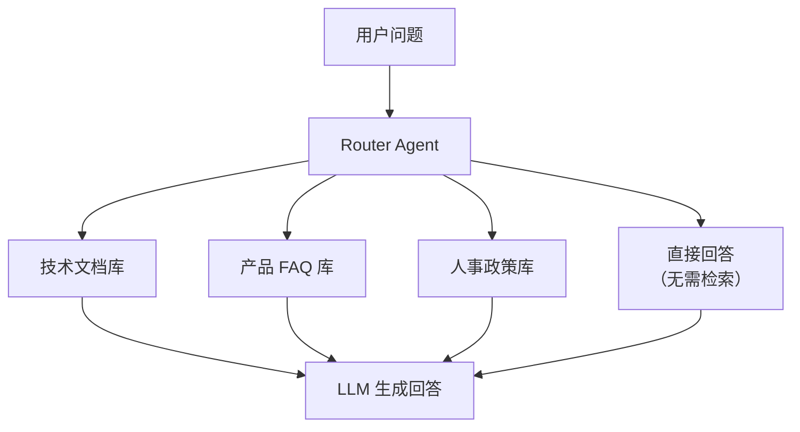
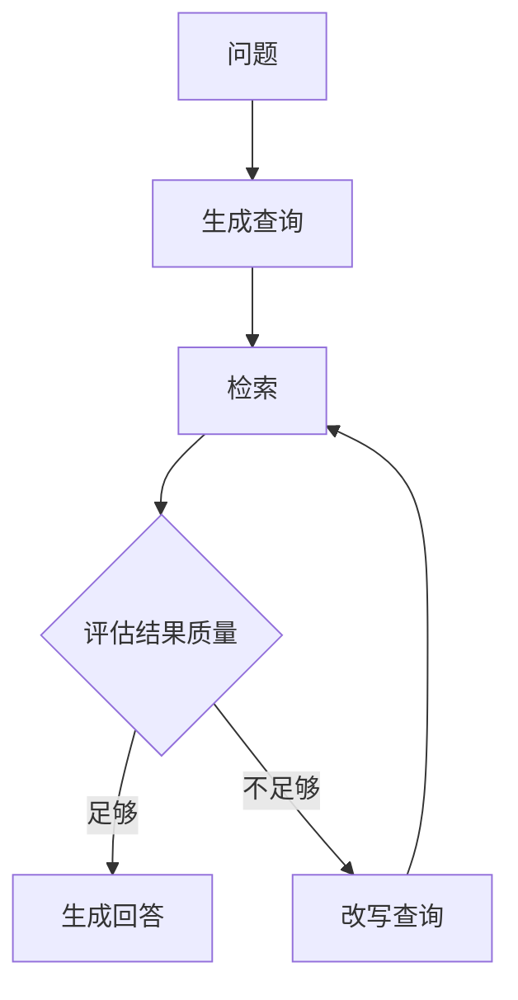

## 什么是 Agentic RAG

传统 RAG 是一条固定流水线：问题进来 → 检索 → 生成。无论问题是什么，都走同样的流程。

Agentic RAG 则让 Agent **自主决定**：要不要检索？检索什么？从哪里检索？检索结果够不够？不够要不要再检索？

类比：传统 RAG 像一个只会按固定流程查资料的实习生，Agentic RAG 像一个经验丰富的研究员——他知道什么时候该查文献、查哪个数据库、查到的结果是否靠谱。

```
┌────────────────────────────────────────────────────┐
│  传统 RAG：                                        │
│  问题 ──→ 检索 ──→ 生成（固定流水线）                │
│                                                    │
│  Agentic RAG：                                     │
│  问题 ──→ Agent 思考：                              │
│           ├─ 这个问题需要检索吗？                     │
│           ├─ 应该查哪个数据源？                       │
│           ├─ 检索结果够回答吗？                       │
│           └─ 需要换个角度再查吗？                     │
│           ──→ 自主决策 ──→ 生成                     │
└────────────────────────────────────────────────────┘
```

## 与传统 RAG 的区别

| 维度 | 传统 RAG | Agentic RAG |
|------|---------|-------------|
| 检索决策 | 每次都检索 | Agent 判断是否需要检索 |
| 数据源 | 固定一个 | 可动态选择多个数据源 |
| 检索次数 | 固定一次 | 可迭代多次 |
| 结果评估 | 无 | Agent 评估结果质量 |
| 适应性 | 低 | 高 |

## 路由式 RAG

根据查询类型，将问题路由到不同的数据源或处理流程。



```python
from openai import OpenAI

client = OpenAI()

DATASOURCES = {
    "technical": "技术文档向量库，包含 API 文档、架构设计",
    "product": "产品 FAQ 库，包含功能说明、定价信息",
    "hr": "人事政策库，包含请假制度、报销流程",
    "none": "问题可以直接回答，不需要检索",
}

def route_query(question: str) -> str:
    """让 LLM 决定应该查询哪个数据源"""
    response = client.chat.completions.create(
        model="gpt-4o-mini",
        messages=[{
            "role": "system",
            "content": f"""根据用户问题，选择最合适的数据源。
可选数据源：
{chr(10).join(f'- {k}: {v}' for k, v in DATASOURCES.items())}

只返回数据源名称，不要解释。"""
        }, {
            "role": "user", "content": question,
        }],
    )
    return response.choices[0].message.content.strip()

# 使用
source = route_query("如何申请年假？")
print(f"路由到: {source}")  # → "hr"
```

## 迭代式 RAG

Agent 检索后评估结果，不满意则调整查询重新检索。



```python
def agentic_rag(question: str, max_iterations: int = 3) -> str:
    """迭代式 Agentic RAG"""
    context_docs = []
    current_query = question

    for i in range(max_iterations):
        # 1. 检索
        new_docs = retrieve(current_query, top_k=3)
        context_docs.extend(new_docs)

        # 2. 评估检索结果是否足够
        eval_response = client.chat.completions.create(
            model="gpt-4o-mini",
            messages=[{
                "role": "system",
                "content": """判断检索到的文档是否足以回答用户问题。
如果足够，返回 JSON: {"sufficient": true}
如果不足，返回 JSON: {"sufficient": false, "follow_up_query": "需要进一步检索的查询"}"""
            }, {
                "role": "user",
                "content": f"问题: {question}\n\n检索到的文档:\n{chr(10).join(context_docs)}",
            }],
        )

        eval_result = json.loads(eval_response.choices[0].message.content)

        if eval_result["sufficient"]:
            break
        else:
            current_query = eval_result["follow_up_query"]
            print(f"第 {i+1} 轮检索不足，改写查询: {current_query}")

    # 3. 生成最终回答
    context = "\n---\n".join(context_docs)
    response = client.chat.completions.create(
        model="gpt-4o",
        messages=[{
            "role": "system",
            "content": f"根据以下参考资料回答问题，注明信息来源。\n\n参考资料:\n{context}",
        }, {
            "role": "user", "content": question,
        }],
    )
    return response.choices[0].message.content
```

## 面试考点

Agentic RAG 是 2025-2026 年 AI Engineer 面试的热门话题：

1. **与传统 RAG 的本质区别** —— 决策权从固定流程转移到 Agent
2. **何时使用 Agentic RAG** —— 多数据源、查询复杂度变化大、需要多步推理
3. **成本权衡** —— Agentic RAG 的 LLM 调用次数更多，需要考虑延迟和成本
4. **评估方法** —— 用 Recall、Precision、Answer Relevancy 等指标评估各环节

---

<details>
<summary><strong>自测题</strong></summary>

1. **Agentic RAG 比传统 RAG 多了哪些决策能力？**
   - 答：是否需要检索、检索哪个数据源、检索结果是否足够、是否需要改写查询重新检索。

2. **路由式 RAG 和迭代式 RAG 分别解决什么问题？**
   - 答：路由式解决「查哪里」的问题（多数据源选择）；迭代式解决「查到没有」的问题（结果质量评估和反复检索）。

3. **Agentic RAG 的主要缺点是什么？**
   - 答：LLM 调用次数增多导致延迟增加和成本上升；Agent 的决策本身可能出错（如错误路由、不必要的重复检索）。

</details>

## 延伸阅读

- [LlamaIndex Agentic RAG 教程](https://docs.llamaindex.ai/en/stable/examples/agent/agentic_rag/)
- [LangChain Self-RAG 实现](https://python.langchain.com/docs/tutorials/rag/)
- [Agentic RAG 综述论文](https://arxiv.org/abs/2501.09136)
- [RAG vs Fine-tuning vs Agentic RAG 对比](https://www.anthropic.com/research/building-effective-agents)
