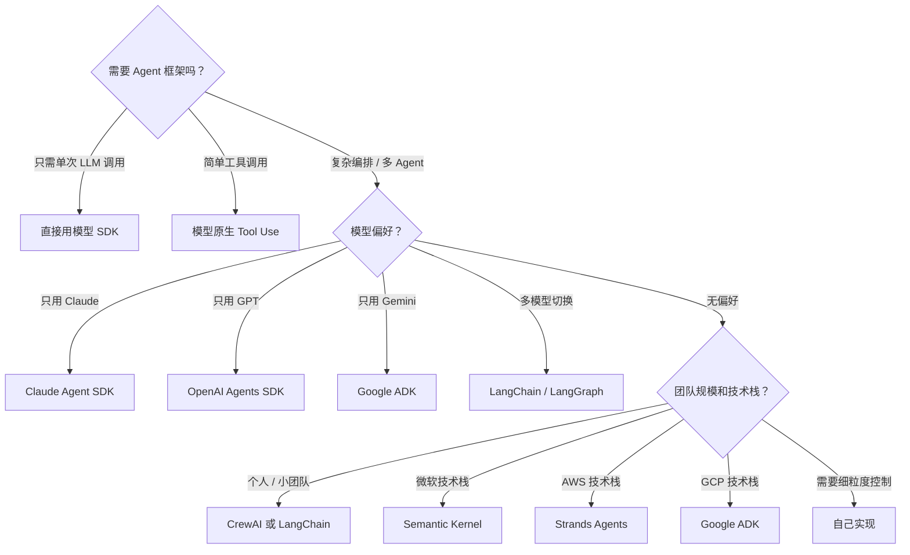

:::tip[与其他章节的关联]
- 「不用框架」的选项对应 [ch02 Agent 模式](/02-agent-basics/02-agent-patterns/) 中从零实现 Agent Loop 的思路
- 工具定义使用 MCP 标准以降低迁移成本，参见 [ch03 MCP 协议](/03-tools-mcp/02-mcp-protocol/)
- 选型需考虑 RAG 支持能力，参见 [ch04 RAG 技术栈](/04-rag/02-rag-basics/)
:::

## 选型决策树

选择 Agent 框架不应该从"哪个最热门"开始，而应该从**你的实际需求**出发。以下决策树帮你快速缩小范围：

## 按场景推荐

### 场景 1：快速原型 / PoC

**推荐：CrewAI 或 LangChain**

理由：上手快，社区资源丰富，适合验证想法。CrewAI 的角色定义非常直觉化；LangChain 的集成数量最多。

### 场景 2：生产级单 Agent 应用

**推荐：对应模型的官方 SDK**

理由：官方 SDK 抽象最少、最稳定、调试最容易。Claude 用户选 Claude Agent SDK，GPT 用户选 OpenAI Agents SDK。

### 场景 3：复杂多 Agent 工作流

**推荐：LangGraph**

理由：有向图模型天然支持复杂的分支、循环和并行逻辑。内置状态管理和检查点机制。

### 场景 4：企业级大规模部署

**推荐：与现有云平台对齐的框架**

| 云平台 | 推荐框架 |
|--------|---------|
| Azure | Semantic Kernel |
| AWS | Strands Agents |
| GCP | Google ADK |

### 场景 5：跨框架 Agent 互操作

**推荐：Google ADK + A2A 协议**

理由：A2A 是目前唯一的跨框架 Agent 通信标准。如果你需要不同团队用不同框架构建的 Agent 互相协作，A2A 是最佳选择。

## 框架对比表

| 维度 | LangChain | Claude SDK | OpenAI SDK | Google ADK | CrewAI | Semantic Kernel |
|------|-----------|-----------|-----------|-----------|--------|----------------|
| **学习曲线** | 中 | 低 | 低 | 中 | 低 | 中高 |
| **抽象层级** | 高 | 低 | 低 | 中 | 中 | 中高 |
| **多模型支持** | 优秀 | 仅 Claude | 仅 OpenAI | Gemini 为主 | 多模型 | 多模型 |
| **多 Agent** | LangGraph | Handoff | Handoff | A2A | 原生 | 支持 |
| **MCP 支持** | 社区 | 原生 | 有 | 有 | 有 | 有 |
| **可观测性** | LangSmith | 无内置 | 内置 Tracing | 内置 | 无内置 | 无内置 |
| **生态丰富度** | 最高 | 低 | 中 | 中 | 中 | 高 |
| **生产稳定性** | 中 | 高 | 高 | 中 | 中 | 高 |
| **开源** | 是 | 是 | 是 | 是 | 是 | 是 |

## 迁移成本考量

框架迁移是一个常被忽视但非常重要的考量因素：

**低迁移成本的做法：**
- 将 LLM 调用抽象为接口，不直接依赖框架特定 API
- 工具定义使用 MCP 标准，而不是框架私有格式
- 业务逻辑与框架编排代码分离
- Agent 的 Prompt 独立管理，不硬编码在框架配置中

**高迁移成本的陷阱：**
- 深度使用 LangChain 特定的 Memory 实现
- 依赖框架特定的 Callback 机制
- 大量使用框架私有的工具包装器
- 在框架层实现业务逻辑

**建议原则：**

> 框架是工具，不是架构。核心业务逻辑应该独立于任何框架。

## 常见陷阱

- **过早选型**：在需求不明确时就花大量时间对比框架。建议先用最简单的 SDK 跑通 MVP，再根据实际瓶颈引入框架。
- **框架锁定**：业务逻辑写在框架的 Callback/Hook 里，导致换框架等于重写。核心逻辑应与框架解耦。
- **追新不追稳**：每次出新框架就迁移，实际上大部分框架的核心能力（Tool Use + Agent Loop）是等价的。选一个稳定的长期维护即可。

  

    
自测题 1：如果只需要一个简单的客服 Bot，需要用 LangChain 吗？

    
大概率不需要。简单场景直接用模型 SDK 的 Tool Use 功能即可，引入 LangChain 反而增加了不必要的复杂度和依赖。

  

  

    
自测题 2：降低框架迁移成本的核心原则是什么？

    
将业务逻辑与框架解耦。具体做法包括：LLM 调用抽象为接口、工具定义使用 MCP 标准、Prompt 独立管理、避免深度依赖框架私有 API。

  

  

    
自测题 3：在什么情况下应该考虑不用任何框架、自己从零实现？

    
当你需要极致的性能控制、极简的依赖、或者框架的抽象层成为调试瓶颈时。参考 Chapter 6 的从零实现方案。

  

## 延伸阅读

- [Building Effective Agents - Anthropic](https://www.anthropic.com/engineering/building-effective-agents)
- [AI Agent 框架选型实战](https://blog.langchain.dev/how-to-think-about-agent-frameworks/)
- [MCP 规范](https://modelcontextprotocol.io/)
