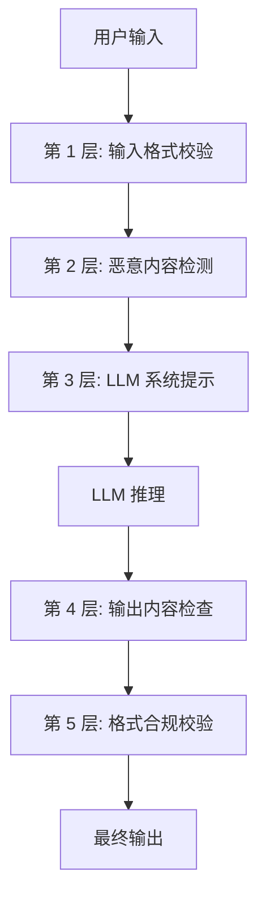

## 为什么需要 Guardrails

LLM 是不可控的——它可能输出幻觉、泄露敏感信息、被恶意 Prompt 操控。Guardrails（防护栏）是在 Agent 的输入和输出端设置的**安全检查点**，确保系统行为在可控范围内。

:::tip[延伸阅读：安全深度]
Guardrails 是安全防御的第一道工程防线。更系统的安全威胁分析（Prompt Injection 分类学、红队测试、OWASP LLM Top 10）将在 [第八章 安全](/08-security/) 中深入展开。
:::

## 输入校验

在用户输入到达 LLM 之前进行检查。

```python
import re

class InputGuard:
    """输入防护"""

    def __init__(self, max_length: int = 5000):
        self.max_length = max_length

    def check(self, user_input: str) -> tuple[bool, str]:
        """返回 (is_safe, reason)"""

        # 1. 长度检查
        if len(user_input) > self.max_length:
            return False, f"输入过长: {len(user_input)}/{self.max_length}"

        # 2. 空输入
        if not user_input.strip():
            return False, "输入为空"

        # 3. Prompt Injection 模式检测
        injection_patterns = [
            r"ignore\s+(previous|above|all)\s+instructions",
            r"you\s+are\s+now\s+(?:a|an)\s+",
            r"system\s*:\s*",
            r"<\|im_start\|>",
            r"```\s*system",
        ]
        for pattern in injection_patterns:
            if re.search(pattern, user_input, re.IGNORECASE):
                return False, f"检测到潜在 Prompt Injection"

        # 4. 敏感内容检测（关键词 + 更复杂的分类器）
        sensitive_keywords = ["密码", "信用卡号", "身份证"]
        for kw in sensitive_keywords:
            if kw in user_input:
                return False, f"输入包含敏感信息关键词: {kw}"

        return True, ""
```

## 输出校验

在 LLM 输出返回给用户之前进行检查。

```python
class OutputGuard:
    """输出防护"""

    def check(self, output: str, context: dict = None) -> tuple[bool, str, str]:
        """返回 (is_safe, reason, sanitized_output)"""

        sanitized = output

        # 1. 敏感信息过滤（如 PII）

:::note[术语：PII（Personally Identifiable Information）]
PII 指可以单独或与其他数据结合识别个人身份的信息，如手机号、邮箱、身份证号、银行卡号等。在 LLM 应用中，输出可能意外包含训练数据中的 PII 或用户对话中出现的 PII，必须在输出端脱敏。
:::

        # 手机号
        sanitized = re.sub(
            r'1[3-9]\d{9}',
            '[手机号已脱敏]',
            sanitized,
        )
        # 邮箱
        sanitized = re.sub(
            r'[\w.-]+@[\w.-]+\.\w+',
            '[邮箱已脱敏]',
            sanitized,
        )

        # 2. 幻觉检测（检查引用的来源是否存在）
        if context and "sources" in context:
            urls_in_output = re.findall(r'https?://\S+', sanitized)
            valid_urls = set(context["sources"])
            for url in urls_in_output:
                if url not in valid_urls:
                    sanitized = sanitized.replace(url, "[来源待验证]")

        # 3. 格式合规检查
        if len(sanitized) > 10000:
            sanitized = sanitized[:10000] + "\n\n[输出已截断]"

        is_modified = sanitized != output
        reason = "输出已清洗" if is_modified else ""

        return True, reason, sanitized
```

## Guardrails 框架

### NeMo Guardrails（NVIDIA）

NeMo Guardrails 使用一种叫 **Colang** 的 DSL 来定义防护规则：

:::note[术语：DSL（Domain-Specific Language）]
DSL 即领域特定语言，是为某一特定领域设计的编程语言（相对于 Python、Java 等通用语言）。Colang 就是 NVIDIA 为对话防护设计的 DSL，语法简单，让非技术人员也能编写防护规则。
:::

```colang
define user ask about politics
  "你觉得哪个政党好？"
  "帮我分析选举结果"

define bot refuse politics
  "抱歉，我不适合讨论政治话题。"

define flow politics guard
  user ask about politics
  bot refuse politics
```

特点：声明式规则，易于非技术人员维护，支持对话流控制。

### Guardrails AI

Guardrails AI 侧重于**输出结构校验**，使用 Pydantic-style 的 Validator：

```python
from guardrails import Guard
from guardrails.hub import ToxicLanguage, DetectPII

guard = Guard().use_many(
    ToxicLanguage(on_fail="fix"),
    DetectPII(
        pii_entities=["EMAIL_ADDRESS", "PHONE_NUMBER"],
        on_fail="fix",
    ),
)

result = guard(
    llm_api=openai.chat.completions.create,
    prompt="回答用户问题...",
    model="gpt-4o-mini",
)
# result.validated_output 是经过校验和修复的输出
```

## 分层防御策略

单一防护措施总有盲区。生产环境需要**多层防御**：



每一层都有可能被突破，但攻击者需要同时绕过所有层才能成功。

| 层级 | 职责 | 工具 |
|------|------|------|
| 输入预处理 | 格式清洗、长度限制 | 自定义代码 |
| 安全分类 | 恶意意图检测 | LLM 分类器 / NeMo |
| System Prompt | 行为约束 | Prompt Engineering |
| 输出过滤 | PII、毒性内容 | Guardrails AI |
| 格式校验 | 结构合规 | JSON Schema / Pydantic |

## 自测问题

<div class="card-quiz">
  <details>
    <summary>自测题 1：为什么简单的关键词过滤不足以防御 Prompt Injection？</summary>
    <div class="answer">攻击者可以用各种变体绕过关键词：拼写变化（igno re）、多语言混合、Unicode 同形字、Base64 编码等。需要结合模式匹配、LLM 分类器和多层防御。</div>
  </details>
</div>

<div class="card-quiz">
  <details>
    <summary>自测题 2：输出中的幻觉 URL 为什么需要特别处理？</summary>
    <div class="answer">LLM 可能生成看起来真实但实际不存在的 URL，用户点击后可能进入恶意网站或得到 404 错误，损害用户体验和信任。检测并标记未经验证的 URL 是必要的。</div>
  </details>
</div>

<div class="card-quiz">
  <details>
    <summary>自测题 3：分层防御中，哪一层最容易被绕过？为什么？</summary>
    <div class="answer">基于关键词的输入检测层最容易被绕过，因为攻击者可以轻松变换措辞。最可靠的是格式合规校验层，因为它基于确定性规则（如 JSON Schema），不存在语义模糊性。</div>
  </details>
</div>

## 延伸阅读

- [NeMo Guardrails](https://github.com/NVIDIA/NeMo-Guardrails)
- [Guardrails AI](https://www.guardrailsai.com/)
- [OWASP LLM Top 10](https://owasp.org/www-project-top-10-for-large-language-model-applications/)
