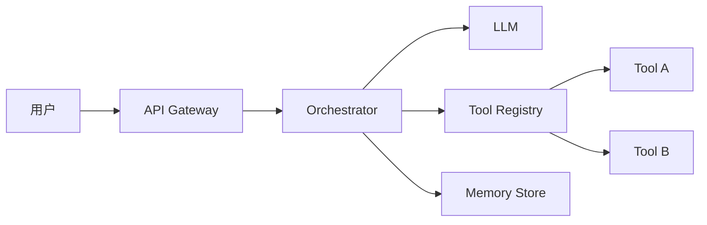

系统设计面试考察的不仅是技术能力，更是你 **结构化思考** 和 **权衡决策** 的能力。本章提供一套适用于 Agent 系统设计的面试框架。

## 面试回答四步法

### 第一步：需求澄清（5 分钟）

在动手画架构之前，先确保你理解了问题的边界。

**功能性需求：**
- 用户是谁？使用场景是什么？
- Agent 需要完成哪些核心任务？
- 需要对接哪些外部系统或数据源？
- 输入输出的格式和预期是什么？

**非功能性需求：**
- 延迟要求（实时对话 vs 异步处理）
- 并发量和吞吐量
- 准确性和可靠性要求
- 成本预算约束

**示例澄清问题：**
> "这个 Agent 是面向内部员工还是外部客户？日活用户量大概是多少？"
> "对响应延迟有什么要求？用户能接受等待 30 秒吗？"
> "出错时的容忍度如何？是否需要人工兜底？"

### 第二步：高层架构设计（10 分钟）

画出核心组件和数据流。

**典型 Agent 系统组件：**

**关键设计决策：**
- 单 Agent vs Multi-Agent
- 同步 vs 异步执行
- Stateless vs Stateful
- 工具调用策略（并行 vs 串行）

### 第三步：组件深入（15 分钟）

选择 2-3 个核心组件深入讲解。

**Orchestrator 设计：**
- 推理循环：ReAct / Plan-and-Execute / 状态机
- 最大迭代次数与退出条件
- 错误恢复与重试策略

**Memory 设计：**
- 短期记忆：对话上下文窗口管理
- 长期记忆：向量数据库存储
- 工作记忆：Scratchpad / 中间结果

**Tool 管理：**
- 工具注册与发现机制
- Schema 定义与参数校验
- 权限控制与沙箱执行

### 第四步：权衡讨论（10 分钟）

主动讨论设计中的 trade-off。

| 维度 | 选项 A | 选项 B |
|------|--------|--------|
| 架构 | 单一全能 Agent | 多个专业 Agent |
| 推理 | 每步调 LLM | 规则优先 + LLM 兜底 |
| 记忆 | 全量上下文 | 摘要压缩 |
| 可靠性 | 重试 + 降级 | 人工接管 |

## RACE 方法论

一个适用于 Agent 系统设计的结构化思考框架：

- **R**equirements — 需求澄清与约束定义
- **A**rchitecture — 高层架构与组件划分
- **C**omponents — 核心组件深入设计
- **E**valuation — 评估指标与权衡讨论

## 常见追问方向

### 可扩展性
- "如果用户量增长 100 倍，架构需要怎么调整？"
- "如何水平扩展 Agent 实例？"

### 可靠性
- "LLM 返回幻觉怎么办？"
- "工具调用失败的降级策略是什么？"
- "如何保证最终一致性？"

### 成本
- "如何控制 Token 消耗？"
- "哪些环节可以用小模型替代？"
- "缓存策略是什么？"

### 安全
- "如何防止 Prompt Injection？"
- "用户数据如何隔离？"
- "工具调用的权限模型是什么？"

### 可观测性
- "如何监控 Agent 的行为质量？"
- "怎么调试一个失败的 Agent 会话？"
- "关键 metrics 有哪些？"

## 面试技巧

1. **先画后说** — 边画架构图边解释，比纯口述清晰
2. **主动提权衡** — 不要等面试官追问，主动讨论 trade-off
3. **用数字说话** — 估算 QPS、Token 成本、延迟
4. **承认不确定性** — "这个部分我不太确定，但我的思路是……"
5. **联系实际经验** — 将设计决策和你做过的项目关联
