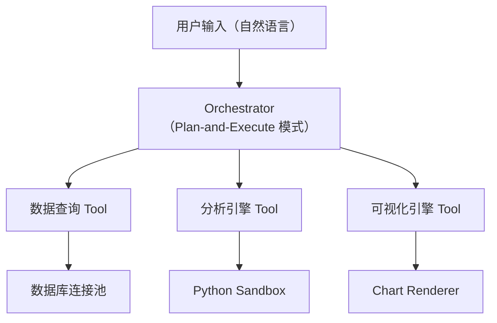

## 题目

> 设计一个自主数据分析 Agent，用户用自然语言描述分析需求，Agent 能自动查询数据、执行分析、生成可视化图表并输出分析报告。

## 需求澄清

### 功能性需求
- 用户用自然语言提出数据分析问题
- Agent 能连接 SQL 数据库、CSV 文件等数据源
- 自动生成并执行查询/分析代码
- 生成可视化图表（柱状图、折线图、散点图等）
- 输出结构化的分析报告

### 非功能性需求
- 响应时间：复杂分析可接受 30-60 秒
- 准确性：SQL 查询结果必须正确，分析结论需有数据支撑
- 安全性：只读数据访问，防止 SQL Injection
- 并发：支持多用户同时使用

### 澄清问题示例
- "数据源类型有哪些？是否需要支持实时数据流？"
- "用户的技术水平如何？需要展示 SQL 还是只看结果？"
- "数据量级是多大？单表千万行还是百万行？"

## 架构设计



### 核心组件

**1. Orchestrator**
- 采用 Plan-and-Execute 模式：先制定分析计划，再逐步执行
- 维护分析状态（已完成步骤、中间结果、待执行步骤）
- 支持计划动态调整（根据中间结果修改后续步骤）

**2. 数据查询 Tool**
- Text-to-SQL：将自然语言转换为 SQL 查询
- Schema 感知：自动加载数据库的表结构、列名、数据类型
- 查询校验：执行前检查 SQL 安全性（只允许 SELECT）
- 结果采样：大结果集只返回前 N 行 + 统计摘要

**3. 分析引擎 Tool**
- 代码生成：生成 Python（pandas/numpy）分析代码
- 沙箱执行：在隔离环境中运行，限制资源和权限
- 统计分析：描述性统计、相关性分析、趋势检测

**4. 可视化引擎 Tool**
- 图表推荐：根据数据类型自动推荐图表类型
- 代码生成：生成 matplotlib/plotly 代码
- 渲染输出：生成图片或交互式 HTML

## 关键设计决策

### Text-to-SQL 策略

| 方案 | 优点 | 缺点 |
|------|------|------|
| 直接 LLM 生成 | 灵活，处理复杂查询 | 可能生成错误 SQL |
| 模板填充 | 准确性高 | 覆盖场景有限 |
| 混合方案 | 兼顾灵活和准确 | 实现复杂 |

**推荐混合方案：** 常见查询模式用模板，复杂需求用 LLM 生成 + 语法校验 + 执行验证。

### Schema 上下文管理

数据库可能有几百张表，不能全部放入 Prompt。

```
用户问题 → Schema 检索（向量搜索相关表）→ 筛选 Top-K 表 → 注入 Prompt
```

- 预先为每张表生成描述 Embedding
- 查询时检索最相关的 5-10 张表
- 包含列名、数据类型、示例值、表关系

### 代码沙箱设计

```python
# 沙箱配置
sandbox_config = {
    "timeout": 30,           # 最大执行时间（秒）
    "memory_limit": "512MB", # 内存限制
    "allowed_modules": [     # 白名单
        "pandas", "numpy", "matplotlib",
        "seaborn", "plotly", "scipy"
    ],
    "network_access": False, # 禁止网络访问
    "filesystem": "readonly" # 只读文件系统
}
```

### 分析计划示例

用户问："分析上个季度各地区的销售趋势，找出增长最快的产品类别"

```
计划：
1. 查询上季度各地区的月度销售数据（SQL）
2. 按地区和产品类别计算月度增长率（Python）
3. 识别增长最快的 Top 5 产品类别（Python）
4. 生成地区销售趋势折线图（可视化）
5. 生成产品类别增长率柱状图（可视化）
6. 汇总分析报告
```

## 面试追问与答案

### Q: 如果 SQL 查询结果为空怎么办？

**A:** 多层处理：
1. 检查查询条件是否过于严格，尝试放宽条件
2. 验证表名和列名是否正确
3. 向用户反馈"未找到数据"并建议调整查询条件
4. 记录空结果日志，用于后续优化 Schema 描述

### Q: 如何保证分析结论的准确性？

**A:**
- SQL 结果校验：检查行数、空值比例、数据范围
- 统计显著性：输出 p-value 和置信区间
- 交叉验证：对关键结论用不同方法验证
- 人工确认：对高风险决策标记"需要人工审核"

### Q: 如何处理大数据集？

**A:**
- 查询层：LIMIT + 采样查询，避免拉取全量数据
- 分析层：流式处理，分批计算统计量
- 可视化层：数据聚合后再绘图，避免渲染百万点
- 缓存：相同查询结果缓存，设置 TTL

### Q: 多租户数据隔离怎么做？

**A:**
- 数据库层：每个租户独立 Schema 或行级安全策略
- 应用层：查询自动注入租户过滤条件
- 审计层：记录所有数据访问日志
