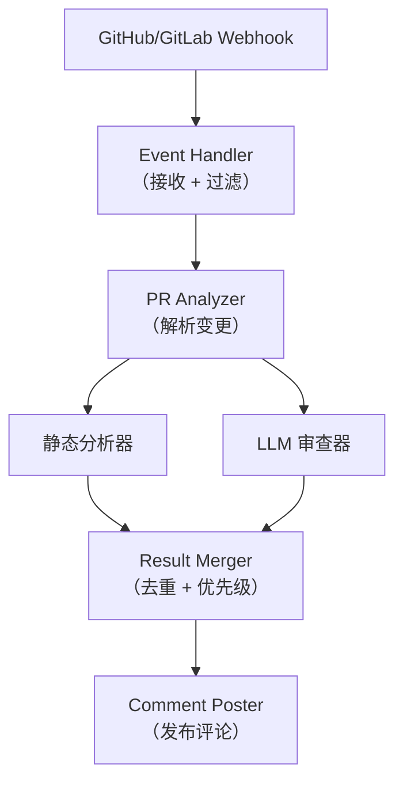
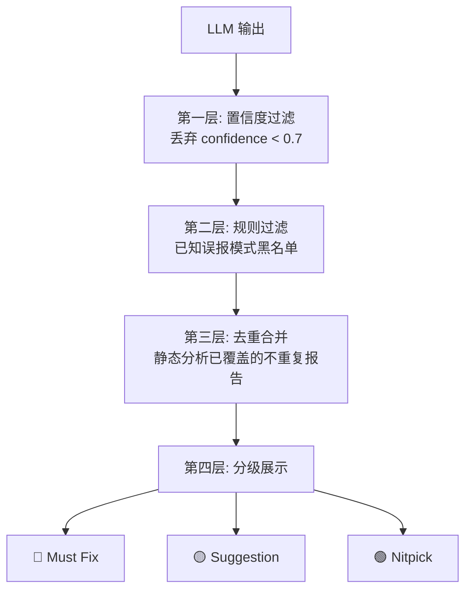

:::tip[与其他章节的关联]
- **ch02 设计模式**：审查流程使用 Pipeline 模式（静态分析 -> LLM 审查 -> 合并），详见 [Agent 设计模式](/02-agent-patterns/01-what-is-agent/)
- **ch07 生产化**：误报控制和反馈学习涉及评估与监控，详见 [生产化章节](/07-production/)
:::

## 题目

> 设计一个代码审查 Agent，能自动分析 Pull Request 的代码变更，给出审查意见，并集成到现有的开发工作流中。

## 需求澄清

### 功能性需求
- 监听 PR 创建/更新事件
- 分析代码变更的质量、安全性和性能
- 生成行级审查评论
- 支持多语言（Python、TypeScript、Go 等）
- 与 GitHub/GitLab 集成

### 非功能性需求
- 分析时间 < 5 分钟（中等 PR）
- 误报率 < 10%
- 支持大型 PR（1000+ 行变更）

## 架构设计



## 核心组件设计

### 1. PR 变更解析

```python
# 解析策略
class PRAnalyzer:
    def analyze(self, pr):
        # 1. 获取 diff
        diff = github.get_pr_diff(pr)

        # 2. 按文件分组
        file_changes = parse_diff(diff)

        # 3. 过滤无需审查的文件
        filtered = filter_files(file_changes, skip=[
            "*.lock", "*.min.js", "*.generated.*",
            "package-lock.json", "yarn.lock"
        ])

        # 4. 添加上下文（完整文件内容、关联文件）
        enriched = enrich_context(filtered)

        return enriched
```

### 2. 静态分析层

在调用 LLM 之前，先用确定性工具扫描：

| 工具 | 检查内容 |
|------|---------|
| ESLint / Ruff | 代码风格和 Lint 规则 |
| Semgrep | 安全漏洞模式匹配 |
| Dependency Check | 依赖安全漏洞 |
| 复杂度分析 | 圈复杂度、函数长度 |

**优势：** 速度快、无误报（规则明确）、不消耗 Token。

### 3. LLM 审查层

静态分析无法覆盖的高层审查：

```
审查维度：
├── 逻辑正确性 — 代码是否实现了预期功能
├── 设计合理性 — 是否符合设计模式和架构规范
├── 边界处理 — 空值、异常、并发场景
├── 可维护性 — 命名、注释、代码组织
├── 性能隐患 — N+1 查询、内存泄漏、阻塞调用
└── 安全风险 — 注入、越权、敏感信息泄露
```

**Prompt 策略：**

```
上下文注入：
1. 仓库的编码规范（CONTRIBUTING.md）
2. 相关的类型定义和接口
3. 被修改函数的调用链
4. 历史 PR 的审查意见（学习团队风格）
```

### 4. 大 PR 处理策略

```
1000+ 行变更的处理：
├── 按文件分组，每组独立审查
├── 优先审查核心逻辑文件
├── 测试文件降低审查深度
├── 生成变更摘要，辅助人工快速理解
└── 对结果做全局一致性检查
```

## 误报控制

误报是代码审查 Agent 最大的敌人。高误报率会让开发者忽视所有建议。

### 多层过滤策略



### 反馈学习

```
开发者操作 → 反馈信号：
  - 采纳建议 → 正反馈
  - 关闭/忽略 → 负反馈
  - "Not helpful" 标记 → 强负反馈

→ 定期用反馈数据微调过滤规则
→ 团队级别的偏好学习
```

## 面试追问与答案

### Q: 如何处理跨文件的变更影响？

**A:**
1. 构建变更影响图（哪些函数被修改，谁调用了它们）
2. 将相关的调用链上下文一起送入 LLM
3. 重点检查接口变更是否向后兼容
4. 对 import 变更做依赖影响分析

### Q: 如何保证审查意见的一致性？

**A:**
- 将团队的 Code Review Guidelines 注入 System Prompt
- 缓存同一 PR 的审查上下文，避免前后矛盾
- 对同一文件的多条意见做一致性检查
- 维护"已知模式"库，相同模式给出相同建议

### Q: Agent 审查和人工审查如何协同？

**A:**
- Agent 先审查，标记问题并分级
- 人工审查者看到 Agent 的标注，聚焦高优先级问题
- Agent 处理机械性检查（格式、命名），人工聚焦设计和逻辑
- 人工可以 override Agent 的建议，形成反馈闭环
