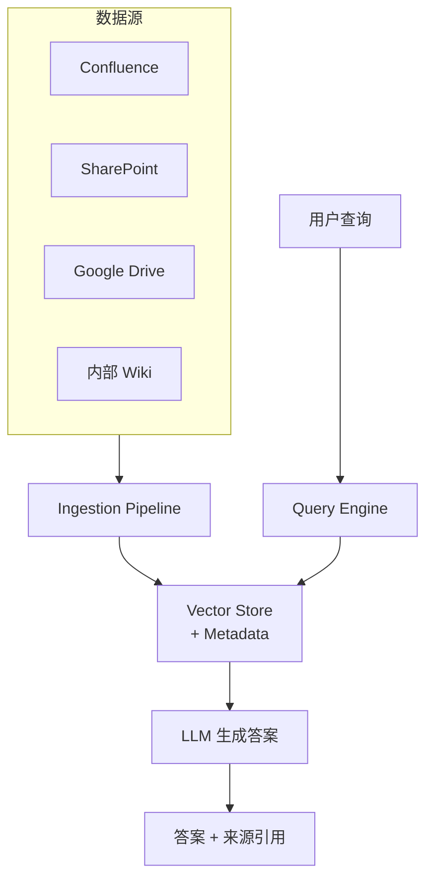

:::tip[与其他章节的关联]
- **ch04 RAG**：本设计题是 RAG 的完整工程化落地，分块、检索、Reranking 的原理详见 [RAG 深入](/04-rag/)
- **ch08 数据隔离**：权限过滤（ACL/SSO/LDAP）的详细讨论，详见 [数据隔离章节](/08-security/02-data-isolation/)
- **ch07 生产化**：评估指标（RAGAS）和可观测性实现，详见 [生产化章节](/07-production/)
:::

## 题目

> 设计一个 RAG 驱动的企业知识库系统，员工可以用自然语言查询公司内部文档，系统返回准确的答案并标注来源。

## 需求澄清

### 功能性需求
- 多数据源接入（Confluence、SharePoint、Google Drive、内部 Wiki）
- 自然语言问答
- 答案附带来源链接和引用片段
- 支持多语言（中英文）

### 非功能性需求
- 查询响应 < 5 秒
- 答案准确率 > 90%（有来源支撑）
- 文档更新后 < 1 小时同步到知识库
- 严格的权限控制：用户只能查到有权访问的文档

## 架构设计



## 核心组件设计

### 1. Ingestion Pipeline（数据摄入）

```
数据源 → Connector → 提取文本 → 分块 → Embedding → 存储

各阶段细节：
├── Connector：各数据源适配器，增量同步
├── 文本提取：PDF/DOCX/PPT → 纯文本 + 结构保留
├── 分块策略：
│   ├── 按语义段落分块（非固定长度）
│   ├── 保留标题层级结构
│   ├── 块大小 300-500 tokens，重叠 50 tokens
│   └── 表格和代码块保持完整
├── Metadata 提取：
│   ├── 文档标题、作者、更新时间
│   ├── 数据源和原始 URL
│   ├── 权限标签（ACL）
│   └── 文档类型和部门归属
└── 增量更新：
    ├── Webhook 监听数据源变更
    ├── 变更检测（hash 对比）
    └── 只重新处理变更的文档
```

### 2. 权限控制

这是企业知识库的 **核心难点**。

**权限同步策略：**

```
数据源权限 → 映射到内部权限模型 → 存入 Metadata

查询时：
1. 获取用户身份（SSO / LDAP）
2. 查询用户的权限组
3. 在向量检索时添加权限过滤条件
4. 只返回用户有权访问的文档块
```

**实现方式：**

```python
# 向量检索时注入权限过滤
results = vector_store.search(
    query_embedding=query_emb,
    filter={
        "access_groups": {"$in": user.groups},
        # 或者
        "acl": {"$contains": user.id}
    },
    top_k=20
)
```

**关键决策：** 权限过滤在检索阶段做（Pre-filtering），而非在结果返回后做（Post-filtering），避免返回空结果。

### 3. 检索策略

**混合检索（Hybrid Search）：**

```mermaid
flowchart TD
    Q["用户查询"] --> Semantic["语义检索\n（Vector）"]
    Q --> Keyword["关键词检索\n（BM25）"]
    Semantic --> RRF["Reciprocal Rank Fusion"]
    Keyword --> RRF

:::note[术语：Reciprocal Rank Fusion (RRF)]
**RRF（倒数排名融合）** 是一种将多个检索结果列表合并为统一排名的算法。公式为 $\text{score}(d) = \sum_r \frac{1}{k + \text{rank}_r(d)}$，其中 $k$ 通常取 60。RRF 的优势在于不需要对不同检索器的分数做归一化，简单高效且效果稳定。
:::
    RRF --> TopK["Top-K 结果"]
    TopK --> Rerank["Reranker\n（Cross-encoder 重排序）"]
    Rerank --> Final["最终 Top-N 结果"]
```

**查询改写：**

```
原始查询 → LLM 改写 → 多个变体查询 → 分别检索 → 合并结果

示例：
原始："报销流程"
变体 1："费用报销的具体步骤"
变体 2："如何提交报销申请"
变体 3："expense reimbursement process"
```

### 4. 答案可追溯性

每个答案必须标注来源，用户可以点击验证。

```
答案格式：
{
  "answer": "报销需要在 OA 系统提交申请，附上发票照片...",
  "sources": [
    {
      "title": "费用报销指南 v3.2",
      "url": "https://confluence.../报销指南",
      "snippet": "员工需在费用发生后 30 天内...",
      "relevance_score": 0.92,
      "last_updated": "2025-01-15"
    }
  ],
  "confidence": 0.88
}
```

**低置信度处理：**
- confidence < 0.6：回答"我不确定，建议联系 XX 部门"
- confidence 0.6-0.8：回答但标注"此答案仅供参考"
- confidence > 0.8：正常回答

## 关键设计决策

### Embedding 模型选择

| 模型 | 维度 | 多语言 | 部署 |
|------|------|--------|------|
| OpenAI text-embedding-3-large | 3072 | 是 | API |
| Cohere embed-v3 | 1024 | 是 | API |
| BGE-M3 | 1024 | 是 | 自部署 |

企业场景推荐 **自部署模型**（数据不出域）+ API 模型做 fallback。

### 向量数据库选择

| 数据库 | 优势 | 适合场景 |
|--------|------|---------|
| Pinecone | 全托管，简单 | 快速上线 |
| Weaviate | 混合搜索原生支持 | 需要 BM25 + 向量 |
| Qdrant | 高性能过滤 | 权限过滤复杂 |
| pgvector | 与现有 PG 集成 | 数据量 < 100 万 |

## 面试追问与答案

### Q: 文档更新后如何保证答案实时性？

**A:**
1. 数据源 Webhook 触发增量更新
2. 更新的文档块替换旧版本（保留版本历史）
3. 高优先级文档（政策、公告）走快速通道，分钟级更新
4. 答案附带"数据更新时间"，用户可判断时效性

### Q: 如何处理矛盾信息？

**A:**
- 检索结果中如果出现矛盾内容，LLM 应明确指出
- 优先采信更新时间较近的文档
- 标注所有来源，让用户自行判断
- 建立文档权威等级（官方政策 > 团队 Wiki > 个人笔记）

### Q: 如何评估系统质量？

**A:**
- **检索质量：** Recall@K、MRR、NDCG
- **答案质量：** RAGAS 框架（Faithfulness、Answer Relevancy、Context Precision）
- **用户反馈：** 点赞/踩 + 定期人工评测
- **来源准确率：** 引用的来源是否真的支持答案
