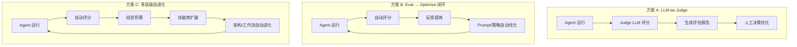

## 为什么 Agent 需要自进化

一个 Agent 上线后，面临的核心问题不是"能不能跑"，而是"跑得好不好、怎么变更好"。

传统软件有单元测试和监控告警，但 Agent 的输出是非确定性的——同一个输入可能产生完全不同的推理路径和结果。你无法用 `assertEqual` 来验证一个 Agent 是否"聪明了"。

```
传统软件质量保证：
  代码 → 测试 → 部署 → 监控 → 人工修 bug → 重新部署

Agent 自进化闭环：
  Agent → 运行 → 评估 → 发现问题 → 自动优化 → 验证提升 → 持续进化
                    ↑_________________________________↓
```

### 自进化要解决的三个问题

1. **怎么知道 Agent 表现如何？**（评估）
2. **怎么让 Agent 自动变好？**（优化）
3. **怎么让 Agent 持续成长？**（进化）

这三个问题对应了三种不同深度的解决方案。

---

## 三条路径总览



### 一句话概括

| 方案 | 核心动作 | 类比 |
|------|---------|------|
| A: LLM-as-Judge | 用 LLM 给 Agent 打分 | 请一个考官来阅卷 |
| B: Eval→Optimize | 评分结果自动驱动优化 | 考官阅卷后还帮你补课 |
| C: 多层级自进化 | Agent 自己改造自己的能力边界 | 学生不仅补课，还自己设计新课程 |

---

## 详细对比

### 核心能力维度

| 维度 | A: LLM-as-Judge | B: Eval→Optimize | C: 多层级自进化 |
|------|-----------------|------------------|----------------|
| 评估能力 | ✅ 核心能力 | ✅ 基础模块 | ✅ 基础模块 |
| Prompt 优化 | ❌ 需人工 | ✅ 自动化 | ✅ 自动化 |
| 经验记忆 | ❌ 无 | ✅ 有 | ✅ 核心能力 |
| 技能扩展 | ❌ 无 | ❌ 无 | ✅ 核心能力 |
| 架构进化 | ❌ 无 | ❌ 无 | ✅ 高级能力 |

### 工程维度

| 维度 | A: LLM-as-Judge | B: Eval→Optimize | C: 多层级自进化 |
|------|-----------------|------------------|----------------|
| 落地时间 | 1-3 天 | 2-4 周 | 1-3 月 |
| 基础设施需求 | 低（一个 eval 脚本） | 中（trace 存储+优化 pipeline） | 高（全套进化基础设施） |
| 团队规模 | 1 人可完成 | 2-3 人 | 需要专项团队 |
| 维护成本 | 低 | 中 | 高 |
| 数据依赖 | 无需历史数据 | 需积累运行数据 | 大量运行数据 |
| 风险 | 低 | 中 | 高（可能退化） |

### 适用场景

| 场景 | 推荐方案 |
|------|---------|
| Agent 刚上线，需要基本的质量把控 | A |
| Agent 已运行一段时间，想自动提升 | B |
| Agent 是核心产品，需要持续进化 | C |
| 快速验证一个新 Agent 的能力 | A |
| Agent 涉及复杂多步骤任务 | B 或 C |
| 需要 Agent 自己学会新技能 | C |

---

## 渐进式落地路线

这三个方案不是互斥的，而是**层层递进**的关系：

```
时间线:
━━━━━━━━━━━━━━━━━━━━━━━━━━━━━━━━━━━━━━━━━━━━━━━━━

Phase 1: 评估基线 (Week 1-2)
├── 搭建 LLM-as-Judge 评估 pipeline
├── 定义评分维度和 rubric
├── 建立 benchmark 数据集
└── 产出: Agent 能力基线报告

Phase 2: 优化闭环 (Week 3-6)
├── 接入 trace 收集
├── 搭建自动评分 + 反馈生成
├── 引入 DSPy / prompt 优化
├── 经验记忆系统 (Reflexion)
└── 产出: Agent 自动变好的证据

Phase 3: 架构进化 (Month 2+)
├── 技能库构建与自动发现
├── 工作流自动重组
├── Meta-Agent 架构搜索
└── 产出: Agent 能力边界扩展
```

### 关键原则

1. **评估先行**：没有评估就没有优化的基础，任何进化都要先证明"比之前好了"
2. **渐进式引入**：每一层都建立在前一层的基础上，不要跳级
3. **安全护栏**：自进化 Agent 必须有回退机制，进化后如果退化要能回滚
4. **人在回路**：初期保持人工审核，逐步放权给自动化

---

## 技术生态全景

### 评估工具

| 工具 | 定位 | 开源 | 特点 |
|------|------|------|------|
| [DeepEval](https://github.com/confident-ai/deepeval) | 评估框架 | ✅ | 14+ 内置指标，pytest 集成 |
| [Promptfoo](https://promptfoo.dev) | Prompt 测试 | ✅ | CLI 工具，对比测试 |
| [Langfuse](https://langfuse.com) | Observability | ✅ | 自部署，trace + scoring |
| [Arize Phoenix](https://phoenix.arize.com) | Observability | ✅ | trace + LLM eval |
| [Braintrust](https://braintrust.dev) | Eval 平台 | 部分 | 数据集管理 + 自动评分 |
| [LangSmith](https://smith.langchain.com) | 全链路 | ❌ | LangChain 生态深度集成 |

### 优化框架

| 框架 | 用途 | 核心思想 |
|------|------|---------|
| [DSPy](https://dspy.ai) | Prompt 自动优化 | 声明式编程，编译器自动优化 |
| [TextGrad](https://github.com/zou-group/textgrad) | 文本梯度优化 | 把 LLM 反馈当梯度信号 |
| [OPRO](https://arxiv.org/abs/2309.03409) | Prompt 搜索 | 用 LLM 搜索最优 prompt |
| [EvoPrompt](https://arxiv.org/abs/2309.08532) | 进化算法优化 | 遗传算法搜索 prompt 空间 |

### 自进化框架

| 框架 | 出处 | 进化目标 |
|------|------|---------|
| [EvoAgentX](https://github.com/EvoAgentX/EvoAgentX) | 开源社区 | Agent 生态系统 |
| [AgentEvolver](https://github.com/modelscope/AgentEvolver) | 阿里 ModelScope | 工作流进化 |
| [EvolveR](https://github.com/KnowledgeXLab/EvolveR) | ICML 2026 | 全生命周期 |
| [EvoMaster](https://github.com/sjtu-sai-agents/EvoMaster) | 上海交大 | 科研级进化 |

---

## 核心论文路线图

按阅读顺序排列，从基础到前沿：

### 必读（理解全貌）

1. [Reflexion: Language Agents with Verbal Reinforcement Learning](https://arxiv.org/abs/2303.11366) — 经验记忆的开山之作
2. [Self-Refine: Iterative Refinement with Self-Feedback](https://arxiv.org/abs/2303.17651) — 最简单的自改进范式
3. [ADAS: Automated Design of Agentic Systems](https://arxiv.org/pdf/2408.08435v2) — Agent 架构自动设计
4. [A Survey of Self-Evolving Agents (Stanford)](https://arxiv.org/abs/2507.21046) — 2025 最全面综述

### 深入（具体方向）

5. [DSPy: Compiling Declarative LM Calls into Self-Improving Pipelines](https://arxiv.org/abs/2604.04869v1) — Prompt 自动优化
6. [Contextual Experience Replay for Self-Improvement](https://aclanthology.org/2025.acl-long.694/) — 经验复用
7. [SAGE: Self-evolving Agents with Reflective and Memory-augmented Abilities](https://www.sciencedirect.com/science/article/pii/S0925231225011427)
8. [Voyager: An Open-Ended Embodied Agent with LLMs](https://arxiv.org/abs/2305.16291) — 技能库自进化
9. [A Comprehensive Survey of Self-Evolving AI Agents](https://arxiv.org/abs/2508.07407v1) — 2026 最新综述

### 前沿（最新进展）

10. [MetaAgent-X: Breaking the Ceiling via End-to-End RL](https://arxiv.org/html/2605.14212)
11. [EvolveR: Self-Evolving LLM Agents through Experience-Driven Lifecycle](https://github.com/KnowledgeXLab/EvolveR)
12. [AHE: Agentic Harness Engineering](https://github.com/mqbazhaoyu/ahe)

---

## 下一步

- 想了解 LLM-as-Judge 的完整 pipeline 搭建 → [方案 A 详解：LLM-as-Judge 评估体系](./02-llm-as-judge)
- 想了解自动优化闭环的工程实现 → [方案 B 详解：Eval→Optimize 自动优化](./03-eval-optimize)
- 想了解多层级自进化的前沿方案 → [方案 C 详解：多层级自进化架构](./04-multi-level-evolution)
