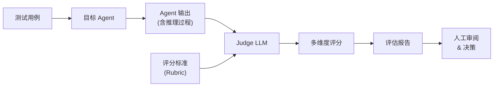

## 核心思想

用一个强 LLM（Judge）对 Agent 的输出进行多维度评分，替代人工评估。这是所有自进化方案的**地基**——没有可靠的评估，后续的优化和进化都是空中楼阁。



---

## 完整 Pipeline 搭建

### Step 1: 定义评估维度

混合型 Agent（对话 + 工具调用 + 多步推理）需要评估的维度比纯对话模型复杂得多：

| 维度 | 评估对象 | 评分标准示例 |
|------|---------|-------------|
| **任务完成度** | 最终结果 | 是否完成了用户的意图？完成了多少？ |
| **推理质量** | 思考过程 | 推理链是否连贯？有无逻辑跳跃？ |
| **工具使用** | Action 序列 | 工具选择是否合适？参数是否正确？有无冗余调用？ |
| **效率** | 整体路径 | 是否走了最短路径？有无无效循环？ |
| **安全性** | 全过程 | 是否泄露敏感信息？是否越权？ |
| **对话质量** | 回复内容 | 清晰度、准确度、有用性 |

### Step 2: 编写 Evaluation Rubric

Rubric 是评分的核心——你给 Judge 的指令决定了评估的质量。

```python
RUBRIC_TASK_COMPLETION = """
你是一个 AI Agent 评估专家。请评估以下 Agent 执行结果。

## 评分标准（1-5 分）

5 分：完美完成任务，结果准确且全面
4 分：基本完成任务，有小瑕疵但不影响实用性
3 分：部分完成任务，核心功能实现但有明显缺失
2 分：尝试完成但结果有重大错误或遗漏
1 分：完全未完成或方向错误

## 评估输入

**用户请求**: {user_request}
**Agent 输出**: {agent_output}
**参考答案（如有）**: {reference}

## 要求

请输出 JSON 格式：
{
  "score": <1-5>,
  "reasoning": "<你的评估推理过程>",
  "issues": ["<问题1>", "<问题2>"],
  "suggestions": ["<改进建议1>", "<改进建议2>"]
}
"""
```

#### Trajectory 级评估（多步骤推理）

对于混合型 Agent，单看最终输出不够，需要评估整个**执行轨迹**：

```python
RUBRIC_TRAJECTORY = """
## 评估 Agent 执行轨迹

请评估以下 Agent 的完整执行过程（不仅是结果）。

### 轨迹记录
{trajectory}

### 评估维度

1. **路径效率** (1-5): 是否选择了合理的执行路径？
   - 5: 最优路径，无冗余步骤
   - 3: 有些绕路但最终完成
   - 1: 严重浪费，大量无效操作

2. **工具选择** (1-5): 每一步的工具选择是否合适？
   - 5: 每次都选了最合适的工具
   - 3: 偶尔选错但能自我纠正
   - 1: 频繁选错工具，不会纠错

3. **错误恢复** (1-5): 遇到错误时的处理能力
   - 5: 快速识别错误并找到替代方案
   - 3: 能恢复但花了较多尝试
   - 1: 卡死或重复同样的错误

4. **信息利用** (1-5): 是否有效利用了观察到的信息？
   - 5: 每个 observation 都被合理利用
   - 3: 忽略了部分有用信息
   - 1: 大量信息被浪费

请对每个维度给出评分和理由。
"""
```

### Step 3: 构建 Benchmark 数据集

```python
# benchmark 数据集结构
benchmark = {
    "test_cases": [
        {
            "id": "task_001",
            "category": "tool_use",  # 分类标签
            "difficulty": "medium",
            "input": "帮我查询北京明天的天气，并根据天气推荐穿搭",
            "expected_tools": ["weather_api", "recommendation"],  # 期望调用的工具
            "reference_output": "...",  # 参考答案（可选）
            "eval_dimensions": ["task_completion", "tool_use", "dialogue_quality"],
        },
        {
            "id": "task_002",
            "category": "multi_step_reasoning",
            "difficulty": "hard",
            "input": "分析这个 repo 的架构问题并提出重构方案",
            "context": {"repo_url": "..."},
            "reference_output": None,  # 开放式任务无标准答案
            "eval_dimensions": ["reasoning_quality", "completeness", "actionability"],
        },
    ]
}
```

#### Benchmark 设计原则

1. **覆盖所有能力维度**：对话、单工具、多工具链式、错误恢复、长程推理
2. **难度分层**：easy / medium / hard，便于定位能力边界
3. **有确定性答案 + 开放式任务**：前者验证正确性，后者验证思维质量
4. **包含 edge case**：工具返回错误、用户意图模糊、上下文冲突

### Step 4: 评估执行引擎

```python
import json
from dataclasses import dataclass


@dataclass
class EvalResult:
    test_case_id: str
    dimension: str
    score: float
    reasoning: str
    issues: list[str]
    suggestions: list[str]


class AgentEvaluator:
    def __init__(self, judge_llm, agent, rubrics: dict[str, str]):
        self.judge = judge_llm
        self.agent = agent
        self.rubrics = rubrics

    async def evaluate_single(self, test_case: dict) -> list[EvalResult]:
        """评估单个测试用例"""
        # 1. 让 Agent 执行任务
        agent_response = await self.agent.run(
            input=test_case["input"],
            context=test_case.get("context"),
        )

        # 2. 对每个评估维度打分
        results = []
        for dimension in test_case["eval_dimensions"]:
            rubric = self.rubrics[dimension]
            judge_input = rubric.format(
                user_request=test_case["input"],
                agent_output=agent_response.output,
                trajectory=agent_response.trajectory,
                reference=test_case.get("reference_output", "无"),
            )

            judge_response = await self.judge.chat(judge_input)
            parsed = json.loads(judge_response)

            results.append(EvalResult(
                test_case_id=test_case["id"],
                dimension=dimension,
                score=parsed["score"],
                reasoning=parsed["reasoning"],
                issues=parsed.get("issues", []),
                suggestions=parsed.get("suggestions", []),
            ))

        return results

    async def run_benchmark(self, benchmark: dict) -> dict:
        """执行完整 benchmark"""
        all_results = []
        for case in benchmark["test_cases"]:
            results = await self.evaluate_single(case)
            all_results.extend(results)

        return self._aggregate(all_results)

    def _aggregate(self, results: list[EvalResult]) -> dict:
        """聚合评估结果"""
        by_dimension = {}
        for r in results:
            by_dimension.setdefault(r.dimension, []).append(r.score)

        return {
            dim: {
                "mean": sum(scores) / len(scores),
                "min": min(scores),
                "max": max(scores),
                "count": len(scores),
            }
            for dim, scores in by_dimension.items()
        }
```

### Step 5: 偏差校准

LLM-as-Judge 有已知的系统性偏差，必须主动消除：

| 偏差类型 | 表现 | 消除方法 |
|---------|------|---------|
| **位置偏差** | 在 A/B 对比中倾向选第一个 | 交换顺序评估两次取平均 |
| **冗长偏差** | 倾向给更长的回复高分 | Rubric 中明确"简洁性"标准 |
| **自我偏好** | 同模型评估时分数虚高 | 用不同模型做 Judge |
| **格式偏差** | 偏爱 markdown/结构化输出 | Rubric 中强调"内容 > 格式" |
| **权威偏差** | 对自信语气的回复评分更高 | 加入"自信度与准确度不一定正相关"提示 |

```python
# 位置偏差消除示例
async def pairwise_eval_debiased(judge, output_a, output_b, rubric):
    """去偏差的 pairwise 评估"""
    # 正序评估
    score_ab = await judge.chat(
        rubric.format(first=output_a, second=output_b)
    )
    # 反序评估
    score_ba = await judge.chat(
        rubric.format(first=output_b, second=output_a)
    )

    # 只有两次都一致时才确认胜者
    if score_ab.winner == "first" and score_ba.winner == "second":
        return "A wins"  # A 在两种位置都赢了
    elif score_ab.winner == "second" and score_ba.winner == "first":
        return "B wins"
    else:
        return "tie"  # 结果不一致，判平局
```

---

## 工程架构

### 最小可用架构

```
┌──────────────────────────────────────────────────┐
│                  Eval Runner                       │
├──────────────────────────────────────────────────┤
│                                                    │
│  Benchmark    →  Agent Runner  →  Judge Pipeline   │
│  (JSON/YAML)     (执行测试)       (评分)           │
│                                                    │
│                       ↓                            │
│              Result Storage (SQLite/JSON)           │
│                       ↓                            │
│              Report Generator (Markdown/HTML)       │
│                                                    │
└──────────────────────────────────────────────────┘
```

### 生产级架构

```
┌─────────────────────────────────────────────────────────────┐
│                    Orchestrator (调度层)                       │
├─────────────────────────────────────────────────────────────┤
│                                                               │
│  ┌─────────┐   ┌──────────────┐   ┌────────────────┐        │
│  │Benchmark│   │  Agent Under │   │  Judge Pool     │        │
│  │Registry │   │  Test (AUT)  │   │  (多 Judge 投票) │        │
│  └────┬────┘   └──────┬───────┘   └───────┬────────┘        │
│       │               │                    │                  │
│       └───────────────┼────────────────────┘                  │
│                       ↓                                       │
│  ┌──────────────────────────────────────────┐                │
│  │         Trace & Result Store              │                │
│  │  (完整轨迹 + 评分 + 元数据)                │                │
│  └──────────────────┬───────────────────────┘                │
│                     ↓                                         │
│  ┌─────────────┐  ┌────────────┐  ┌──────────────┐          │
│  │  Dashboard  │  │  Alerting  │  │  Regression  │          │
│  │  (可视化)    │  │  (退化告警) │  │  Detection   │          │
│  └─────────────┘  └────────────┘  └──────────────┘          │
│                                                               │
└─────────────────────────────────────────────────────────────┘
```

---

## 关键难点与工程挑战

### 难点 1: 评估标准的主观性

"好的回复"没有客观标准。不同用户对"好"的定义不同。

**应对**：
- 收集真实用户反馈作为 ground truth 校准 Judge
- 定期做 Judge vs 人工评分的一致性检验（Cohen's Kappa）
- 对争议性案例做多 Judge 投票

### 难点 2: Trajectory 评估的复杂性

混合型 Agent 的执行轨迹可能有 20+ 步，Judge 很难全面评估。

**应对**：
- 分段评估：把长轨迹切成"决策点"，每个决策点独立评分
- 关键路径提取：只评估分支决策点，忽略确定性步骤
- Checklist 式评估：将评估拆解为一系列 Yes/No 问题

```python
TRAJECTORY_CHECKLIST = """
对以下轨迹回答 Yes/No：

1. Agent 是否在第一步就正确理解了用户意图？
2. 工具调用的顺序是否合理（有依赖关系的是否正确排序）？
3. 遇到工具返回错误时，是否正确处理了？
4. 是否有不必要的重复调用？
5. 最终结果是否回答了用户的原始问题？

轨迹: {trajectory}
"""
```

### 难点 3: 评估成本控制

每次评估 = 一次 Agent 执行 + N 次 Judge 调用。全量 benchmark 跑一次可能花费不小。

**应对**：
- 分层评估策略：日常用小 benchmark + 弱 Judge，定期用全量 + 强 Judge
- 缓存机制：相同输入的 Agent 输出可复用
- 采样评估：大规模时随机抽样而非全量
- 使用较便宜的模型做初筛，只对边界案例用强模型

```python
# 分层评估策略
EVAL_TIERS = {
    "daily": {
        "benchmark": "core_50",  # 50 个核心用例
        "judge_model": "claude-haiku-4-5",
        "dimensions": ["task_completion"],  # 只看核心指标
    },
    "weekly": {
        "benchmark": "full_200",
        "judge_model": "claude-sonnet-4-6",
        "dimensions": ["task_completion", "tool_use", "reasoning"],
    },
    "release": {
        "benchmark": "full_200 + edge_cases_50",
        "judge_model": "claude-opus-4-8",
        "dimensions": "all",
        "multi_judge": True,  # 多 Judge 投票
    },
}
```

### 难点 4: 评估与真实表现的 Gap

Benchmark 上分数高不等于用户满意。

**应对**：
- 定期从生产流量中抽样评估（online eval）
- 将用户反馈（点赞/点踩/投诉）作为 ground truth
- 对比 benchmark 分数与用户满意度的相关性，剔除无效指标

---

## 工具选型建议

### 从零开始推荐

如果你是从零构建评估体系：

1. **第一天**：用 Promptfoo 做 prompt 对比测试，验证评估思路
2. **第一周**：用 DeepEval 搭建 Python 评估脚本，跑通核心 benchmark
3. **第二周**：接入 Langfuse 做 trace 收集和 scoring，建立持续监控

### 已有基础设施

- 用 LangChain → LangSmith 无缝集成
- 需要自部署 → Langfuse（Docker 一键部署）
- 团队协作 + 数据集管理 → Braintrust
- 纯代码偏好 → DeepEval + 自建 dashboard

---

## 自测题

<div class="card-quiz">
  <details>
    <summary>Q1: LLM-as-Judge 和传统的单元测试有什么本质区别？</summary>
    <div class="answer">
      单元测试验证确定性行为（输入 A 必须输出 B），而 LLM-as-Judge 评估非确定性输出的质量。Agent 的同一个输入可能有多种"正确"的输出——Judge 评估的是"好不好"而非"对不对"。这使得评估本身也变成了概率性的，需要通过多次评估、多 Judge 投票等方式提高可靠性。
    </div>
  </details>
</div>

<div class="card-quiz">
  <details>
    <summary>Q2: 为什么不能只用最终输出评分，还需要 Trajectory 评估？</summary>
    <div class="answer">
      因为混合型 Agent 的价值不只在结果，还在路径。一个 Agent 可能碰巧得到正确答案但推理过程完全错误（比如调用了错误工具但恰好返回了正确信息），这种"运气好"无法在生产中持续。Trajectory 评估能发现这类隐患，也能识别"结果正确但效率低下"的问题。
    </div>
  </details>
</div>

<div class="card-quiz">
  <details>
    <summary>Q3: 如果 Judge LLM 本身不够聪明，评估结果还可靠吗？</summary>
    <div class="answer">
      这是 LLM-as-Judge 的根本局限。应对方式：1) 用比 Agent 更强的模型做 Judge；2) 对不确定的判断用多 Judge 投票；3) 对高风险决策保留人工审核；4) 用 Judge 与人工评分的一致性（Cohen's Kappa > 0.7）来验证 Judge 的可靠性。如果 Judge 在某个维度与人工一致性低，就需要改进 Rubric 或换更强的 Judge。
    </div>
  </details>
</div>

---

## 延伸阅读

- [From Generation to Judgment: LLM-as-a-Judge (EMNLP 2025)](https://aclanthology.org/anthology-files/pdf/emnlp/2025.emnlp-main.138.pdf)
- [LLM-as-Judge Patterns for Agent Evaluation](https://zylos.ai/zh/research/2026-05-26-llm-as-judge-agent-evaluation-patterns)
- [How to Build LLM-as-a-Judge Evaluators for Production (Arize)](https://arize.com/blog/how-to-build-llm-as-a-judge-evaluators-that-hold-up-in-production/)
- [LLM Evaluation Framework Benchmark 2026](https://aiml.qa/llm-evaluation-framework-benchmark-2026/)
- [8 AI Agent Evaluation Frameworks Compared](https://growthengineer.ai/blog/ai-agent-evaluation-frameworks-compared)
