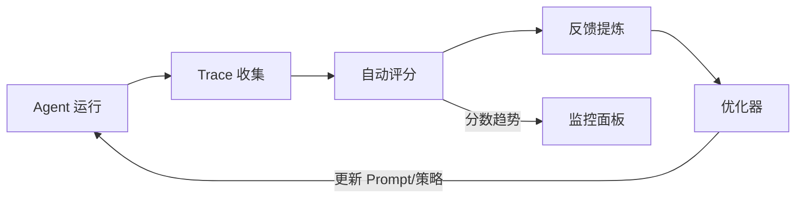

## 核心思想

方案 A 回答了"Agent 表现如何"，方案 B 要回答的是**"怎么让 Agent 自动变好"**。

核心差异：评估结果不再只是给人看的报告，而是直接作为**优化信号**反馈到 Agent 系统中，驱动 prompt、策略、参数的自动调整。



---

## 完整 Pipeline 架构

### 全局视图

```
┌──────────────────────────────────────────────────────────────┐
│                    自动优化闭环系统                              │
├──────────────────────────────────────────────────────────────┤
│                                                                │
│  ┌──────────┐    ┌───────────┐    ┌───────────────┐          │
│  │  Agent   │───→│  Trace    │───→│  Auto Eval    │          │
│  │  Runtime │    │  Store    │    │  (LLM Judge)  │          │
│  └────▲─────┘    └───────────┘    └──────┬────────┘          │
│       │                                   │                    │
│       │                                   ▼                    │
│  ┌────┴──────────┐              ┌─────────────────┐          │
│  │  Prompt/Config│◀─────────────│  Feedback       │          │
│  │  Store        │              │  Generator      │          │
│  └────▲──────────┘              └────────┬────────┘          │
│       │                                   │                    │
│       │         ┌───────────────┐         │                    │
│       └─────────│  Optimizer    │◀────────┘                    │
│                 │  (DSPy/OPRO)  │                              │
│                 └───────────────┘                              │
│                                                                │
└──────────────────────────────────────────────────────────────┘
```

---

## 各环节详解

### 环节 1: Trace 收集

Trace 是优化的原材料。你需要记录 Agent 每次运行的完整信息。

```python
@dataclass
class AgentTrace:
    """一次 Agent 执行的完整记录"""
    trace_id: str
    timestamp: datetime
    input: str                    # 用户输入
    context: dict                 # 上下文信息
    steps: list[TraceStep]        # 每一步的记录
    final_output: str             # 最终输出
    metadata: dict                # 延迟、token 消耗等


@dataclass
class TraceStep:
    """执行轨迹中的一步"""
    step_type: str                # "thought" | "tool_call" | "observation" | "response"
    content: str                  # 内容
    tool_name: str | None         # 调用的工具（如有）
    tool_input: dict | None       # 工具输入
    tool_output: str | None       # 工具输出
    latency_ms: int               # 耗时
    token_count: int              # token 消耗
```

#### 生产环境 Trace 收集要点

1. **异步写入**：不阻塞主流程，trace 写入失败不影响 Agent 执行
2. **采样率**：高流量场景下 100% 收集成本太高，按比例采样
3. **隐私过滤**：写入前脱敏，去除 PII（个人身份信息）
4. **结构化存储**：便于后续查询和分析

### 环节 2: 自动评分

复用方案 A 的 LLM-as-Judge 能力，但这里是**自动化、批量化、持续运行**的。

```python
class ContinuousEvaluator:
    """持续评估器 — 自动从 trace store 拉取新记录并评分"""

    def __init__(self, judge_llm, trace_store, result_store):
        self.judge = judge_llm
        self.traces = trace_store
        self.results = result_store

    async def eval_loop(self):
        """持续评估循环"""
        while True:
            # 拉取未评估的 traces
            new_traces = await self.traces.get_unevaluated(batch_size=20)

            for trace in new_traces:
                scores = await self._evaluate_trace(trace)
                await self.results.store(trace.trace_id, scores)

                # 检测退化
                if self._is_regression(scores):
                    await self._alert_regression(trace, scores)

            await asyncio.sleep(60)  # 每分钟检查一次

    def _is_regression(self, scores: dict) -> bool:
        """与历史基线对比，检测是否退化"""
        baseline = self.results.get_rolling_average(window_days=7)
        for dim, score in scores.items():
            if score < baseline[dim] * 0.85:  # 低于基线 15% 视为退化
                return True
        return False
```

### 环节 3: 反馈提炼

评分本身不够——优化器需要的是**可执行的改进建议**，而不是一个数字。

```python
FEEDBACK_GENERATOR_PROMPT = """
基于以下评估结果，生成具体的、可执行的改进建议。

## 低分案例摘要
{low_score_cases}

## 当前 Agent 的 System Prompt
{current_system_prompt}

## 要求
分析评分低的根本原因，生成改进建议。格式：

{
  "root_causes": [
    {"issue": "描述问题", "evidence": "具体案例", "frequency": "出现频率"}
  ],
  "suggestions": [
    {
      "target": "system_prompt | tool_selection | reasoning_strategy",
      "action": "具体要怎么改",
      "expected_impact": "预期提升什么",
      "priority": "high | medium | low"
    }
  ]
}
"""
```

#### 反馈类型

| 类型 | 输入 | 输出 | 示例 |
|------|------|------|------|
| **模式级反馈** | 聚合多个低分 case | 系统性问题诊断 | "Agent 在多步推理中倾向跳步" |
| **案例级反馈** | 单个失败 case | 具体修复建议 | "这个 case 应该先调 search 再调 compute" |
| **维度级反馈** | 某维度的分数趋势 | 维度专项改进 | "工具使用效率从 4.2 降到 3.5，需要优化工具选择逻辑" |

### 环节 4: Prompt 自动优化

这是闭环的关键——把反馈转化为实际的 prompt 改进。

#### 方法 1: DSPy 自动编译

DSPy 的核心思想：把 prompt 当作程序来编译优化。

```python
import dspy

# 定义 Agent 的 Signature（声明式描述）
class AgentTask(dspy.Signature):
    """完成用户请求的 AI Agent"""
    user_request: str = dspy.InputField(desc="用户的请求")
    available_tools: list[str] = dspy.InputField(desc="可用工具列表")
    reasoning: str = dspy.OutputField(desc="推理过程")
    tool_calls: list[dict] = dspy.OutputField(desc="工具调用序列")
    final_answer: str = dspy.OutputField(desc="最终回复")


# 定义 Agent Module
class SmartAgent(dspy.Module):
    def __init__(self):
        self.planner = dspy.ChainOfThought(AgentTask)

    def forward(self, user_request, available_tools):
        result = self.planner(
            user_request=user_request,
            available_tools=available_tools,
        )
        return dspy.Prediction(
            reasoning=result.reasoning,
            tool_calls=result.tool_calls,
            final_answer=result.final_answer,
        )


# 定义评估指标
def agent_metric(example, prediction, trace=None):
    """评估 Agent 输出质量"""
    # 任务完成度
    completion = judge_task_completion(example.user_request, prediction.final_answer)
    # 工具使用合理性
    tool_quality = judge_tool_usage(prediction.tool_calls, example.expected_tools)
    return (completion + tool_quality) / 2


# 编译优化！
optimizer = dspy.MIPROv2(metric=agent_metric, num_threads=8)
optimized_agent = optimizer.compile(
    SmartAgent(),
    trainset=training_examples,
    max_bootstrapped_demos=4,  # 自动挑选 few-shot 示例
    max_labeled_demos=8,
)

# optimized_agent 的 prompt 已被自动优化
```

#### 方法 2: TextGrad 文本梯度

把 LLM 评估反馈当作"梯度"，反向传播优化 prompt。

```python
# TextGrad 核心思路（伪代码）
class TextGradOptimizer:
    def __init__(self, agent_prompt, eval_fn, learning_rate=1):
        self.prompt = agent_prompt
        self.eval_fn = eval_fn

    def step(self, examples):
        """一步优化"""
        # 前向传播：用当前 prompt 运行 Agent
        outputs = [run_agent(self.prompt, ex) for ex in examples]

        # 计算"损失"：评估每个输出
        scores = [self.eval_fn(ex, out) for ex, out in zip(examples, outputs)]

        # 生成"文本梯度"：用 LLM 分析改进方向
        gradient = self._compute_text_gradient(examples, outputs, scores)

        # "反向传播"：用梯度修改 prompt
        self.prompt = self._apply_gradient(self.prompt, gradient)

        return sum(scores) / len(scores)

    def _compute_text_gradient(self, examples, outputs, scores):
        """让 LLM 生成文本形式的梯度"""
        low_score_pairs = [
            (ex, out) for ex, out, s in zip(examples, outputs, scores)
            if s < 3.5
        ]
        return llm.chat(f"""
分析以下低分案例，找出 prompt 中导致表现差的部分：

当前 Prompt: {self.prompt}

低分案例:
{format_pairs(low_score_pairs)}

请指出 prompt 中哪些部分需要修改，以及应该改成什么。
""")
```

#### 方法 3: Reflexion 经验记忆

不改 prompt 本身，而是积累经验记忆，通过上下文注入改进行为。

```python
class ReflexionOptimizer:
    """基于经验记忆的优化器"""

    def __init__(self, memory_store):
        self.memory = memory_store

    async def learn_from_failure(self, trace: AgentTrace, eval_result: EvalResult):
        """从失败中学习"""
        if eval_result.score >= 4.0:
            return  # 成功的不需要反思

        # 生成经验教训
        lesson = await self._reflect(trace, eval_result)

        # 存入经验记忆
        await self.memory.store(
            lesson=lesson,
            context_tags=self._extract_tags(trace),
            failure_pattern=eval_result.issues,
        )

    async def enhance_prompt(self, user_input: str, base_prompt: str) -> str:
        """用相关经验增强 prompt"""
        # 检索相关经验
        relevant_lessons = await self.memory.search(
            query=user_input,
            top_k=3,
        )

        if not relevant_lessons:
            return base_prompt

        lessons_text = "\n".join(
            f"- {l.lesson}" for l in relevant_lessons
        )

        return f"""{base_prompt}

## 历史经验教训（请参考避免重复犯错）
{lessons_text}
"""

    async def _reflect(self, trace, eval_result) -> str:
        """反思生成经验教训"""
        return await llm.chat(f"""
分析以下 Agent 执行失败的根因，提炼一条简短的经验教训。

任务: {trace.input}
执行轨迹: {format_steps(trace.steps)}
评估反馈: {eval_result.reasoning}

要求：经验教训应该是通用的（适用于类似场景），而不是只针对这一个 case。
格式：一句话概括教训 + 适用场景描述。
""")
```

---

## 闭环调度策略

### 优化频率

不是每次评估后都要优化——过于频繁的优化会导致不稳定。

```python
class OptimizationScheduler:
    """优化调度器"""

    def should_optimize(self, eval_history: list[dict]) -> bool:
        """决定是否触发一轮优化"""
        recent = eval_history[-50:]  # 最近 50 次评估

        # 条件 1: 分数显著下降
        if self._detect_regression(recent):
            return True

        # 条件 2: 积累了足够多的失败案例
        failures = [e for e in recent if e["score"] < 3.0]
        if len(failures) >= 10:
            return True

        # 条件 3: 定期优化（每周一次）
        last_optimization = self._get_last_optimization_time()
        if datetime.now() - last_optimization > timedelta(days=7):
            return True

        return False

    def _detect_regression(self, recent: list) -> bool:
        """滑动窗口检测退化"""
        if len(recent) < 20:
            return False
        first_half = [e["score"] for e in recent[:10]]
        second_half = [e["score"] for e in recent[-10:]]
        return (sum(second_half) / 10) < (sum(first_half) / 10) * 0.9
```

### 优化验证（A/B 测试）

优化后不能直接上线，需要验证确实变好了：

```python
async def validate_optimization(
    original_agent,
    optimized_agent,
    validation_set: list[dict],
    min_improvement: float = 0.05,
) -> bool:
    """验证优化效果"""
    original_scores = []
    optimized_scores = []

    for case in validation_set:
        orig_result = await evaluate(original_agent, case)
        opt_result = await evaluate(optimized_agent, case)
        original_scores.append(orig_result.score)
        optimized_scores.append(opt_result.score)

    orig_mean = sum(original_scores) / len(original_scores)
    opt_mean = sum(optimized_scores) / len(optimized_scores)

    improvement = (opt_mean - orig_mean) / orig_mean

    # 要求提升超过阈值且没有维度退化
    if improvement >= min_improvement:
        # 检查是否有单项退化超过 10%
        for i, case in enumerate(validation_set):
            if optimized_scores[i] < original_scores[i] * 0.9:
                print(f"警告: case {case['id']} 退化了")
                return False
        return True

    return False
```

---

## 关键难点与工程挑战

### 难点 1: 优化目标冲突

混合型 Agent 有多个评估维度，优化一个可能伤害另一个。

**典型冲突**：
- 提升任务完成度 → 可能让 Agent 更激进，安全性下降
- 提升效率（减少步骤）→ 可能牺牲推理质量
- 提升对话质量 → 可能增加不必要的废话

**应对**：
```python
# 多目标优化：设置底线约束
OPTIMIZATION_CONSTRAINTS = {
    "task_completion": {"target": "maximize", "min_threshold": 3.5},
    "safety": {"target": "maintain", "min_threshold": 4.5},  # 安全不能降
    "efficiency": {"target": "maximize", "min_threshold": 3.0},
    "dialogue_quality": {"target": "maintain", "min_threshold": 3.5},
}

# 优化时：只有所有约束都满足时，才接受新版本
```

### 难点 2: 冷启动 — 数据不够怎么优化

DSPy 等优化器需要训练集，但初期 trace 数据很少。

**应对**：
- Phase 1（前 100 条 trace）：只做评估，不做自动优化，先积累数据
- Phase 2（100-500 条）：用 Reflexion 做经验记忆，不改 prompt 本身
- Phase 3（500+ 条）：启动 DSPy 编译优化
- 可以用 LLM 生成合成测试数据加速冷启动

### 难点 3: 优化的可解释性

自动优化后，prompt 变了，但**为什么变好了**不清楚。

**应对**：
- 记录每次优化的 diff（旧 prompt vs 新 prompt）
- 记录触发优化的失败案例
- 自动生成"优化报告"解释改了什么、为什么改

```python
@dataclass
class OptimizationRecord:
    timestamp: datetime
    trigger_reason: str              # 什么触发了这次优化
    failure_cases: list[str]         # 导致优化的失败案例
    prompt_diff: str                 # prompt 改动内容
    before_score: float              # 优化前基线分
    after_score: float               # 优化后验证分
    validation_result: bool          # 是否通过验证
    deployed: bool                   # 是否已部署
```

### 难点 4: 防止过拟合评估指标

Agent 可能学会"骗过" Judge 而不是真的变好。

**表现**：
- 学会输出 Judge 喜欢的格式但内容空洞
- 学会在输出中加"我仔细思考了"等 Judge 偏好的措辞
- Benchmark 分数上升但用户满意度没变

**应对**：
- 定期更新 benchmark，加入新 case
- 交叉使用多个 Judge（不让 Agent 适应一个 Judge 的偏好）
- 周期性做人工评估，与自动评分对比
- 引入"用户实际反馈"作为终极指标

### 难点 5: Prompt 空间的搜索效率

Prompt 的可能变体是无限的，如何高效搜索最优解？

**DSPy 的策略**：
- 通过 few-shot 示例选择来优化（有限搜索空间）
- Bootstrap 从好的 trace 中提取 demonstrations
- 使用贝叶斯优化减少搜索次数

**OPRO 的策略**：
- 让 LLM 自己提出 prompt 变体
- 每轮只保留 top-k 表现最好的
- 逐步逼近最优

---

## 最小可落地方案

如果你想在 **2 周内** 跑通一个基本的 Eval→Optimize 闭环：

```
Week 1:
├── Day 1-2: 接入 trace 收集（用 Langfuse 或自建）
├── Day 3-4: 搭建自动评分 pipeline（复用方案 A）
└── Day 5: 实现反馈提炼（聚合低分 case → 生成改进建议）

Week 2:
├── Day 1-2: 实现 Reflexion 经验记忆
├── Day 3-4: 搭建优化验证（A/B 对比）
└── Day 5: 串联闭环，跑通第一轮优化
```

---

## 自测题

<div class="card-quiz">
  <details>
    <summary>Q1: DSPy 和手动 prompt engineering 的核心区别是什么？</summary>
    <div class="answer">
      手动 prompt engineering 是人凭直觉试错；DSPy 是声明式编程——你定义"要什么"（Signature），编译器自动搜索"怎么实现"（最优 prompt + few-shot 示例）。类比传统编程：手动 PE 像写汇编，DSPy 像写高级语言让编译器优化。DSPy 还能自动从好的执行轨迹中 bootstrap 出 demonstrations，这是人工很难做到的。
    </div>
  </details>
</div>

<div class="card-quiz">
  <details>
    <summary>Q2: 为什么优化后需要 A/B 验证而不能直接部署？</summary>
    <div class="answer">
      三个原因：1) Goodhart's Law——当指标变成目标时就不再是好指标，优化可能只学会了骗过 Judge；2) 多维度冲突——某个维度提升可能伴随另一个维度退化；3) 分布偏移——优化用的数据集可能不代表真实流量分布。A/B 验证使用独立的验证集，能发现这些问题。
    </div>
  </details>
</div>

<div class="card-quiz">
  <details>
    <summary>Q3: Reflexion 的经验记忆和 RAG 有什么本质不同？</summary>
    <div class="answer">
      RAG 检索的是外部知识（事实、文档），Reflexion 记忆存的是 Agent 自己的经验教训（"上次这样做失败了，因为..."）。RAG 扩展的是 Agent 的知识面，Reflexion 扩展的是 Agent 的策略库。一个类比：RAG 像教科书，Reflexion 像个人错题本。
    </div>
  </details>
</div>

---

## 延伸阅读

- [DSPy: Compiling Declarative Language Model Calls into Self-Improving Pipelines](https://arxiv.org/abs/2604.04869v1)
- [DSPy 3.1: Stanford's LM Compiler That Beats Manual Prompt Engineering by 40%](https://agentmarketcap.ai/blog/2026/04/06/dspy-stanford-programmatic-agent-optimization)
- [TextGrad: Automatic Differentiation via Text](https://github.com/zou-group/textgrad)
- [SAGE: Self-evolving Agents with Reflective and Memory-augmented Abilities](https://www.sciencedirect.com/science/article/pii/S0925231225011427)
- [Contextual Experience Replay for Self-Improvement of Language Agents (ACL 2025)](https://aclanthology.org/2025.acl-long.694/)
- [MARS: Memory-Enhanced Agents with Reflective Self-improvement](https://arxiv.org/pdf/2503.19271v1)
