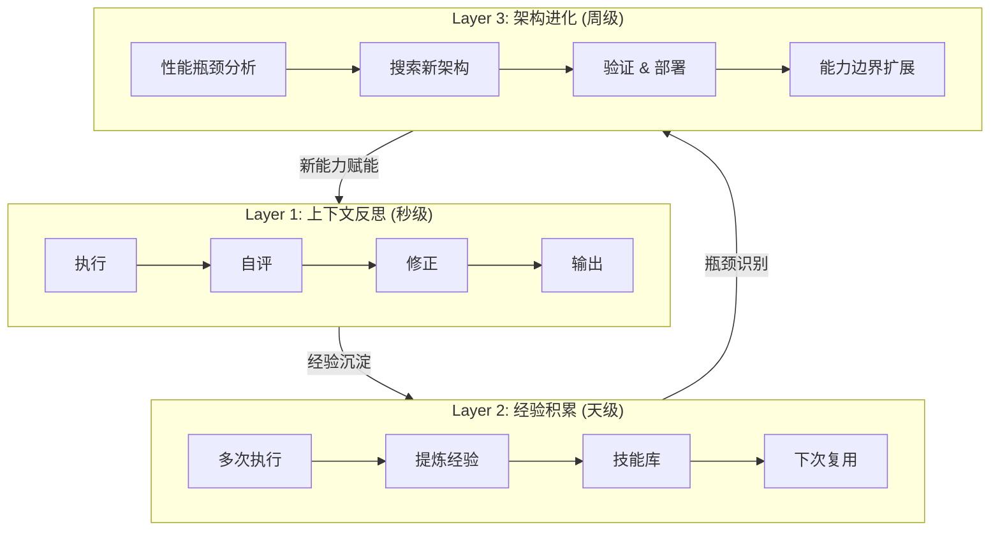
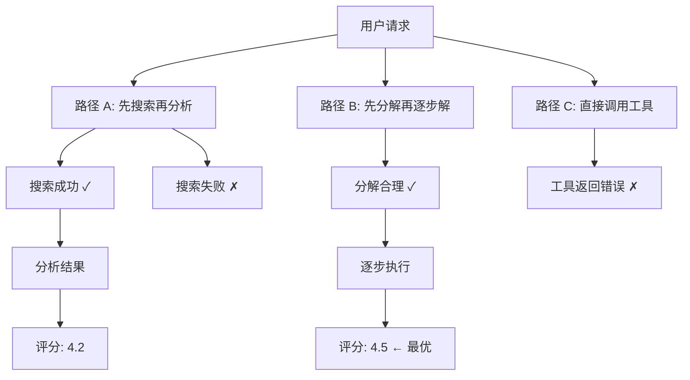
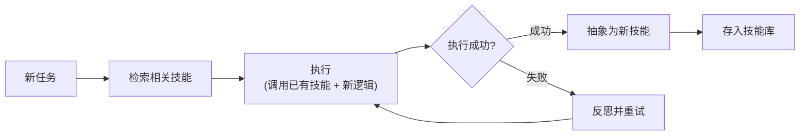
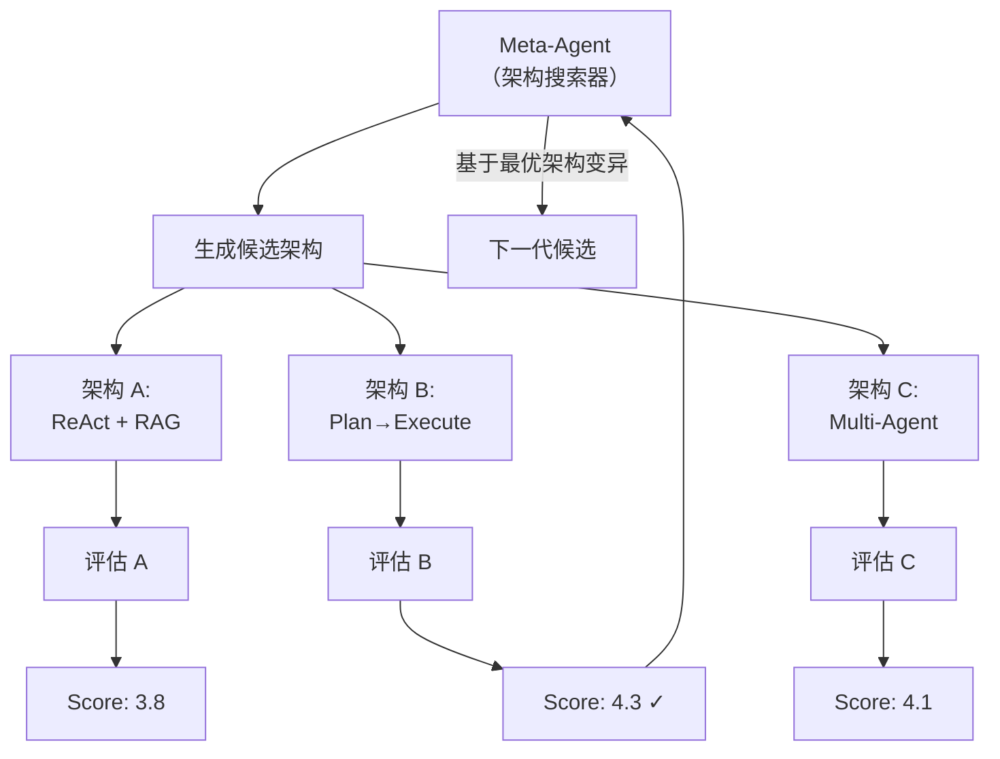

## 核心思想

方案 A 让 Agent 知道自己"好不好"，方案 B 让 Agent 自动"变好一点"，方案 C 要让 Agent **自己改造自己的能力边界**——不只是优化参数，而是创造新技能、重组工作流、甚至设计新的自身架构。

这是通向真正"自主进化"的路径。



---

## Layer 1: 上下文反思（In-Context Self-Correction）

最基础的自进化——在单次交互中自我纠错。这一层你在方案 B 已经接触过（Reflexion），这里关注的是**如何做得更深**。

### 从 Self-Refine 到 LATS

| 方法 | 搜索策略 | 适用场景 |
|------|---------|---------|
| Self-Refine | 线性迭代（生成→评估→修改→...） | 简单的内容改进 |
| Reflexion | 线性 + 记忆（失败经验存储） | 需要跨尝试学习的任务 |
| LATS | 树搜索（多条路径并行探索） | 复杂推理、多步决策 |
| MCTS-Agent | 蒙特卡洛树搜索 | 高风险决策、博弈场景 |

### LATS (Language Agent Tree Search) 详解



```python
class LATSAgent:
    """Language Agent Tree Search"""

    def __init__(self, llm, evaluator, max_depth=5, branch_factor=3):
        self.llm = llm
        self.evaluator = evaluator
        self.max_depth = max_depth
        self.branch_factor = branch_factor

    async def solve(self, task: str) -> str:
        root = TreeNode(state=task, parent=None)
        best_solution = None
        best_score = 0

        for iteration in range(self.max_depth):
            # 1. Selection: 选择最有希望的节点
            node = self._select(root)

            # 2. Expansion: 生成多个候选下一步
            children = await self._expand(node)

            # 3. Simulation: 对每个候选路径评估
            for child in children:
                score = await self._simulate(child)
                child.value = score

                if score > best_score:
                    best_score = score
                    best_solution = child.get_path()

            # 4. Backpropagation: 更新父节点的价值
            self._backpropagate(children)

        return best_solution

    async def _expand(self, node: TreeNode) -> list[TreeNode]:
        """生成多个候选方案"""
        prompt = f"""
        当前状态: {node.state}
        历史路径: {node.get_history()}

        请提出 {self.branch_factor} 个不同的下一步方案。
        每个方案应该采用不同的策略。
        """
        responses = await self.llm.chat(prompt, n=self.branch_factor)
        return [TreeNode(state=r, parent=node) for r in responses]
```

---

## Layer 2: 经验积累与技能库

### Voyager 模型：自动技能发现

Voyager（Minecraft 自进化 Agent）的核心创新：Agent 自动把成功的行为序列**抽象为可复用技能**，存入技能库。



#### 技能库的数据结构

```python
@dataclass
class Skill:
    """一个可复用的 Agent 技能"""
    name: str                    # 技能名称
    description: str             # 技能描述（用于检索）
    trigger_conditions: str      # 什么场景下应该使用这个技能
    implementation: str          # 具体实现（可以是 prompt 模板、代码、工作流）
    dependencies: list[str]      # 依赖的其他技能
    success_rate: float          # 历史成功率
    usage_count: int             # 使用次数
    created_from: str            # 从哪个 trace 抽象而来
    version: int                 # 版本号


class SkillLibrary:
    """技能库管理"""

    def __init__(self, vector_store):
        self.skills: dict[str, Skill] = {}
        self.vector_store = vector_store

    async def retrieve(self, task_description: str, top_k: int = 5) -> list[Skill]:
        """根据任务描述检索相关技能"""
        results = await self.vector_store.search(
            query=task_description,
            top_k=top_k,
        )
        return [self.skills[r.id] for r in results if r.score > 0.7]

    async def learn_new_skill(self, trace: AgentTrace, eval_score: float):
        """从成功的执行中学习新技能"""
        if eval_score < 4.0:
            return  # 只从高分执行中学习

        # 让 LLM 判断这个 trace 是否包含可复用的模式
        analysis = await llm.chat(f"""
分析以下执行轨迹，判断是否包含可抽象为通用技能的模式。

任务: {trace.input}
执行步骤: {format_steps(trace.steps)}

判断标准:
1. 这个模式是否会在其他任务中重复出现？
2. 能否抽象为一个通用的、参数化的技能？
3. 抽象后是否比每次重新推理更高效？

如果值得抽象，请输出:
- 技能名称
- 技能描述
- 触发条件
- 参数化的实现模板
""")

        if analysis.worth_abstracting:
            skill = Skill(
                name=analysis.skill_name,
                description=analysis.description,
                trigger_conditions=analysis.trigger,
                implementation=analysis.template,
                success_rate=1.0,
                usage_count=0,
                created_from=trace.trace_id,
                version=1,
            )
            self.skills[skill.name] = skill
            await self.vector_store.index(skill)

    async def evolve_skill(self, skill_name: str, feedback: list[dict]):
        """基于使用反馈进化技能"""
        skill = self.skills[skill_name]

        # 收集使用该技能时的成功/失败案例
        successes = [f for f in feedback if f["score"] >= 4.0]
        failures = [f for f in feedback if f["score"] < 3.0]

        if len(failures) / max(len(feedback), 1) > 0.3:
            # 失败率超过 30%，需要改进
            improved = await llm.chat(f"""
技能 "{skill.name}" 的失败率过高，请改进。

当前实现: {skill.implementation}
失败案例: {format_cases(failures[:5])}
成功案例: {format_cases(successes[:3])}

请分析失败原因，输出改进后的实现。
""")
            skill.implementation = improved
            skill.version += 1
```

### Claude Code Skills 与 Voyager 的对比

| 维度 | Voyager | Claude Code Skills |
|------|---------|-------------------|
| 技能形式 | 代码函数（JavaScript） | SKILL.md + 工具组合 |
| 发现方式 | 自动抽象 | 人工定义 + 自动触发 |
| 存储 | 向量数据库 | 文件系统 |
| 进化 | 基于成功率自动改进 | 手动迭代 |
| 组合 | 技能可嵌套调用 | 技能可调用其他技能 |

**启示**：Claude Code Skills 提供了一个很好的**技能承载框架**，可以在其上构建 Voyager 式的自动发现和进化机制。

---

## Layer 3: 架构自进化（Meta-Evolution）

### ADAS: 自动设计 Agent 系统

ADAS (Automated Design of Agentic Systems) 的核心思想：用一个 **Meta-Agent** 来搜索和设计最优的 Agent 架构。



#### ADAS 核心代码范式

```python
class ADAS:
    """Automated Design of Agentic Systems"""

    def __init__(self, meta_llm, eval_fn, archive_size=20):
        self.meta_llm = meta_llm
        self.eval_fn = eval_fn
        self.archive = []  # 存储历史最优架构
        self.archive_size = archive_size

    async def search(self, task_description: str, generations: int = 10):
        """搜索最优 Agent 架构"""

        for gen in range(generations):
            # 用 Meta-Agent 生成新架构
            candidate = await self._generate_candidate(task_description)

            # 评估候选架构
            score = await self._evaluate_architecture(candidate, task_description)

            # 更新 archive
            self.archive.append({"architecture": candidate, "score": score})
            self.archive.sort(key=lambda x: x["score"], reverse=True)
            self.archive = self.archive[:self.archive_size]

            print(f"Gen {gen}: score={score:.2f}, best={self.archive[0]['score']:.2f}")

        return self.archive[0]

    async def _generate_candidate(self, task_description: str) -> str:
        """让 Meta-Agent 生成新的架构代码"""
        top_architectures = self.archive[:5] if self.archive else []

        prompt = f"""你是一个 Agent 架构设计师。

任务描述: {task_description}

{"历史最优架构:" + format_archive(top_architectures) if top_architectures else "这是第一代，请从基础架构开始。"}

请设计一个新的 Agent 架构。要求：
1. 如果有历史架构，在最优的基础上创新（组合、变异、简化）
2. 输出完整的 Python 代码定义 Agent 类
3. 包含 __init__ 和 run 方法
4. 可以使用以下组件: LLM调用、工具调用、记忆存储、多Agent协作

输出格式: 纯 Python 代码
"""
        return await self.meta_llm.chat(prompt)

    async def _evaluate_architecture(self, architecture_code: str, task: str) -> float:
        """实例化并评估一个架构"""
        # 动态执行架构代码
        agent = self._instantiate(architecture_code)

        # 在 benchmark 上评估
        scores = []
        for test_case in self.eval_fn.get_test_cases():
            result = await agent.run(test_case["input"])
            score = await self.eval_fn.evaluate(test_case, result)
            scores.append(score)

        return sum(scores) / len(scores)
```

### MetaAgent-X: 端到端多智能体设计

更进一步——不只设计单个 Agent，而是**自动设计多 Agent 协作系统**。

```python
# MetaAgent-X 的核心流程
class MetaAgentX:
    """从任务描述自动生成多智能体系统"""

    async def design_system(self, task: str) -> MultiAgentSystem:
        # 1. 任务分解：识别需要哪些角色
        roles = await self._decompose_roles(task)

        # 2. 为每个角色设计最优配置
        agents = []
        for role in roles:
            agent_config = await self._design_agent(role)
            agents.append(agent_config)

        # 3. 设计通信协议和协作模式
        collaboration = await self._design_collaboration(agents, task)

        # 4. 组装 & 验证
        system = MultiAgentSystem(agents=agents, protocol=collaboration)
        await self._validate_system(system, task)

        return system
```

### EvolveR: 全生命周期进化

EvolveR (ICML 2026) 提出了 Agent 的**生命周期模型**：

```
Birth → Growth → Maturity → Adaptation → (Renewal | Retirement)

Birth:     初始化基础能力
Growth:    通过执行积累经验，扩展技能库
Maturity:  性能稳定，进入常规优化
Adaptation:环境变化时，重新调整架构
Renewal:   大规模重构，进入新生命周期
Retirement:能力被更新版本替代
```

```python
class AgentLifecycle:
    """Agent 生命周期管理"""

    def __init__(self, agent, evaluator, skill_library):
        self.agent = agent
        self.evaluator = evaluator
        self.skills = skill_library
        self.phase = "birth"
        self.performance_history = []

    async def tick(self):
        """每个周期的进化步骤"""
        current_score = await self.evaluator.evaluate(self.agent)
        self.performance_history.append(current_score)

        if self.phase == "birth":
            # 快速学习基础技能
            await self._bootstrap_skills()
            if current_score > 3.0:
                self.phase = "growth"

        elif self.phase == "growth":
            # 积极探索，从每次执行中学习
            await self.skills.learn_aggressively()
            if self._is_plateauing():
                self.phase = "maturity"

        elif self.phase == "maturity":
            # 稳定期：只做小幅优化
            await self._incremental_optimize()
            if self._detect_environment_shift():
                self.phase = "adaptation"

        elif self.phase == "adaptation":
            # 环境变了，需要大幅调整
            await self._restructure()
            if current_score > self._get_pre_shift_baseline():
                self.phase = "maturity"

    def _is_plateauing(self) -> bool:
        """检测是否进入平台期"""
        recent = self.performance_history[-20:]
        if len(recent) < 20:
            return False
        variance = max(recent) - min(recent)
        return variance < 0.2  # 分数波动很小 = 平台期

    def _detect_environment_shift(self) -> bool:
        """检测环境是否发生变化（如用户需求变了、工具 API 变了）"""
        recent = self.performance_history[-10:]
        baseline = self.performance_history[-30:-10]
        if not baseline:
            return False
        return (sum(recent) / len(recent)) < (sum(baseline) / len(baseline)) * 0.85
```

---

## 工程架构：完整的多层级系统

```
┌───────────────────────────────────────────────────────────────────┐
│                     Multi-Level Evolution Engine                     │
├───────────────────────────────────────────────────────────────────┤
│                                                                     │
│  ┌─────────────────────────────────────────────────────────┐      │
│  │  Layer 3: Architecture Evolution (Meta-Agent)            │      │
│  │  ┌──────────┐  ┌────────────┐  ┌──────────────────┐    │      │
│  │  │ ADAS     │  │ MetaAgent  │  │ Lifecycle Mgr    │    │      │
│  │  │ Search   │  │ Design     │  │ (EvolveR)        │    │      │
│  │  └──────────┘  └────────────┘  └──────────────────┘    │      │
│  └─────────────────────────────────────────────────────────┘      │
│                              ↕                                      │
│  ┌─────────────────────────────────────────────────────────┐      │
│  │  Layer 2: Skill & Experience (Knowledge Layer)           │      │
│  │  ┌──────────┐  ┌────────────┐  ┌──────────────────┐    │      │
│  │  │ Skill    │  │ Experience │  │ Pattern          │    │      │
│  │  │ Library  │  │ Memory     │  │ Detector         │    │      │
│  │  └──────────┘  └────────────┘  └──────────────────┘    │      │
│  └─────────────────────────────────────────────────────────┘      │
│                              ↕                                      │
│  ┌─────────────────────────────────────────────────────────┐      │
│  │  Layer 1: Runtime Reflection (Per-Interaction)           │      │
│  │  ┌──────────┐  ┌────────────┐  ┌──────────────────┐    │      │
│  │  │ Self-    │  │ LATS       │  │ Error Recovery   │    │      │
│  │  │ Refine   │  │ Search     │  │ Engine           │    │      │
│  │  └──────────┘  └────────────┘  └──────────────────┘    │      │
│  └─────────────────────────────────────────────────────────┘      │
│                              ↕                                      │
│  ┌─────────────────────────────────────────────────────────┐      │
│  │  Foundation: Eval + Trace + Safety                       │      │
│  │  ┌──────────┐  ┌────────────┐  ┌──────────────────┐    │      │
│  │  │ Eval     │  │ Trace      │  │ Safety           │    │      │
│  │  │ Pipeline │  │ Store      │  │ Guardrails       │    │      │
│  │  └──────────┘  └────────────┘  └──────────────────┘    │      │
│  └─────────────────────────────────────────────────────────┘      │
│                                                                     │
└───────────────────────────────────────────────────────────────────┘
```

---

## 关键难点与工程挑战

### 难点 1: 进化安全性 — 如何防止"变坏"

自进化最大的风险是 Agent 可能进化出**有害行为**或**退化行为**。

**具体风险**：
- 技能库中出现绕过安全检查的"技能"
- 架构进化后失去了重要的约束
- 经验记忆中积累了错误的"教训"

**安全护栏设计**：

```python
class EvolutionSafetyGuard:
    """进化安全护栏"""

    # 不可变的安全约束
    INVARIANTS = [
        "不泄露用户隐私",
        "不执行未授权的系统操作",
        "不绕过安全审核",
        "不输出有害内容",
    ]

    async def validate_evolution(self, before_agent, after_agent) -> bool:
        """验证进化后是否仍满足安全约束"""
        # 1. 对抗性测试
        adversarial_cases = self._generate_adversarial_inputs()
        for case in adversarial_cases:
            result = await after_agent.run(case)
            if self._violates_invariants(result):
                return False  # 拒绝这次进化

        # 2. 回归测试
        regression_suite = self._get_safety_regression_suite()
        for case in regression_suite:
            result = await after_agent.run(case)
            if not self._passes_safety_check(result):
                return False

        # 3. 能力边界检查
        if self._exceeds_authorized_capabilities(after_agent):
            return False

        return True

    async def rollback(self, agent, checkpoint: str):
        """回滚到安全的检查点"""
        await agent.restore_from_checkpoint(checkpoint)
```

### 难点 2: 技能冲突与组合爆炸

当技能库增长到几百个技能时：
- 多个技能可能适用于同一场景，如何选择？
- 技能组合可能产生意外的交互效果
- 过时的技能可能比不用还差

**应对**：

```python
class SkillConflictResolver:
    """技能冲突解决器"""

    async def select_skills(self, task: str, candidates: list[Skill]) -> list[Skill]:
        """从候选技能中选择最优组合"""
        if len(candidates) <= 2:
            return candidates

        # 基于历史成功率加权
        scored = [(s, s.success_rate * self._recency_weight(s)) for s in candidates]
        scored.sort(key=lambda x: x[1], reverse=True)

        # 检查前 N 个是否有冲突
        selected = [scored[0][0]]
        for skill, score in scored[1:]:
            if not self._conflicts_with(skill, selected):
                selected.append(skill)
            if len(selected) >= 3:
                break

        return selected

    def _conflicts_with(self, skill: Skill, existing: list[Skill]) -> bool:
        """检查技能是否与已选技能冲突"""
        for e in existing:
            # 同一类型的技能可能冲突
            if skill.trigger_conditions == e.trigger_conditions:
                return True
            # 依赖不兼容
            if set(skill.dependencies) & set(e.dependencies):
                return True
        return False
```

### 难点 3: 进化的可评估性

怎么知道"进化"了而不是"退化"了？尤其是架构级变化，影响面很大。

**多层验证策略**：

```
Level 1: 单元验证
  - 新技能/新架构在 10 个核心 case 上通过

Level 2: 集成验证
  - 在 50+ 的 benchmark 上不退化
  - 每个维度分别验证（不能某维度大涨掩盖另一维度退化）

Level 3: 灰度验证
  - 在 10% 真实流量上运行 24h
  - 对比新旧版本的用户满意度

Level 4: 长期跟踪
  - 部署后 7 天内持续监控
  - 设置自动回滚阈值
```

### 难点 4: Meta-Agent 的可靠性

Meta-Agent（设计 Agent 的 Agent）本身可能不可靠——它设计出的架构可能有 bug。

**应对**：
- Meta-Agent 生成的代码必须通过静态分析
- 每个候选架构必须在沙箱中试运行
- Meta-Agent 自己也需要评估和进化（但注意无限递归风险）
- 设置架构复杂度上限，防止过度设计

### 难点 5: 计算成本控制

架构搜索的计算成本极高——每评估一个候选需要完整跑一轮 benchmark。

**应对**：
- 分层评估：先在小数据集快速筛选，再对 top-k 做全量评估
- 缓存：相似架构的评估结果可复用
- 预算约束：设置每轮搜索的最大 agent 调用次数
- 递增搜索：从简单架构开始，逐步增加复杂度

---

## 落地路线建议

### Month 1: 搭建基础 + Layer 1

```
Week 1-2: Eval Pipeline (方案 A)
Week 3: Self-Refine 集成到 Agent 运行时
Week 4: 实现 LATS 用于复杂任务
```

### Month 2: Layer 2 — 经验与技能

```
Week 1: Reflexion 经验记忆系统
Week 2: 技能库基础设施（存储 + 检索）
Week 3: 自动技能发现（从高分 trace 抽象）
Week 4: 技能使用 + 反馈 + 技能进化
```

### Month 3+: Layer 3 — 架构进化

```
Week 1-2: ADAS 基础版（单 Agent 架构搜索）
Week 3-4: Lifecycle Manager
后续: MetaAgent 多 Agent 系统设计（按需）
```

---

## 开源项目参考

| 项目 | Stars | 定位 | 适合参考 |
|------|-------|------|---------|
| [EvoAgentX](https://github.com/EvoAgentX/EvoAgentX) | 活跃 | 完整自进化生态 | 整体架构设计 |
| [AgentEvolver](https://github.com/modelscope/AgentEvolver) | 阿里出品 | 工作流进化 | 工作流优化思路 |
| [EvolveR](https://github.com/KnowledgeXLab/EvolveR) | ICML 2026 | 生命周期进化 | 生命周期管理 |
| [AHE](https://github.com/mqbazhaoyu/ahe) | arXiv 配套 | Harness 自进化 | Agent 环境自优化 |
| [EvoMaster](https://github.com/sjtu-sai-agents/EvoMaster) | 学术 | 科研规模进化 | 大规模进化实验 |

---

## 自测题

<div class="card-quiz">
  <details>
    <summary>Q1: 为什么 Voyager 的技能库方法比纯 Reflexion 的进化上限更高？</summary>
    <div class="answer">
      Reflexion 的经验记忆本质上是"避免重犯同一个错误"——它不创造新能力，只是让已有能力发挥更稳定。而 Voyager 的技能库是"创造新的可复用行为模块"——每个新技能都是能力边界的扩展。一个类比：Reflexion 像是错题本让你考试不再犯错，Voyager 像是你学会了新的解题方法可以解新类型的题。
    </div>
  </details>
</div>

<div class="card-quiz">
  <details>
    <summary>Q2: ADAS 的架构搜索和 NAS（神经架构搜索）有什么本质不同？</summary>
    <div class="answer">
      NAS 搜索的是神经网络的结构（层数、连接方式），搜索空间是数学化的（可用梯度或强化学习优化）。ADAS 搜索的是 Agent 的逻辑架构（推理模式、工具组合、协作方式），搜索空间是代码/自然语言定义的，无法用传统优化方法搜索——因此 ADAS 用 Meta-Agent（LLM）来生成候选，本质上是"用 AI 设计 AI"。
    </div>
  </details>
</div>

<div class="card-quiz">
  <details>
    <summary>Q3: 自进化 Agent 最大的安全风险是什么？怎么缓解？</summary>
    <div class="answer">
      最大的风险是"能力溢出"——Agent 进化出超出预期授权范围的能力，或者学会规避安全检查的"技能"。缓解方法：1) 设置不可变的安全 invariants，每次进化后必须通过对抗性测试；2) 能力白名单——进化只能在授权范围内扩展；3) 灰度 + 自动回滚——进化后的 Agent 先在小流量验证；4) 人工审计——周期性审查技能库和架构变更。
    </div>
  </details>
</div>

---

## 延伸阅读

- [A Survey of Self-Evolving Agents (Stanford SCALE)](https://arxiv.org/abs/2507.21046)
- [A Comprehensive Survey of Self-Evolving AI Agents](https://arxiv.org/abs/2508.07407v1)
- [ADAS: Automated Design of Agentic Systems (ICLR 2025)](https://arxiv.org/pdf/2408.08435v2)
- [Voyager: An Open-Ended Embodied Agent with LLMs](https://arxiv.org/abs/2305.16291)
- [EvolveR: Self-Evolving LLM Agents through Experience-Driven Lifecycle (ICML 2026)](https://github.com/KnowledgeXLab/EvolveR)
- [MetaAgent-X: Breaking the Ceiling via End-to-End RL](https://arxiv.org/html/2605.14212)
- [Auto Skills: 从 Voyager 到 Claude Code Skills](https://www.ai-insight.org/reports/auto-skills-2026)
- [Anthropic: Equipping Agents for the Real World with Skills](https://www.anthropic.com/engineering/equipping-agents-for-the-real-world-with-agent-skills)
